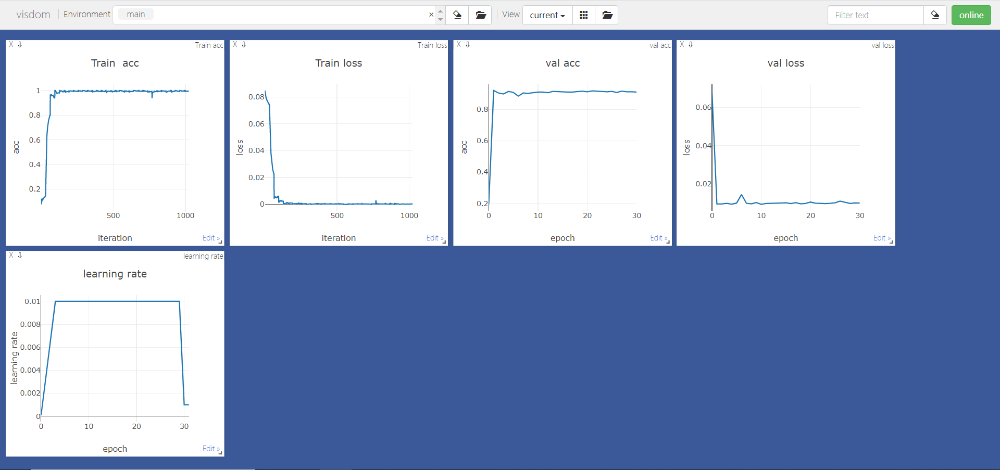

# version2已完成改进：

- train和val分开，可指定trian多少个epoch，val一次
- 将pth文件导入自己写的resnet18中
- 笔记本电脑（无N卡）直接用CPU能跑起来batch_size=32是万万没想到的
  - ==若batch_size太大，考虑前向传播几次再更新梯度==
- 添加了一些数据增广方法
- 使用visdom绘图loss/acc-epoch
- 日志保存为文件txt
- model中自己写的`MyResnet18.py`的模型虽然可以实现resnet18，但是加载预训练权重的时候key差别太大了。故采用resnet的pytorch源码，进行删改后有`Resnet18_simplified.py`
- 实现保存包含optimizer,epoch, state_dict 信息的`checkpoint_saver`
- `resume_checkpoint`函数resume恢复训练功能
- pytorch使用`autoaugment`
- 直接通过args指定optimizer方法(sgd,adam等)
- 直接通过args指定learning rate方法

# versionv3改进：

- 关掉数据增广，跑出一个曲线较稳定的baseline
- 由2分类扩展到10分类
- 打印learning rate信息，在visdom上将learning rate - epoch曲线画出来

# 下一步：

- `validate.py`
- 训练策略有些问题，需要进一步改进
- 用2080Ti跑，笔记本性能终究是有限的

