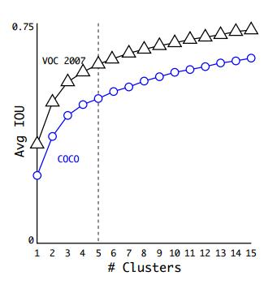
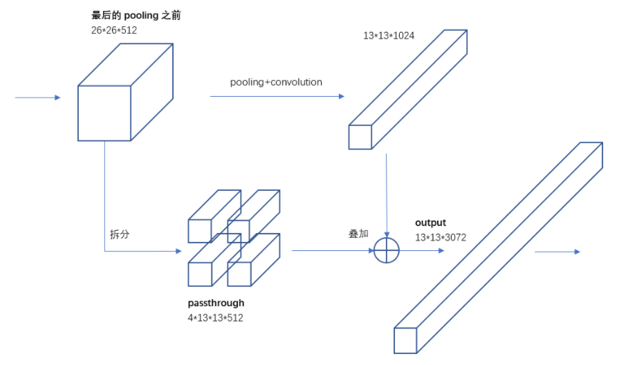
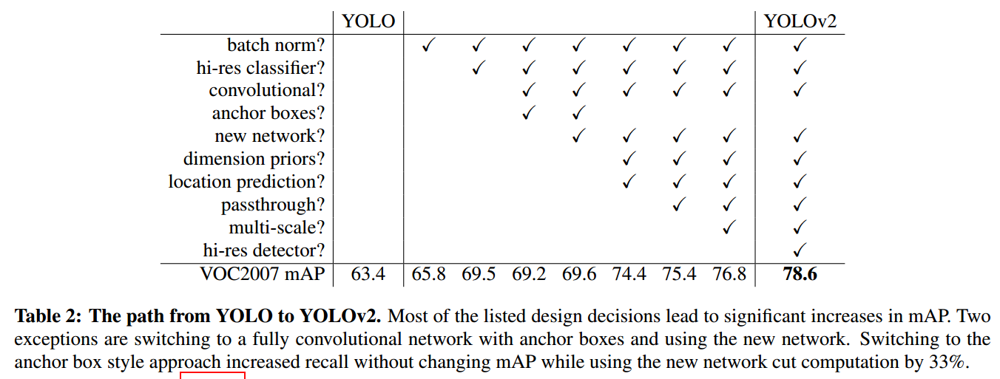
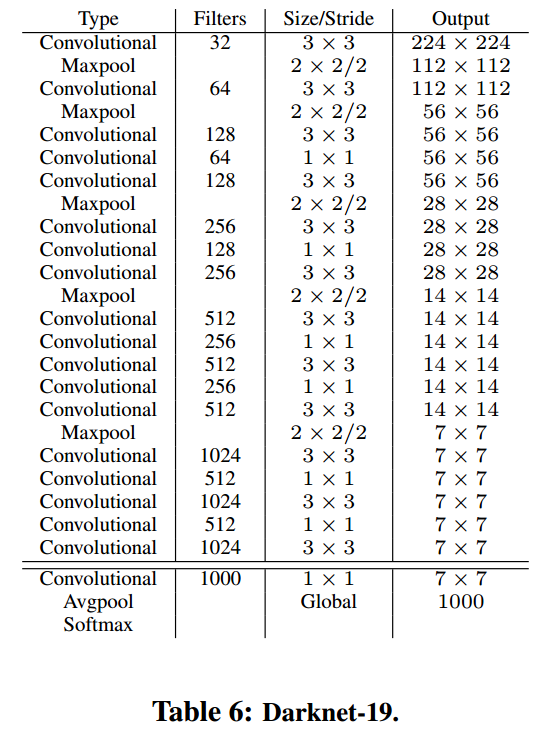
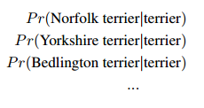
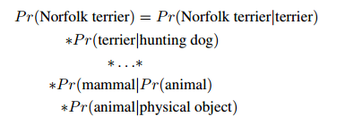
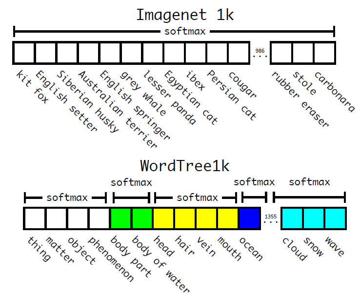

# YOVO v2调研报告

[toc]

## 1 动机

在YOLO v1的基础上，提出一种**better**，**faster**，**stronger**的目标检测算法。

## 2 Contribution

- 对YOLO进行多方面改进(==具体点==)，提高召回率和Localization性能，实现better
- 为实现精度与速度并重，作者提出了新的分类网络Darknet-19，实现faster
- 提出一种分类、检测数据集联合训练方法，实现stronger

## 3 简介

YOLO的升级版有两种：YOLOv2和YOLO9000。作者采用了一系列的方法优化了YOLO的模型结构，产生了YOLOv2，在快速的同时准确率达到当时最好的结果。然后作者提出了一种目标分类与检测的联合训练方法，通过WordTree来联合检测数据集与识别数据集中的数据，同时在COCO和ImageNet数据集中进行训练得到了YOLO9000,实现了9000多种物体的实时检测。

## 4 方法

### 4.1 Better

在YOLO V1基础上，作者提出了不少的改进来进一步提升算法的性能（mAP），主要改进措施包括网络结构的改进（第4.1.1，4.1.3，4.1.5，4.1.6条）和Anchor Box的引进（第4.1.3，4.1.4，4.1.5条）以及训练方法（第4.1.2，4.1.7条）。

### 4.1.1 引入BN层（Batch Normalization）

**Batch Normalization能够加快模型收敛，并提供一定的正则化**。作者在每个conv层后都加上了BN层，同时去掉了原来模型中的dropout部分，实验证明可以提高2%的mAp。

BN层进行如下变换：①对该批样本的各特征量（对于中间层来说，就是每一个神经元输入）分别进行归一化处理，分别使每个特征的数据分布变换为均值0，方差1。从而使得每一批训练样本在每一层都有类似的分布。这一变换不需要引入额外的参数 ②对上一步的输出再做一次线性变换，假设上一步输出为Z，则$Z1=\gamma Z+\beta$。这里$\gamma$、$\beta$是可以训练的参数。增加这一变化是因为上一步骤中强制改变了特征数据的分布，可能影响了原有数据的信息表达能力。增加的线性变化使其有机会恢复其原本的信息。

BN学习参考：[Batch Normalization原理与实战](https://zhuanlan.zhihu.com/p/34879333)

### 4.1.2 高分辨率分类器（High Resolution Classifier）

相比图像分类任务，目标检测需要更高的图像分辨率。另外，**训练网络时一般不会从随机初始化所有的参数来开始，一般都是用已训练好的网络来fine-tuning自己的网络**，预训练的网络一般是在ImageNet上训练好的分类网络。

- YOLOv1预训练时使用$224\times224$的输入，检测的时候采用的是$448\times448$的输入，这会导致分类切换到检测的时候，模型需要适应图像分辨率的改变

- YOLOv2中将预训练分成两步：① 先用$224\times224$的输入来训练大概160epoch，然后再把输入调整到$448\times448$再训练10epoch，然后在训练好的模型上进行fine-tuning，检测的时候用$448\times448$就可以顺利过渡了。

  这个方法提高了3.7%的mAP。

###  4.1.3 引入先验框(Convolutional With Anchor Boxes)

在YOLO中使用网络最后的全连接层直接预测目标边框的坐标，在YOLOv2中借鉴了Faster R-CNN中Anchor的思想。

- 去掉了YOLO网络的全连接层和最后的池化层，使提取特征的网络能得到更高分辨率的特征

- 使用$416\times416$代替$448\times448$作为网络的输入。这是因为希望得到的特征图的尺寸为奇数。奇数大小的宽和高会使得每个特征图在划分cell的时候就只有一个center cell。为什么希望只有一个center cell呢？因为大的object一般会占据图像的中心，所以希望用一个center cell去预测，而不是4个center cell 去预测。网络最终将416×416的输入变成了$13\times13$大小的feature map输出，也就是缩小比例为32。（5个池化层，每个池化层将输入的尺寸缩小1/2）。

- **Anchor Boxes**  在YOLO中，每个grid cell只预测两个bbox，最终只能预测98个bbox（$7\times7\times2=98$）,而在Faster R-CNN在输入大小为$1000\times600$时的boxes数量大概是6000，在SSD300中boxes数量是8732。显然**增加box数量是为了提高object的定位准确率**。 过少的bbox显然影响了YOLO的定位的精度，在YOLO V2中引入了Anchor Boxes的思想，其预测的bbox则会超过千个（以输出的feature map为13×13为例，每个grid cell有9个anchor box的话，其预测的bbox数量为$13\times13\times9=1521$个）。

  引入anchor box之后，相对YOLO1的81%的召回率，YOLOv2的召回率大幅提升到88%。同时mAP有0.2%的轻微下降。

### 4.1.4 引入聚类提取先验框尺度(Dimension Clusters)

在引入anchor box后，一个问题就是如何确定anchor的位置和大小？Faster R-CNN中是手工选定的，每隔stride设定一个anchor，并根据不同的面积比例和长宽比例产生9个(3种大小，3种形状共9种)anchor box。设想能否一开始就选择了更好的、更有代表性的先验Boxes维度，那么网络就应该更容易学到准确的预测位置。作者的解决办法就是统计学习中的**K-means聚类**方法，通过对数据集中的Ground True Box做聚类，找到Ground True Box的统计规律。==以聚类个数k为Anchor Boxs个数，以k个聚类中心Box的宽高维度为Anchor Box的维度==。

[K-means聚类算法简介](http://c.biancheng.net/view/3708.html)

如果按照标准K-means使用欧式距离函数，大Boxes比小Boxes产生更多Error。但是，我们真正想要的是产生好的IOU得分的Boxes（与Box的大小无关）。因此采用了如下距离度量:

$$d(box,centriod) = 1 - IOU(box, centroid)$$

下图是在VOC和COCO上聚类结果：

实验结论：

1. 采用聚类分析得到的先验框比手动设置的平均IOU值更高，模型更容易训练和学习
2. 随着K的增大，平均的IOU是增加的。但是为了综合考虑模型的复杂度和召回率。最终选择K=5。使用5个聚类框就已经达到61 Avg IOU，相当于9个手工设置的先验框60.9 Avg IOU。

### 4.1.5 直接位置预测（Direct Location Prediction）

在引入anchor box后，另一个问题就是模型不稳定，特别是在训练前期，作者认为这种不稳定是因为边界框（bounding box）中心位置的预测不够成功。

基于候选框的网络一般是通过预测相对于anchor box中心的偏移值来预测边界框的的中心坐标。公式如下：
$$
x = (t_{x}*w_{a}) + x_{a}\\
y = (t_{y}*h_{a}) + y_{a}
$$
其中$(x_{a},y_{a})$是anchor box的中心坐标。$w_{a}，W_{b}$是anchor box的宽和高，$(t_{x},t_{y})$表示预测的边界框的中心坐标，这个公式对于$(t_{x},t_{y})$没有限制，这就表示预测的边界框容易向任何一个方向偏移，比如当$t_{x}=1$时，边界框就会向右偏移一个anchor box的宽度。所以，每一个预测的边界框可能处于图片中的任意位置，这就导致了模型的不稳定。

YOLO v2沿用了v1中的做法，预测边界框的中心点相对于对应网格左上角的偏移值，每个网格有5个anchor box来预测5个边界框，每个边界框预测得到5个值：$t_{x},t_{y},t_{w},t_{h},t_{o}$，前四个是边界框的坐标和边长信息，$t_{o}$ 则类似于YOLO V1中的置信度，$(c_{x},c_{y})$ 是当前网格相对于图像左上角的坐标，anchor box的先验宽度和高度为 $p_{w},p_{h}$，则参照下图,可预测公式为：

$$
b_{x} = \sigma(t_{x}) + c_{X}\\
b_{y} = \sigma(t_{y}) + c_{y}\\
b_{w} = p_{w}e^{t_{w}}\\
b_{h} = p_{h}e^{t_{h}}\\
Pr(object)*IOU(b,object) = \sigma(t_{o})
$$
为了将边界框的中心约束到当前网格中，利用logistic activation将$t_{x}, t_{y}$ 进行归一化处理，使得模型更加稳定。==此处logistic activation是指什么函数，是YOLOv1中的leaky ReLu吗？参考博客写为sigmoid funcion，如果是sigmoid，那么bx与cx不是只相差零点几吗？此处得看源码。可能是对grid cell归一化处理后使用Sigmoid函数了==

通过对比实验发现，采用维度聚类与直接位置预测比单纯使用anchor box的方法在精度能多出5%。

结合4.4.1节欧式距离函数的计算公式以及公式(2)可知，**作者并没有预测也没有用到anchor box的中心坐标**。

### 4.1.6 细粒度特征（Fine-Grained）

YOLO v2最后一层卷积层输出的是13x13的特征图，检测时也是遵循的这个分辨率。这个分辨率对于大尺寸目标的检测是足够了，但是对于小目标则需要更细粒度的特征，因为越小的物体在经过层层池化后，体现在最终特征图中的可能性越小。

Faster R-CNN和SSD都在不同层次的特征图上进行region proposal以获得多尺度的适应性，YOLO V2则开创性地引入了直通层(**passthrough layer**)，这个直通层有点类似ResNet的dentity mappings结构，将浅层和深层两种不同尺寸的特征连接起来。在这里是将前一层高分辨率的特征图连接到低分辨率的特征图上：前一层的特征图的维度为26x26x512，在最后一个pooling之前将其1拆4形成4个13x13x512大小的特征图，然后将其与最后一层特征图（13x13x1024）连接成13x13x(1024+2048)的特征图，最后在此特征图上进行卷积预测（详细过程见下图）。相当于做了一次特征融合，有利于检测小目标。[注]：**此图来自参考博客而非原论文**。

### ==4.1.7 多尺度训练（Multi-Scale Training）（有用！！！）==

在实际应用时，输入的图像大小有可能是变化的。作者也将这一点考虑进来。因为作者的网络是全卷积神经网络，只有conv和pooling层，没有全连接层，这样就可以处理任意尺寸的图像。为了应对不同尺寸的图像，YOLO v2中在训练的时候使用不同的尺寸图像。

具体来说，在训练的时候，每隔一定的epoch后就会微调网络，每10 baches随机改变网络的输入图像大小。YOLO v2共进行5次最大池化，即最终的下采样参数为32，所以随机生成的图像大小为32的倍数，即{320,352,…,608}，最终最小的尺寸为320×320，最大的尺寸为608×608。

该训练规则强迫模型取适应不同的输入分辨率。模型对于小尺寸的输入处理速度更快，因此YOLOv2可以按照需求调节速度和准确率。在低分辨率情况下（288×288），YOLOv2可以在保持和Fast R-CNN持平的准确率的情况下，处理速度可以达到90FPS。在高分辨率情况下，YOLOv2在VOC2007数据集上准确率可以达到state of the art（78.6mAP）

对于目前流行的检测方法（Faster R-CNN，SSD，YOLO）的精度和帧率之间的关系，见下图。可以看到，作者在30fps处画了一条竖线，这是算法能否达到实时处理的分水岭。Faster R-CNN败下阵来，而YOLO V2的不同点代表了不同输入图像分辨率下算法的表现。对于详细数据，见下表对比（VOC 2007上进行测试）。

### 4.1.8 小结

YOLO V2针对YOLO定位不准确以及召回率低的问题，进行一些改变。 主要是借鉴Faster R-CNN的思想，引入了Anchor box。并且使用k-means的方法，通过聚类得到每个Anchor应该生成的Anchor box的的大小和形状。为了使提取到的特征有更好的细粒度，其网络中借鉴ResNet的思想，将浅层的高分辨率特征和深层的特征进行了融合，这样能够更好的检测小的目标。 最后，由于YOLO v2的网络是全卷积网络，能够处理任意尺寸的图像，在训练的时候使用不同尺度的图像，以应对图像尺寸的变换。

在Better这部分的末尾，作者给出了一个表格，指出了主要提升性能的措施。

---

## 4.2 Faster

为了精度与速度并重，作者在速度上也作了一些改进措施。大多数检测网络依赖于VGG-16作为特征提取网络，VGG-16是一个强大而准确的分类网络，但是确过于复杂。224×224的图片进行一次前向传播，其卷积层就需要多达306.9亿次浮点数运算。

YOLO使用的是基于Googlenet的自定制网络，比VGG-16更快，一次前向传播仅需85.2亿次运算，不过它的精度要略低于VGG-16。224*224图片取Single-Crop(数据增强的一种方法), Top-5 Accuracy==(top5指的是什么？？以前评价分类算法不是取$h_{x}$的最大值与y进行比较来衡量正确性，而是取$h_{x}$的前5个最高预测值与y进行比较)==，YOLO的定制网络得到88%（VGG-16得到90%）。

### 4.2.1 Darknet-19

YOLOv2使用了一个新的分类网络作为特征提取部分，参考了前人的工作经验。类似于VGG，网络使用了较多的3×3卷积核，在每一次池化操作后把通道数翻倍。借鉴了Network In Network的思想，网络使用了全局平均池化（Global Average Pooling）做预测，**把1×1的卷积核置于3*3的卷积核之间，用来压缩特征**。使用Batch Normalization稳定模型训练，加速收敛，正则化模型。

[Global Average Pooling](https://blog.csdn.net/u012911202/article/details/87099559)

最终得出的基础模型就是Darknet-19，包含19个卷积层、5个最大值池化层（Max Pooling Layers ）。Darknet-19处理一张照片需要55.8亿次运算，Imagenet的Top-1准确率为72.9%，Top-5准确率为91.2%。具体的网络结构见下表。

一般尺寸减半，通道数翻倍

### 4.2.2 分类任务训练（Training For Classification）

作者采用ImageNet1000 classification数据集来训练分类模型。训练160epochs,使用stochastic griadient descent ,初始 learning rate为0.1，4次幂的polynomial rate decay，0.0005的weight decay和0.9的momentum。训练过程中，采用了==**random crops**（随机切图，很常用）==, rotations, and hue, saturation, and exposure shifts等data augmentation方法。预训练后，作者采用高分辨率图像（448×448）对模型进行finetune。高分辨率下训练的分类网络Top-1准确率76.5%，Top-5准确率93.3%。

### 4.2.3  检测任务训练（Training For Detection）

为了把分类网络改成检测网络，作者将分类模型的最后一层卷积层去除，替换为三层卷积层（3×3,1024 filters,1×1,），最后一层为1×1卷积层，输出维度filters为需要检测的数目。对于VOC数据集，预测5个Boxes，每个Box包含5个坐标值和20个类别，所以总共是5 * （5+20）= 125个输出维度。因此，输出为125（5x20+5x5） filters。最后还加入了passthough 层，从最后3 x 3 x 512的卷积层连到倒数第二层，使模型有了细粒度特征。

模型训练方法：train 160 epochs；初始learning rate为$10^{-3}$,在第60和90 epochs时将learning rate除以10；weight decay:0.0005，momentum:0.9；数据增强方法:random crops,color shifting等。COCO和VOC上训练策略相同。

---

## 4.3 Stronger

物体分类，是对整张图片打标签，比如这张图片中含有人，另一张图片中的物体为狗；而物体检测不仅对物体的类别进行预测，同时需要框出物体在图片中的位置。物体分类的数据集，最著名的ImageNet，物体类别有上万个，而物体检测数据集，例如coco，只有80个类别，因为物体检测、分割的打标签成本比物体分类打标签成本要高很多。所以在这里，作者提出了分类、检测数据集联合训练的方案。

使用检测数据集的图片去学习检测相关的信息，例如Bounding Box 坐标预测，是否包含物体以及属于各个物体的概率。使用仅有类别标签的分类数据集图片去扩展可以检测的种类。训练过程中把监测数据和分类数据混合在一起。**基本的思路是，如果是检测样本，训练时其Loss包括分类误差和定位误差，如果是分类样本，则Loss只包括分类误差。**

联合分类与检测数据集，这里不同于将网络的backbone在ImageNet上进行预训练，预训练只能提高卷积核的鲁棒性，而分类检测数据集联合，可以扩充识别物体种类。比如狗，ImageNet上就包含超过100多类品种的狗。如果要联合训练，需要将这些标签进行合并。

大部分分类方法采用softmax输出所有类别的概率。采用softmax的前提假设是类别之间不相互包含（比如，犬和牧羊犬就是相互包含）。因此，我们需要一个多标签的模型来综合数据集，使类别之间不相互包含。

作者最后采用WordTree来整合数据集，解决了ImageNet与coco之间的类别问题。

### 4.3.1 Hierarchical classification

**World Tree的构建方法**：检查ImageNet中的可视名词，并查看它们在WordNet图中的路径根节点，在本例中是“physical object”。许多同义词集图中只有一条路径，将这些路径加入World Tree的路径中。然后迭代地检查剩下的名词，并以使树的路径增加最短为目标添加路径。例如一个名词有两条路径到根结点，其中一条路径会给树加上三条边，另外一条路径只给树增加一条边，我们选择较短的路径，即将增加一条边的路径加入树中。

WorldTree中每个node都预测其相对于其父节点的条件概率，即$Pr(子节点\mid父节点)$。例子如下图所示：

则某个node的绝对概率为此node到根节点路径之间的所有node的条件概率之积。其中为了进行分类，认为图像中有目标，则将Pr(physical)设为1。例子如下图所示：

树结构表示物体之间的从属关系非常合适，第一个大类，物体，物体之下有动物、人工制品、自然物体等，动物中又有更具体的分类。此时，在类别中，不对所有的类别进行softmax操作，而对同一层级的类别进行softmax。

**WorldTree进行Classification可行性验证：**为了验证这种方法，使用在1000 class ImageNet构建的WordTree来训练Darknet-19模型。为构建WordTree1k，作者添加了所有中间节点，使标签空间从1000扩展到1369。在训练过程中，作者向world tree上传播ground truth labels，即，如果一只狗被贴上“诺福克梗”的标签，它也会被贴上“狗”或“哺乳动物”的标签，等等。为了计算条件概率，模型预测了1369个值的向量，作者在所有sysnset上计算softmax，它们是同一概念的下义词，见下图.

**WorldTree用于detection**:相较于Classification任务，在detection中使用YOLOv2的objectness predictor给出Pr(physical object)的值。如上图中所示，同一颜色的位置，进行softmax操作，使得同一颜色中只有一个类别预测分值最大。在预测时，从树的根节点开始向下检索，每次选取预测分值最高的子节点，直到所有选择的节点预测分值连乘后小于某一阈值时停止。在训练时，如果标签为人，那么只对人这个节点以及其所有的父节点进行loss计算，而其子节点，男人、女人、小孩等，不进行loss计算。

### 4.3.2  Dataset combination with WordTree

可以使用WordTree把多个数据集整合在一起。只需要把数据集中的类别映射到树结构中的同义词集合（Synsets）。同义词之间的关系来自WorldNet使用WordTree整合ImageNet和COCO的标签如下图所示：

### 4.3.3 Joint Classification And Detection

作者使用COCO 检测数据集和ImageNet的top 9000class数据集建立一个大的联合数据集。为评估网络检测效果，作者添加了ImageNet中非上述top 9000class的一些class。最终这个联合数据集对应的WorldTree有9418个类。 同时**为了分类、检测数据量平衡，作者对CoCo数据集进行了oversampling，使得ImageNet数据总数只比CoCo数据总数大4倍**。

关于联合训练，论文并未给出明确的Loss Function，仅给出以下信息：

- 若网络检测到输入图像为detection image，则对于classification loss，计算当前节点（这个当前节点即4.3.1节提及的到达阈值的节点）以其路径上的父节点的loss，对于location loss，按照之间的方法计算。
- 若网络检测到输入图像为classification image，则只计算classification loss。要做到这一点，只需找到预测该类的最高概率的bounding box，然后在它的predicted tree上计算损失。假设前提是predicted box与ground truth标签至少重叠0.3 IOU。

YOLO9000在ImageNet detection task上的检测性能评估：

- 利用了COCO与ImageNet有44个相同的物体类别进行检测评估
- YOLO9000在训练时只看到了这44个相同物体类别的classification 信息，没有看到detection信息，故可用于检测其detection性能。

## ~~5 实验~~

YOLOv2并未单独论述实验部分，而是在上述方法后论述了部分步骤及实验结果。

## 6 可以吸收借鉴的点

- Batch Normalization能够加快模型收敛，并提供一定的正则化，甚至可以不用dropout。
- 训练网络时一般不会从随机初始化所有的参数来开始，一般都是用已训练好的网络来fine-tuning自己的网络，预训练的网络一般是在ImageNet上训练好的分类网络。
- 增加box数量可以提高object的定位准确率
- K-means聚类时，欧式距离函数灵活选取
- 将深层浅层特征连接起来获得Fine-Grained，本文使用passthrough layer进行连接
- 多尺度训练时，输入图像一定是下采样参数的倍数
- 1×1卷积核可以用作压缩特征
- 数据增强方法：random crops, rotations, and hue, saturation,  exposure shifts，color shifting

## 7 存在的问题

作者对YOLOv2极尽赞美之词，未提及其存在的问题及改进的方向

初学CV，很多不理解，本文主要参考[YOLO学习报告](https://www.cnblogs.com/han-sy/p/13301054.html)，对其内容进行修改、补充以及删除。

[注]==黄色标注==：补完深度学习机器学习基础再回来看一遍，看能否理解