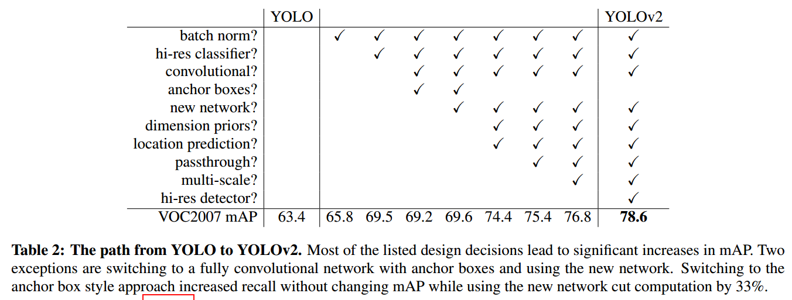

**1 Faster R-CNN中anchor如何手动设置的？长宽比，stride**

anchor box的中心：feature map每个位置上的点，就对应一个anchor box的中心，一个anchor box的中心产生k个anchor box。

anchor box是在原图上的区域而不是在特征图上，即anchor box在特征图上抽取，而映射回原图（这个原图是指resize之后的图）计算IOU。

anchor的宽高：根据base size，scales，aspect ratios计算。此处base size。base size的确定博主也不知道如何确定的。

参考博客：

[关于Faster-Rcnn中的AnchorBox的一些理解](https://blog.csdn.net/qian99/article/details/79942591?utm_source=blogxgwz2)

stride选择：stride会影响中心点的个数。

$$中心点个数 = (原图长度/stride)\times(原图宽度/stride)$$

参考博客：

[Faster-RCNN anchor box Pytorch 锚点生成 （含代码）](https://blog.csdn.net/weixin_44638957/article/details/94902435)

---


**2 直接引入anchor box会带来模型不稳定，这句话如何理解如何理解？ $b_{W}=P_{W}e^{t_{W}}$ ，为何用指数函数？**

- 原文说法：基于候选框的网络一般是通过预测相对于anchor box中心的偏移值来预测边界框的的中心坐标。公式如下：

$$
x = (t_{x}*w_{a}) + x_{a}\\
y = (t_{y}*h_{a}) + y_{a}
$$

其中$(x_{a},y_{a})$是anchor box的中心坐标。$w_{a}，W_{b}$是anchor box的宽和高，$(t_{x},t_{y})$表示预测的边界框的中心坐标，这个公式对于$(t_{x},t_{y})$没有限制，这就表示预测的边界框容易向任何一个方向偏移，比如当$t_{x}=1$时，边界框就会向右偏移一个anchor box的宽度。所以，每一个预测的边界框可能处于图片中的任意位置，这就导致了模型的不稳定。

- 作者借鉴了RPN网络使用的anchor boxes去预测bounding boxes相对于图片分辨率的offset，通过(x,y,w,h)四个维度去确定anchor boxes的位置，但是这样在早期迭代中x,y会非常不稳定，**因为RPN是一个区域预测一次，但是YOLO中是169个gird cell一起预测，处于A gird cell 的x,y可能会跑到B gird cell中，到处乱跑，导致不稳定**。

- 作者巧妙的引用了sigmoid函数来规约x,y的值在（0,1）轻松解决了这个offset的问题。**关于w,h的也改进了YOLOv1中平方差的差的平方的方法，用了RPN中的log函数**。
  $$
  b_{x} = \sigma(t_{x}) + c_{X}\\
  b_{y} = \sigma(t_{y}) + c_{y}\\
  b_{w} = p_{w}e^{t_{w}}\\
  b_{h} = p_{h}e^{t_{h}}\\
  Pr(object)*IOU(b,object) = \sigma(t_{o})
  $$

参考博客：[目标检测之YOLOv2，最详细的代码解析](https://www.jianshu.com/p/032b1eecb335)

---


**3 k-means算法用python手敲**

参考博客：[K-means聚类算法原理及python实现](https://blog.csdn.net/qq_43741312/article/details/97128745)

```python
import random
import pandas as pd
import numpy as np
import matplotlib.pyplot as plt


# 计算欧式距离
def calcDis(dataSet, centroids, k):
    clalist = []
    for data in dataSet:
        diff = np.tile(data, (k, 1)) - centroids  # 相减  因为centroids维度为(k,n)
        squareDiff = diff ** 2  # 平方
        squareDist = np.sum(squareDiff, axis=1)  # 和 (axis=1表示行)  (k,1)
        distance = squareDist ** 0.5  # 开根号  (k,1)
        clalist.append(distance)
    clalist = np.array(clalist)  # m个数据到k个centroids的距离。m个数组，每个数组代表数据点到各个质心的距离
    return clalist


# 计算质心
def classify(dataSet, centroids, k):
    # 计算样本到质心的距离
    clalist = calcDis(dataSet, centroids, k)
    # 分组并计算新的质心
    minDistIndices = np.argmin(clalist, axis=1)  # axis=1, 表示求出每行的最小值的下标。求出距离每个数据点的最近质心编号  (m,1)
    # DataFrame(dataSet)对dataSet分组,groupby(min)按照min进行统计分类，mean()对分类结果求均值
    newCentroids = pd.DataFrame(dataSet).groupby(minDistIndices).mean()  # 聚合！！一步实现了簇中数据的寻找以及新质心的计算
    newCentroids = newCentroids.values

    # 计算变化量
    changed = newCentroids - centroids
    return changed, newCentroids


# 使用k-means聚类
def kmeans(dataSet, k):
    # 随机取质心
    centroids = random.sample(dataSet, k)  # (k,n)

    # 更新质心，直到变化量全为0
    changed, newCentroids = classify(dataSet, centroids, k)
    while np.any(changed != 0):
        changed, newCentroids = classify(dataSet, centroids, k)

    centroids = sorted(newCentroids.tolist())  # tolist()将矩阵转换为列表， sorted()排序

    # 根据质心计算每个集群
    cluster = []
    clalist = calcDis(dataSet, centroids, k)  # 调用欧拉距离  m个k维向量
    minDisIndices = np.argmin(clalist, axis=1)  # (m,1)
    for i in range(k):  # 创建k个空的cluster
        cluster.append([])
    for i, j in enumerate(minDisIndices):  # enumerate枚举
        cluster[j].append(dataSet[i])

    return centroids, cluster


# 创建数据集
def creatDataSet():
    return [[1, 1], [1, 2], [2, 1], [6, 4], [6, 3], [5, 4]]


if __name__ == '__main__':
    dataSet = creatDataSet()
    centroids, cluster = kmeans(dataSet, 2)
    print("质心为: %s" % centroids)
    print("集群为: %s" % cluster)
    for i in range(len(dataSet)):
        plt.scatter(dataSet[i][0], dataSet[i][1], marker='o', color='green', s=40, label="原始点")

    for j in range(len(centroids)):
        plt.scatter(centroids[j][0], centroids[j][1], marker='x', color='red', s=50, label='质心')
        plt.show()
```


---


**4  推理速度，参数量(一个卷积核怎么算)，flops(一个卷积怎么算)**

1 参数量计算公式

1.1 对于卷积层而言，参数量计算公式：
$$
K_{H}\times K_{W} \times C_{in} \times C_{out} + C_{out}
$$
式中，$K_{H}$、$K_{W}$为卷积核的宽高，$C_{in}$为input feature map的通道数，$C_{out}$为output feature map的通道数。

1.2 对于全连接层而言，参数量计算公式：
$$
N_{in} \times N_{out} + N_{out}
$$
式中，$N_{in}$为输入数据的节点数，$N_{out}$为输出节点的节点数。

2 Flops计算公式

1.1 对于卷积层：
$$
(K_{h} \times K_{w} \times C_{in} \times C_{out} + C_{out}) \times H_{out} \times W_{out} =
num_{paramter} \times size_{output featuremap}
$$
式中，$K_{H}$、$K_{W}$为卷积核的宽高，$C_{in}$为input feature map的通道数，$C_{out}$为output feature map的通道数，$num_{paramter}$为该层参数数量，$H_{out}$、$W_{out}$代表输出特征图的高宽 ，$size_{output featuremap}$表示输出特征图的二位尺寸。

1.2 对于全连接层：
$$
N_{in} \times N_{out} + N_{out}
$$
参考博客：

[CNN模型复杂度（FLOPS、MAC）、参数量与运行速度](https://blog.csdn.net/weixin_39833897/article/details/105807172?utm_medium=distribute.pc_relevant.none-task-blog-BlogCommendFromMachineLearnPai2-2.control&depth_1-utm_source=distribute.pc_relevant.none-task-blog-BlogCommendFromMachineLearnPai2-2.control)

3 推理速度:FPS

---


**5 这个图中hi-res detecor是什么?**



**<font color=red>hi-res detecor</font>：**表格中最后一行有个hi-res detector，使mAP提高了1.8。因为YOLO2调整网络结构后能够支持多种尺寸的输入图像。通常是使用416×416的输入图像，如果用较高分辨率的输入图像，比如544×544，则mAP可以达到78.6，有1.8的提升。

**<font color=red>convlolutional</font>：**在YOLO中使用网络最后的全连接层直接预测目标边框的坐标，YOLOv2去掉了YOLO网络的全连接层和最后的池化层，整个backbone仅使用卷积层与池化层

**<font color=red>dimension prios</font>：**使用k-means聚类anchor box

**<font color=red>location prediction</font>：**基于候选框的网络一般是通过预测相对于anchor box中心的偏移值来预测边界框的的中心坐标。公式如下：
$$
x = (t_{x}*w_{a}) + x_{a}\\
y = (t_{y}*h_{a}) + y_{a}
$$
而YOLOv2采用的位置预测方法：
$$
b_{x} = \sigma(t_{x}) + c_{X}\\
b_{y} = \sigma(t_{y}) + c_{y}\\
b_{w} = p_{w}e^{t_{w}}\\
b_{h} = p_{h}e^{t_{h}}\\
Pr(object)*IOU(b,object) = \sigma(t_{o})
$$
