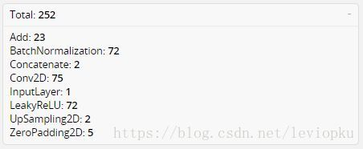
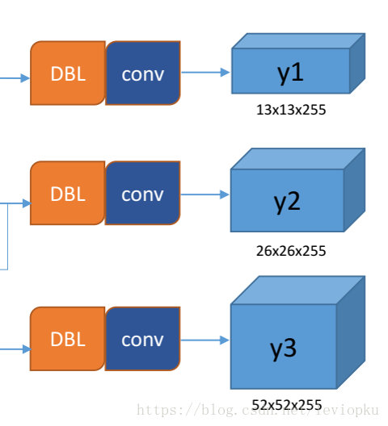
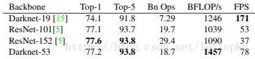
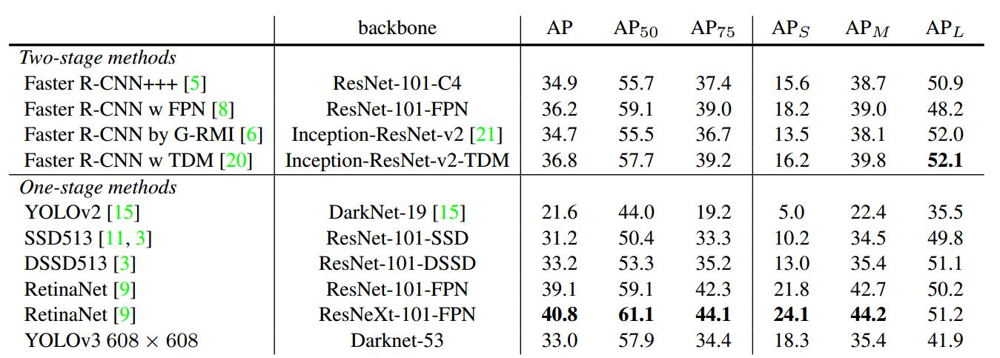

# YOLO V3调研报告

[toc]

## 1 动机

提出一种快速且比YOLOv2准确率更高的目标检测算法。

## 2 Contribution

- 提出一种**新的Backbone（Darknet-53）**，其准确率可与ResNet-152媲美，但速度更快，网络层数更少
- 使用**Multilabel classification**取代softmax。使其对Open Images Dataset适用性更好（可将一个object同时预测为person以及woman等）
- **Predictions across scales**。输出三个不同size的feature map，分别适用于大、中、小三类目标的检测

## 3 简介

提出新的目标检测算法YOLOv3。YOLOv3在YOLOv2的基础上对Bounding box prediction、classification做了改进，为解决不同大小的object的检测问题提出了Predictions Across Scales，最大的改变就是提出了新的backbone即DarkNet-53。与其他算法对比上，YOLOv3比SSD variants 等其他算法$AP_{50}$更高，尽管不如RetinaNet，但其速度更快。论文最后，作者提出了一些尝试过但是对YOLOv3检测效果没有提升甚至带来下降的方法，包括Anchor box  （x, y） offset predictions、Linear( x, y)  predictions instead of logistic、Focal loss、Dual IOU thresholds and truth assignment。

## 4 网络结构   ==为啥比RetinaNet，V2快，好。网络结构。RetiNet为啥更强，改进方案==


<center>图1  yolo_v3结构图

图1表示了yolo_v3整个yolo_body的结构，没有包括把输出解析整理成[box, class, score]。

**<font color=red>DBL</font>**: 如图1左下角所示，也就是代码中的Darknetconv2d_BN_Leaky，是yolo_v3的基本组件。就是卷积+BN+Leaky relu。对于v3来说，BN和leaky relu已经是和卷积层不可分离的部分了(最后一层卷积除外)，共同构成了最小组件。
**<font color=red>resn</font>**：n代表数字，有res1，res2, … ,res8等等，表示这个res_block里含有多少个res_unit。这是yolo_v3的大组件，yolo_v3开始借鉴了ResNet的残差结构，使用这种结构可以让网络结构更深(从v2的darknet-19上升到v3的darknet-53，前者没有残差结构)。对于res_block的解释，可以在图1的右下角直观看到，其基本组件也是DBL。
**<font color=red>concat</font>**：张量拼接。将darknet中间层和后面的某一层的上采样进行拼接。拼接的操作和残差层add的操作是不一样的，拼接会扩充张量的维度，而add只是直接相加不会导致张量维度的改变。

借鉴netron来分析网络层，整个yolo_v3_body包含252层，组成如下：



<center>表0. yolo_v3_layers</center>

根据表0可以得出，对于代码层面的layers数量一共有252层，包括add层23层(主要用于res_block的构成，每个res_unit需要一个add层，一共有1+2+8+8+4=23层)。除此之外，BN层和LeakyReLU层数量完全一样(72层)，在网络结构中的表现为： <font color=red>每一层BN后面都会接一层LeakyReLU</font>。卷积层一共有75层，其中有72层后面都会接BN+LeakyReLU的组合构成基本组件DBL。看结构图，可以发现上采样和concat都有2次，和表格分析中对应上。每个res_block都会用上一个零填充，一共有5个res_block。

## 5 方法

### 5.1 Bounding Box Prediction

YOLOv3在b-box的预测上与v2类似，都是采用k-means聚类确定k个anchor prior，然后依据下面的公式直接预测相对位置。b-box的位置大小和confidence都可以通过$(t_{X},t_{y},t_{h},t_{w},t_o)$计算得来，v2相当直接predict出了b-box的位置和confidence。box宽和高的预测是受prior影响的，对于v2而言，b-box prior数为5。
$$
b_{x} = \sigma(t_{x}) + c_{X}\\
b_{y} = \sigma(t_{y}) + c_{y}\\
b_{w} = p_{w}e^{t_{w}}\\
b_{h} = p_{h}e^{t_{h}}\\
Pr(object)*IOU(b,object) = \sigma(t_{o})
$$
YOLOv3不同之处：

- 聚类k值由5确定为9，即预测9个不同尺寸的anchor。其具体值在论文中也有给出如下：

  ```python
  # (w,h)
  (10,13),  (16,30),  (33,23),  (30,61),  (62,45),  (59,119),  (116,90),  (156,198),  (373,326)
  ```

- v3对b-box进行预测的时候，采用了**logistic regression**。logistic regression用于对anchor包围的部分进行一个目标性评分(objectness score)，即这块位置是目标的可能性有多大。

  - ==这一步是在predict之前进行的，可以去掉不必要anchor，可以减少计算量。如果anchor不是最佳的即使它超过我们设定的阈值，我们还是不会对它进行predict。不同于faster R-CNN的是，yolo_v3只会对1个prior进行操作，也就是那个最佳prior。而logistic回归就是用来从9个anchor priors中找到objectness score(目标存在可能性得分)最高的那一个。==

  ```python
  黄色标注句子源自博客，存疑，因为：
  	作者最终输出三个不同feature map,每个feature map输出的channel都为255=3*（5+80），这个3就代表每个scale下的3个b-box啊。如果predict之前只保留一个anchor，那么就意味着只预测一个b-box？？
  ```

  - 自己对于在Bounding Box Prediction时使用logistic regression的猜测：

  ```python
    参考原文句子：
    Unlike Faster R-CNN, our system only assigns one bounding box prior for each ground truth object. If a bounding box prior is not assigned to a ground truth object it incurs no loss for coordinate or class predictions, only objectness.
    猜测作者挑出objectness score最高的anchor区别于其他的anchor，可能是在loss function上两种anchor贡献不同。
  ```

### ==5.2 Classification==

使用**multilabel classification**取代softmax，因为使用multilabel classification的performance与使用softmax的performance差不多，而multilabel对Open Images Dataset适用性更好（可将一个object同时预测为person以及woman等）。

Training时使用binary cross-entropy loss 。

### 5.3 Predictions Across Scales

对于图1而言，更值得关注的是输出张量：



yolo v3输出了3个不同尺度的feature map，如上图所示的y1, y2, y3。这也是v3论文中提到的为数不多的改进点：**predictions across scales**
这个借鉴了FPN(feature pyramid networks)，采用多尺度来对不同size的目标进行检测，越精细的grid cell就可以检测出越精细的物体。
y1,y2和y3的深度都是255($3 \times (4+1+80)$,3-bbox数量，4-xywh,80-classes)，边长的规律是13:26:52
v3用上采样的方法来实现这种多尺度的feature map，可以结合图1和下图2右边来看，图1中concat连接的两个张量是具有一样尺度的(两处拼接分别是26x26尺度拼接和52x52尺度拼接，通过(2, 2)上采样来保证concat拼接的张量尺度相同)。作者并没有像SSD那样直接采用backbone中间层的处理结果作为feature map的输出，而是和后面网络层的上采样结果进行一个拼接之后的处理结果作为feature map。

### 5.4 Feature Extractor

整个v3结构里面，是**没有池化层和全连接层**的。前向传播过程中，**张量的尺寸变换是通过改变卷积核的步长来实现的**，比如stride=(2, 2)，这就等于将图像边长缩小了一半(即面积缩小到原来的1/4)。在yolo_v2中，要经历5次缩小，会将特征图缩小到原输入尺寸的$1 / 2^5$，即1/32。输入为416x416，则输出为13x13(416/32=13)。
yolo_v3也和v2一样，backbone都会将输出特征图缩小到输入的1/32。所以，通常都要求输入图片是32的倍数。可以对比v2和v3的backbone看看：（DarkNet-19 与 DarkNet-53）


<center>图2 darknet-19 vs darknet-53</center>

yolo_v2中对于前向过程中张量尺寸变换，都是通过 <font color=red>最大池化</font> 来进行，一共有5次。而v3是通过卷积核 <font color=red>增大步长</font>来进行，也是5次。(darknet-53最后面有一个全局平均池化，在yolo-v3里面没有这一层，所以张量维度变化只考虑前面那5次)。
这也是416x416输入得到13x13输出的原因。从图2可以看出，darknet-19是不存在残差结构(resblock，从resnet上借鉴过来)的，和VGG是同类型的backbone(属于上一代CNN结构)，而darknet-53是可以和resnet-152正面刚的backbone，见下图：



<center>表1 backbone对比图</center>

从上表也可以看出，darknet-19在速度上仍然占据很大的优势。其实在其他细节也可以看出(比如bounding box prior采用k=9)，<font color=green> yolo_v3并没有那么追求速度，而是在保证实时性(fps>36)的基础上追求performance</font>>。

### 5.5 Training

设置：

- 与YOLOv2一样，train on full images with no hard negative mining or any stuff
- multi-scale training
- data augmentation
- BN
- 其他all the standard stuff

## 6 实验

YOLOv3与其他算法在COCO上的表现比较：



YOLOv3比SSD variants 等其他算法$AP_{50}$更高，尽管不如RetinaNet，但其速度更快。

## 7 可以吸收借鉴的点

- 可以使用**残差网络**解决梯度弥散/爆炸，网络退化问题
- 在网络中使用**up-sample**（上采样）。网络越深的特征表达效果越好，比如在进行16倍降采样检测，如果直接使用第四次下采样的特征来检测，这样就使用了浅层特征，这样效果一般并不好。如果想使用32倍降采样后的特征，但深层特征的大小太小，因此yolo_v3使用了步长为2的up-sample（上采样），把32倍降采样得到的feature map的大小提升一倍，也就成了16倍降采样后的维度。同理8倍采样也是对16倍降采样的特征进行步长为2的上采样，这样就可以使用深层特征进行detection。
- 为了加强算法对小目标检测的精确度，YOLO v3中采用类似FPN的**upsample和concat**做法（最后融合了3个scale，其他两个scale的大小分别是26×26和52×52），在多个scale的feature map上做检测。
- 为了降低池化带来的梯度负面效果，作者直接摒弃了POOLing，用**conv的stride来实现降采样**。


## 8 存在的问题

- 与YOLOv1相反，YOLOv3对small objects的检测效果比对medium and large size objects效果好


参考博客:

[yolo系列之yolo v3【深度解析】](https://blog.csdn.net/leviopku/article/details/82660381)

[一文看懂YOLO v3](https://blog.csdn.net/litt1e/article/details/88907542)

[CNN张量(图像)的尺寸和参数计算](https://www.cnblogs.com/touch-skyer/p/9150039.html)

[残差网络学习心得](https://blog.csdn.net/litt1e/article/details/87644012)

[Focal loss理解](https://www.cnblogs.com/king-lps/p/9497836.html)