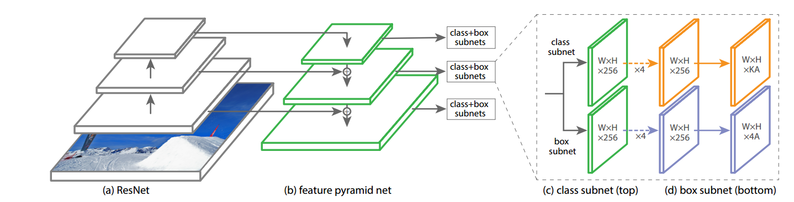

# 1 RetinaNet与YOLOv3的对比

## 1.1 相同

分类时都是使用多类分类

## 1.2 不同

### <font color=red>model</font>：

<font color=blue>yolo_v3结构图如下</font>：


<font color=blue>RetinaNet模型如下</font>：



- RetinaNet将classification和box 分开，用**两套不同的参数**；而YOLOv3直接共用**一套参数**
- RetinaNet中特征金字塔的level从P3-P7共**5**种不同size的feature map，而YOLOv3仅输出**3**种不同size的feature map
- RetinaNet对不同size的feature map采用上采样然后**相加**；而YOLOv3对不同size的feature map采用**concat（拼接）**
- RetinaNet的backbone：**FPN**（7个level，其中P3-P7输出）；而YOLOv3的backbone：**Darknet-53**

### <font color=red>loss function</font>:

RetinaNet采用Focal loss，而YOLOv3使用Focal loss没有效果

### <font color=red>anchor box</font>:

- <font color=red>坐标预测</font>

  R预测边界框的坐标：

$$
t_{x}=(G_{x}-P_{x})/P_{W}\\
t_{y}=(G_{y}-P{y})/P_{h}\\
t_{w}=log(G_{w}/P_{w})\\
t_{h}=log(G_{h}/P_{h})
$$
​		而在YOLOv3中：
$$
b_{x} = \sigma(t_{x}) + c_{X}\\
b_{y} = \sigma(t_{y}) + c_{y}\\
b_{w} = p_{w}e^{t_{w}}\\
b_{h} = p_{h}e^{t_{h}}\\
Pr(object)*IOU(b,object) = \sigma(t_{o})
$$

- <font color=red>anchor数量</font>

  RetinaNet：9 anchor/level

  YOLOv3：聚类方法产生9 anchor / grid cell，然后使用logistic regression保留 objectness score的1个anchor

- <font color=red>Dual IOU thresholds</font>

  RetinaNet：使用Dual IOU thresholds

  YOLOv3：使用Dual IOU thresholds失败

# 2 差异分析

<font color=blue>RetinaNet 比 YOLOv3检测准确率高的原因分析</font>：

-  RetinaNEet将b-box 和 class 分开预测，使用两套权重（可能原因）
- RetinaNet使用Focal loss 解决正负样本以及hard/easy example不平衡问题

<font color=blue>YOLOv3比RetinaNet快的原因</font>：

- RetinaNet的head比YOLOv3的head结构复杂

RetinaNet的head部分：

```
1. 5个class subnet和 5个box subnet（分别对应P3-P7 5个level）。对于class subnet，不同level之间共享权重；box subnet不同level之间共享权重；但是box subnet与class subnet之间权重不共享
2. 每个class subnet的结构：4个 3×3 的卷积核（C filters） + 1个 3×3 的卷积核（KA filters）
3. 每个box subnet的结构：：4个 3×3 的卷积核（C filters） + 1个 3×3 的卷积核（4A filters）
```

YOLOv3的head部分：

```
只有三个不同size的feature map输出
```

- RetinaNet的backbone比YOLOv3的backbone复杂：

RetinaNet的backbone：

```
在ResNet的基础上接上FPN，既有残差操作，还要进行4 次上采样与 feature map的相加操作
```

YOLOv3的backbone：

```
通过多个残差块直接连接，不用对特征图进行操作
```

# 3 如何对RetinaNet改进提高其速度

- 将CSP(Cross-Stage-Partial-Connections )用于RetinaNet中的ResNet部分