# YOLOv4: Optimal Speed and Accuracy of Object Detection


## 1  动机

设计一个速度快，易部署（单个普通GPU即可），训练简单的目标检测算法。

## 2  Contribution

- 开发了一个简单且高效的目标检测算法(YOLOv4)，该算法**可通过普通GPU（1080TI或者2080TI）来训练**
- 作者**验证**了在目标检测算法训练过程中不同的**tricks**对实验性能的影响，这些tricks主要包括Bag-of-Freebies和Bag-of-Specials
- 作者**修改了一些state-of-the-art算法**，使得这些算法适用于单GPU上训练，这些算法包括CBN，PAN和SAM。

##  3  简介

作者提出了一个更快性能更好的目标检测模型，该模型能够在8-16GB显存的显卡上训练。作者首先对当时的目标检测算法进行总结，归纳出目标检测算法的几个部分即Input，Backbone，Neck，Heads，以及将算法的调优手段分为BoF和BoS。然后作者从多个实验对比结果中选择了YOLOv4的架构。最后将YOLOv4与当时的目标检测算法进行对比，得出的实验结论是：YOLOv4在相同准确率下速度最快，在相同速度下准确率最高。

## 4 Related Works

作者对现有目标检测算法进行了总结。

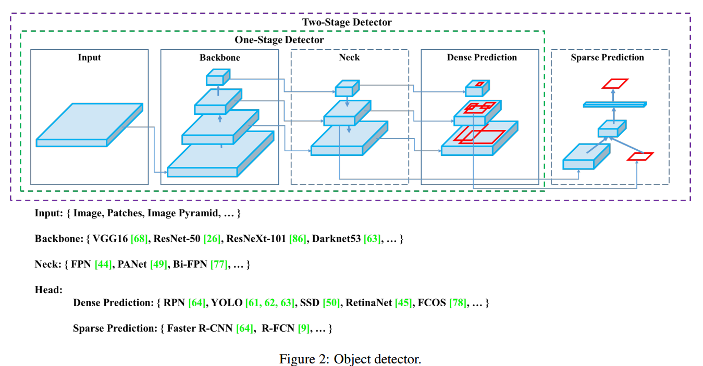

目前检测器通常可以分为以下几个部分，不管是two-stage还是one-stage都可以划分为如下结构，只不过各类目标检测算法设计改进侧重在不同位置：

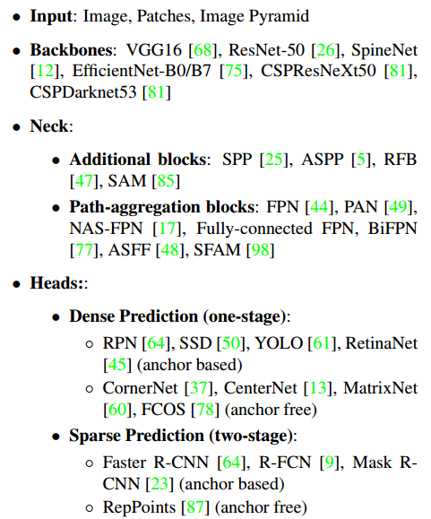

作者把所有的调优手段分为了两大类“Bag of freebies”和“Bag of specials”。

- **Bag of freebies**

  是指在离线训练阶段为了提升精度而广泛使用的调优手段，而这种技巧并不在推断中使用，不会增加推断时间。

  - 数据类

    - 数据增强（random erase/CutOut/hide-and-seek/grid mask/MixUp/CutMix/GAN）

    - 数据分布：two-stage的有难例挖掘，one-stage的有focal loss。

  - 特征图类

    DropOut/DropConnect/DropBlock

  - Bounding Box目标函数类

    MSE/ IoU loss/l1、l2 loss/GIoU loss/DIoU loss/CIoU loss

- **Bag of specials**

  是指在推断过程中增加的些许成本但能换来较大精度提升的技巧。

  - 增大感受野类

    SPP/ASPP/RFB

  - 注意力类

    Squeeze-and-Excitation (SE)/Spa-tial Attention Module (SAM)

  - 特征集成类

    SFAM/ASFF/BiFPN

  - 激活函数类

    ReLu/LReLU/PReLU/ReLU6/Scaled ExponentialLinear Unit (SELU)/Swish/hard-Swish/Mish 

  - 后处理类

    soft NMS/DIoU NMS 

## 5  方法

### 5.1  Selection of architecture

选择模型的时候，在分类任务中表现优异的模型有时候不适用检测模型，检测模型要求以下几点：

- 更大的输入尺寸--为了检测到多个小目标
- 更多的层--这样网络的感受域会增强
- 更多的参数--这样网络模型的学习能力更强，可以检测一张图片中不同尺寸的多个物体

**Backbone**：作者对比了CSPResNext50、CSPDarknet53以及EifficientNet-B3,对比结果如下图所示。考虑到CSPDarknet53相对于CSPResNext50有更大的感受野以及更多的paramters，选择CSPDarknet53。==表格中最后一行存疑，在正文中貌似没有提到==

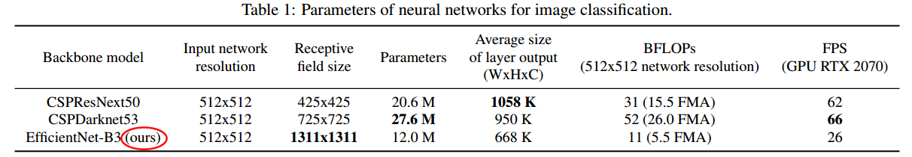

**Neck**: 考虑到SPP能在几乎不降低network operation speed的条件下，显著提高感受野、分离出最重要的context features，故将SPP置于CSPDarknet53之后。使用PANet作为backbone不同levels之间参数聚合方式。

最终<font color=red>YOLOv4架构</font>：

- backbone：CSPDarknet53

- additional block：SPP-block
- path-aggregation neck：PANet
- heads：YOLOv3的heads

### 5.2 Selection of Bof and Bos

通常为了增强目标检测的训练，一个CNN算法通常使用以下方法：

- **Activation:** Relu, Leaky-ReLU, Parametric-Relu, ReLU6, SELU, Swish, or Mish

- **Bounding box regression loss :** MSE, IOU, GIOU, CIOU, DIOU

- **Data augmentatiao:** CutOut, MixUp, CutMix

- **Regularization method:** DropOut, DropPath, Spatial DropOut, DropBlock

- **Normalization:** LN, IN, GN, Cross-GPU BN(CGBN or SysnBN), Filter Response Normalization(FRN), Cross-Iteration Batch Normalization(CBN)

- **Skip-Connection:** Residual connection, Weighted residual connections, multi-input weighted redidual connections, or Cross stage partial connection(CSP)

  ---

  1.对于训练Activation function，由于PReLU和SELU更难训练，而ReLU6是专门为量化网络设计的，因此将这几个激活函数从候选列表中删除。

  2.在regularization方法上，发表Drop-Block的人将其方法与其他方法进行了详细的比较，其regularization方法取得了很大的成果。因此，作者毫不犹豫地选择DropBlock作为regularization方法。

  2.在归一化方法的选择上，由于关注的是只使用一个GPU的训练策略，所以没有考虑syncBN。

### 5.3  Additional improments

为了使网络更适合在单GPU上训练，做了一些额外的改进：

- 绍了一种新的数据增强Mosaic法和Self-AdversarialTraining 自对抗训练法。
- 应用遗传算法选择最优超参数。
- 改进SAM，改进PAN，和交叉小批量标准化(CmBN)，使设计训练和检测更高效

<font color=red>Mosaic</font>:

```
这种做法的好处是：
1.允许检测上下文之外的目标，增强模型的鲁棒性
2.在计算BN的时候，一次相当于计算了四张，那么就减少了对大batch-size的依赖
```

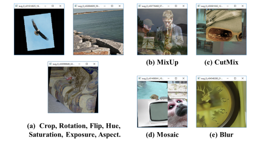

<font color=red>Self-Adversarial Training自对抗训练</font>:

```
新的数据增强方法，该技术分前后两个阶段进行:
在第一阶段，神经网络改变原始图像而不是网络权值。通过这种方式，神经网络对自身执行一种对抗性攻击，改变原始图像，从而造成图像上没有目标的假象。
在第二阶段，训练神经网络对修改后的图像进行正常的目标检测。
```

<font color=red>CmBN</font>:

```
CBN的修改版本，如下图所示，定义为跨微批量标准化(CmBN)。这仅收集a single batch中的mini-batch之间的统计信息。
```

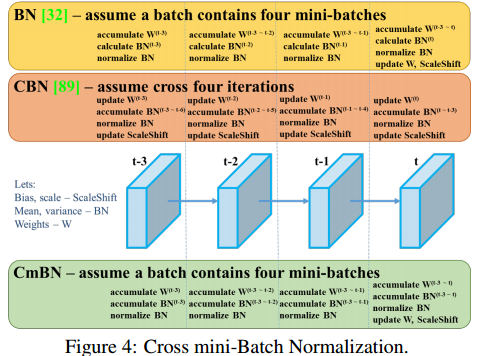

<font color=red>SAM改进</font>

将SAM从spatial-wise attention修改为point-wise attention，并将PAN的shortcut connection改为concatenation。如下图所示。

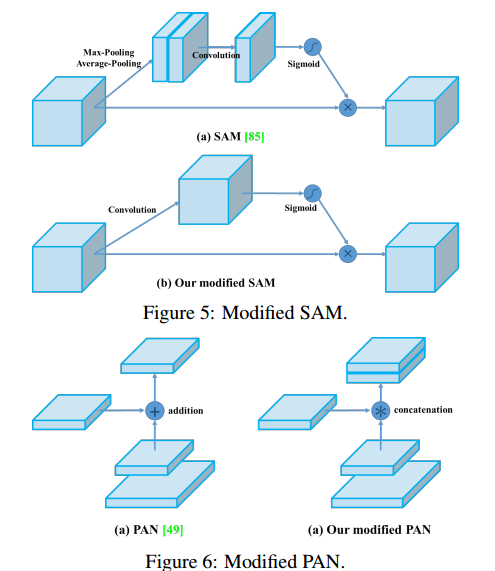

### 5.4  YOLOv4架构总结

 1.  **YOLOv4 架构:**

- <font color=red>Backbone</font>: CSPDarknet53

- <font color=red>Neck</font>: SPP, PAN 

- <font color=red>Head</font>: YOLOv3的Head

2.  **YOLOv4 使用的调优技巧：**

- Bof for backbone：CutMix和mosaic数据增强；DropBlock正则化；Class label Smoothing
- BoS for backbone : Mish activation，Cross-stage patial connections（CSP）,Multiinput weighted residual connections（MiWEC）
- BoF for detector：CIoU-loss，CmBN，DropBlock regularization，Mosaic data augmentation，Self-Adversarial Training，Eliminate grid sensitivity，Using multiple anchors for a single ground truth，Cosine annealing schedualer，Optimal hyper-parameters，Random training shapes
- Bos for detector：Mish activation，SPP-block，SAM-block，PAN path-aggregation block，DIoU-NMS

## 6  实验

### 6.1 实验建立

#### 6.1.1  ImageNet图像classification实验

默认的超参数如下:

- ==training step==：8,000,000;

- batch size：128;

- mini-batch size：32;

- polynomial decay learning strategy：initial learning rate 0.1

- warm-up steps：1000;

- momentum和weight衰减分别设置为0.9和0.005。

所有的BOS实验使用默认上述默认超参数，BOF实验中则增加额外的50%  training steps。

在BOF实验中，验证MixUp，CutMix，Mosaic，Bluring data augmentation， label smoothing regularization methods。

在BOS实验中，比较LReLU，Swish，Mish activation function。

所有实验在1080TI或者2080TIGPU上训练的。

#### 6.1.2  MS COCO 目标检测实验

默认的超参数如下:

- training steps：500500;
- step decay learning rate scheduling strategy：  初始学习速率0.01，在400000步和450000步分别乘以因子0.1;
- momentum衰减为0.9，weight衰减为0.0005。
- 所有的架构都使用一个GPU来执行batch size为64的多尺度训练，而mini-batch size为8或4取决于架构和GPU内存限制。

除了使用遗传算法进行超参数搜索实验外，其他实验均使用默认设置。

- 遗传算法利用YOLOv3-SPP进行带GIoU损失的训练，搜索300个epoch的min-val  5k sets
- 遗传算法实验采用search rata为0.00261、momentum为0.949、IoU阈值分配ground truth 0.213、loss normalizer为0.07。

### 6.2  不同features对classifier训练的影响

实验结果如下图所示：

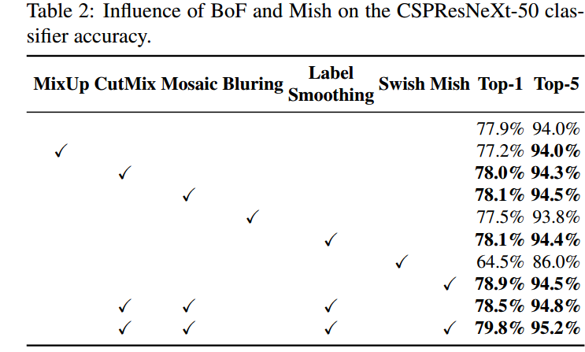

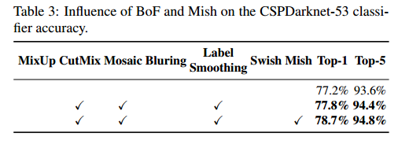


根据实验结果，将CutMix，Mosaic data augmentation以及Class label smoothing 用于分类训练，将Mish activation作为补充项。

### 6.3 不同features对Detector训练的影响

1.BoF对detector训练准确率的影响如下图所示：

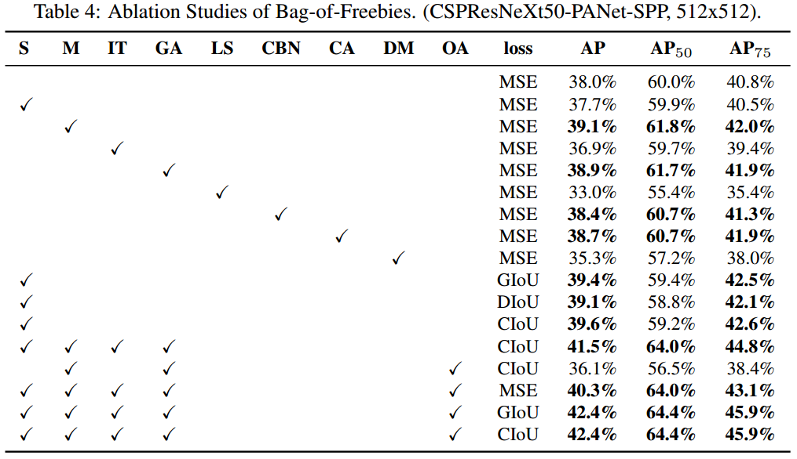

上图中各BoF注释：

- S：为解决$b_{x}= \sigma(t_{x})+c_{x}，b_{y}=\sigma(t_{y})+c_{y} $公式中，$b_{x},b_{y}$很难取值到$c_{x},c_{y}，c_{x}+1，c_{y}+1$的问题（需要$t_{x},t_{y}$很小很小或者很大很大才能取到），在sigmoid函数前面乘以一个大于1的系数，如$b_{x}=k \times \sigma(t_{x})+c_{x}，k > 1.0$。此即前面5.4节中的Eliminate grid sensitivity。
- M：Mosaic data augmentation(4-iamge mosaic)
- ==IT==：IoU threshold -- using multiple anchors for a sigle groud truth IoU（truth，anchor）>IoU_threshold
- ==GA==：在网络训练的前10%时间段内使用遗传算法Genetic algorithms选择最优超参数
- LS：使用Class label smoothing 用于sigmoid activation
- CBN：使用Cross mini-Batch Normalization收集整个batch的统计数据而不是收集单个mini-batch内的统计数据
- CA：Cosine annealing scheduler -- 改变 learning rate 在sinusoid training
- ==DM==：Dynamic mini-batch size -- 在小分辨率训练过程中使用Random training shapes自动增加mini-batch size
- ==OA==：Optimized Anchors -- 训练512×512的输入分辨率时，使用优化后的anchors
- GIoU，CIoU，DIoU，MSE -- 边界框回归时使用不同的损失函数

2.BoS对detector的影响

探究不同BoF对检测训练准确率的影响，包括PAN，RFB，SAM，Gaussian YOLO(G)以及ASFF，实验结果如下图所示。

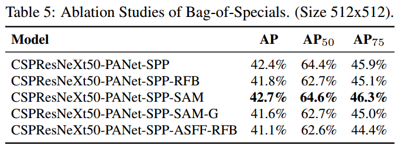

由实验结果可知，当使用SPP，PAN以及SAM时可以获得更好的表现。

### 6.4 不同backbone和预训练权重对detector training的影响

不同backbone对检测准确率的影响如下图所示：

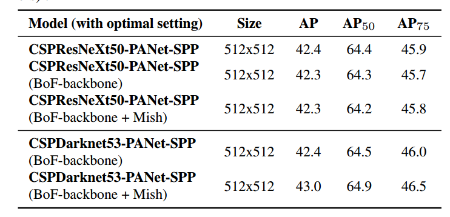

实验发现，分类准确率最高的模型不一定检测准确率最高。由上图实验结果最终选择backbone为CSPDarknet53

### 6.5  不同mini-batch size对检测器训练的影响

对使用不同mini-batch size进行训练的模型的分析结果如下图所示：

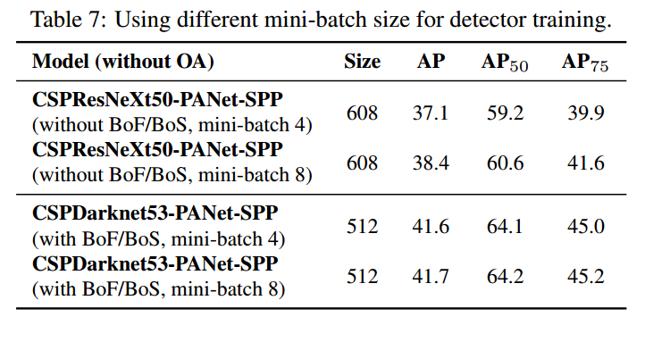

实验发现，在使用BoF和BoS后，mini-bath size的取值对detector的表现几乎没有影响。即不再需要使用昂贵的GPU进行训练，一个普通的GPU即可train一个很好的detector。

### 6.6 Results

YOLOv4与其他算法进行比较的结果如下图所示：

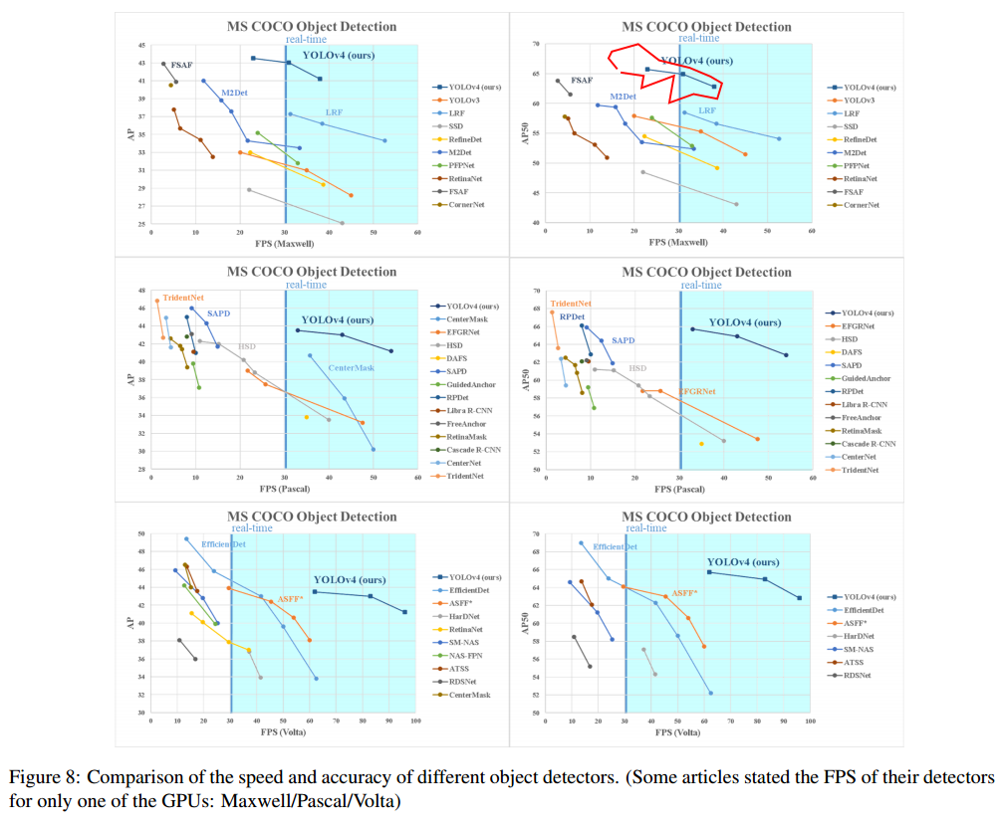

==这个图，每种算法都有几个点是什么意思？？==

实验结果：YOLOv4在相同准确率下速度最快，在相同速度下准确率最高。

## 7 可以吸收借鉴的点

- SPP:  能在几乎不降低network operation speed的条件下，显著提高感受野、分离出最重要的context features。

- PANet：通过自底向上的路径增强，利用准确的低层定位信号增强整个特征层次，从而缩短了低层与顶层特征之间的信息路径。

- 数据增强方法：Cutmix，Cutout，MixUp，Mosaic，SAT(Self-Adversarial Training)

- DropBlock正则化：通过dropout掉一部分相邻的整片的区域，网络就会去注重学习object的别的部位的特征，来实现正确分类，从而表现出更好的泛化

- Class label Smoothing：提高模型的泛化能力，一定程度上避免过拟合

- Mish activation：有望取代ReLu系列在激活函数的统治地位

- CmBN：用于batch-size较小（如使用单个普通GPU的条件）情况下的batch normalization

- Weighted-Residual-Connections：weighted-residual 可以更好更快的结合不同层传递过来的残差，虽然增加了一些计算量，但是当网络层数从100+增加到1000+时，网络效果更好，收敛得更快。公式是：

  ![[公式]](https://www.zhihu.com/equation?tex=x_%7Bi%2B1%7D+%3D+x_%7Bi%7D+%2B+%5Clambda_%7Bi%7D%5CDelta+L_i%28x_i%2C%5Ctheta_i%29%2C%5Clambda_i+%5Cin%28-1%2C1%29)

  ![[公式]](https://www.zhihu.com/equation?tex=%5Ctheta_i) 卷积网络参数， ![[公式]](https://www.zhihu.com/equation?tex=%5Clambda_i) 是控制残差的权重， ![[公式]](https://www.zhihu.com/equation?tex=%5CDelta+L_i) 是连续两个conv-BN-Relus。

- Cross-Stage-Partial-Connections用来减少计算量，在这种情况下甚至都不需要bottleneck。


## 8 存在的问题

论文未提及存在问题。


[YOLO-V4解读：速度与精度的完美结合](https://zhuanlan.zhihu.com/p/136172670)

[YOLOv4 详解](https://blog.csdn.net/baobei0112/article/details/105831613/)

[FPN](https://zhuanlan.zhihu.com/p/92005927)

[Spatial Pyramid Pooling](https://blog.csdn.net/Jeremy_lf/article/details/105902580)

[PANet](https://www.cnblogs.com/wzyuan/p/10029830.html)

[Cutmix,Cutout,MixUp简介](https://blog.csdn.net/weixin_38715903/article/details/103999227)

[正则化方法之DropBlock](https://blog.csdn.net/qq_14845119/article/details/85103503) 

[Label Smoothing](https://www.datalearner.com/blog/1051561454844661)

[Mish：一个新的state of the art的激活函数，ReLU的继任者](https://blog.csdn.net/u011984148/article/details/101444274)

[CBN(Cross-Iteration Batch Normalization)详解](https://www.freesion.com/article/1033876240/)

[神经网络中Epoch、Iteration、Batchsize相关理解和说明](https://blog.csdn.net/program_developer/article/details/78597738)

[深度学习中的BN_CBN_CmBN](https://blog.csdn.net/qq_35447659/article/details/107797737)

[CBAM: Convolutional Block Attention Module](https://zhuanlan.zhihu.com/p/65529934)

[Weighted-Residual-Connections；IOU,GIOU,DIOU,CIOU；Cross-Stage-Partial-Connections](https://zhuanlan.zhihu.com/p/136475787)

[学习率衰减策略之Cosine Annealing LR](https://zhuanlan.zhihu.com/p/336673856)

[Warm_Up，Random Shapes Training](https://blog.csdn.net/jacke121/article/details/106439743)

[学习率衰减 Learning Rate Decay](https://blog.csdn.net/zpalyq110/article/details/81585990)