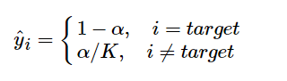
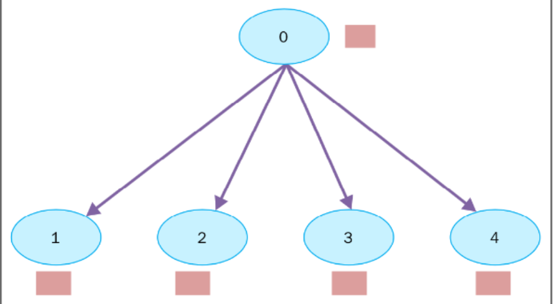
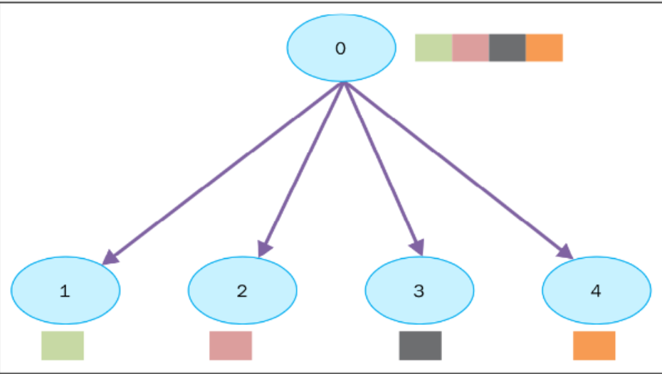
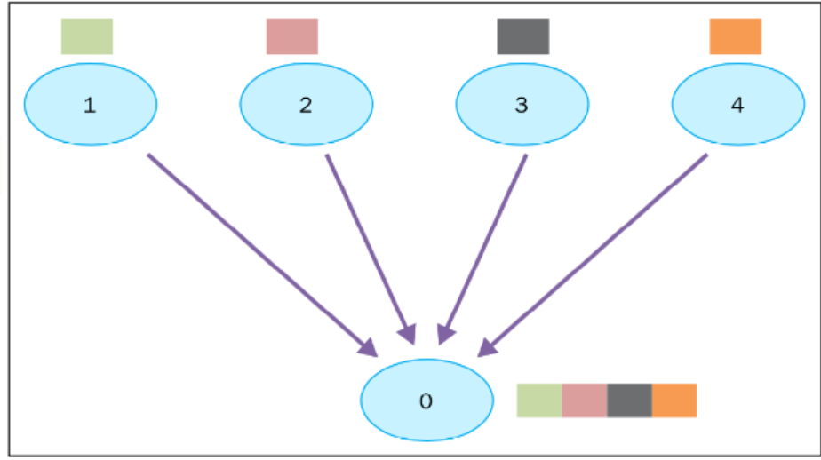
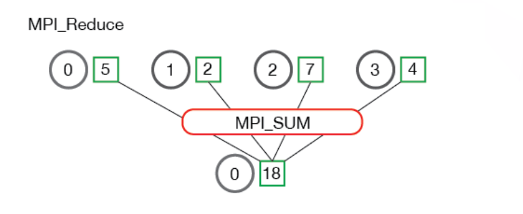
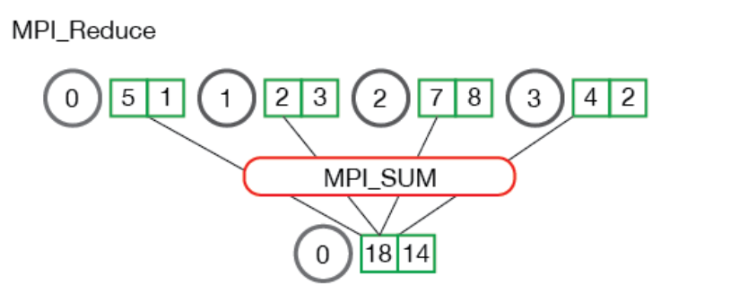
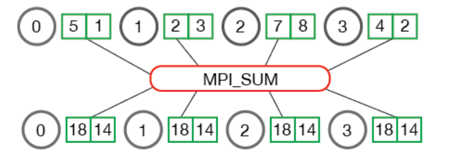

# Introduction

很像mmdecion，都是将模型，优化器等进行封装，然后可以灵活调用。

> Py**T**orch **Im**age **M**odels (`timm`) is a collection of image models, layers, utilities, optimizers, schedulers, data-loaders / augmentations, and reference training / validation scripts that aim to pull together a wide variety of SOTA models with ability to reproduce ImageNet training results.
>
> The work of many others is present here. I've tried to make sure all source material is acknowledged via links to github, arxiv papers, etc in the README, documentation, and code docstrings. Please let me know if I missed anything.

# Feature

- 所有模块都有通用的API接口
- 可以从模型中获取各个level的feature map（pool前后均可获取）
- 统一的预训练模型
- 分布式训练，直接使用DistributedDataParrellel或者使用Apex进行混合混合精度训练
- 动态全局池化。自动从average pooling, max pooling, average + max, or concat([average, max]) 中选择pool方式。默认情况下，所有全局池化都采用这种动态方式，并且与预训练的权重兼容
- A 'Test Time Pool' wrapper （未知）
- 多种Learning Rate schedulers、多种优化器optimizer、多种数据增广方法及其他tricks


# train.py源码解读（按源码顺序）

```python
import argparse       #  参数解析，用于程序与命令行交互
import time           #  记录时间戳
import yaml           #  使用python对yaml文件读写
import os             #  os.path文件路径操作,os.environ获取系统环境信息
import logging        #  日志输出，过滤
from collections import OrderedDict  #  有序字典
from contextlib import suppress      #  用于处理（忽略）异常
from datetime import datetime        #  用于处理时间和日期的标准库

import torch                         #  pytorch  模块
import torch.nn as nn                #  可以实现神经网络的各层运算，如卷积、池化、padding、激活(非线性层)、线性层、正则化层、其他损失函数Loss等，以及Sequential()这种将多个层弄到一个序列这样复杂的操作。
import torchvision.utils             #  给一个mini-batch的图像可以产生一个图像格网；utils.data.DistributedSample在DistributedDataParallel时使每个进程知道自己要处理数据的哪一部分
from torch.nn.parallel import DistributedDataParallel as NativeDDP  #  导入pytorch自身支持的DDP
```

[argparse用法](https://zhuanlan.zhihu.com/p/56922793)

[python中logging模块的一些简单用法](https://www.cnblogs.com/CJOKER/p/8295272.html)

[os.path总结](https://blog.csdn.net/Li_haiyu/article/details/80448028)

[suppress](https://blog.csdn.net/zhou_438/article/details/109293498)

[python 第三方模块 yaml - 处理 YAML （专门用来写配置文件的语言）](https://blog.csdn.net/fenglepeng/article/details/112331659)


==这一块待补充==

---

```python
# TODO  待读后续代码看其模块作用##################################################################################################
from timm.data import create_dataset, create_loader, resolve_data_config, Mixup, FastCollateMixup, AugMixDataset  
from timm.models import create_model, safe_model_name, resume_checkpoint, load_checkpoint,\
    convert_splitbn_model, model_parameters
from timm.utils import *
from timm.loss import LabelSmoothingCrossEntropy, SoftTargetCrossEntropy, JsdCrossEntropy
from timm.optim import create_optimizer_v2, optimizer_kwargs
from timm.scheduler import create_scheduler
from timm.utils import ApexScaler, NativeScaler
```

---

---


```python
# pytorch1.5之前使用AMP的方法 
try:
    from apex import amp  
    from apex.parallel import DistributedDataParallel as ApexDDP  #  导入apex支持的DDP
    from apex.parallel import convert_syncbn_model              # TODO????????????????
    has_apex = True                                            # 标志位：记录是否能成功导入apex
except ImportError:
    has_apex = False
```

```python
# pytorch1.6及以上版本使用AMP
has_native_amp = False  # 标志位，记录autocast能否被导入
try:               #autocast: 当进入autocast上下文后，在这之后的cuda ops会把tensor的数据类型转换为半精度浮点型， 从而在不损失训练精度的情况下加快运算。而不需要手动调用.half(),框架会自动完成转换。
    if getattr(torch.cuda.amp, 'autocast') is not None:  
        has_native_amp = True
except AttributeError:
    pass
```

[Pytorch自动混合精度(AMP)介绍与使用](https://www.cnblogs.com/jimchen1218/p/14315008.html)

> DataParallel流程如下图。各GPU进行前向传播的loss[i]传输到GPU0上，GPU0负责计算最后一层的gradient，然后将最后一层的gradient分发到各GPU进行BP计算出全部梯度。最后再将全部梯度累加到GPU0上。
>
> 

> DDP: **只有梯度会在进程/GPU之间传播，这样网络通信就不至于成为一个瓶颈了。**而DP通信时，除了梯度还有模型的weight，所以网络通信就成为了一个瓶颈，而GPU使用率也通常很低。
>
> During training, each process loads its own minibatches from disk and passes them to its GPU. Each GPU does its own forward pass, and then the gradients are all-reduced across the GPUs. Gradients for each layer do not depend on previous layers, so the gradient all-reduce is calculated concurrently with the backwards pass to futher alleviate the networking bottleneck. At the end of the backwards pass, every node has the averaged gradients, ensuring that the model weights stay synchronized.

- **GROUP**：进程组，大部分情况下DDP的各个进程是在同一个进程组下
- **WORLD_SIZE**：总的进程数量 (原则上一个process占用一个GPU是较优的)
- **RANK**：当前进程的序号，用于进程间通讯，rank = 0 的主机为 master 节点
- **LOCAL_RANK**：当前进程对应的GPU号
- **backend** str/Backend 是通信所用的后端，可以是”ncll” “gloo”或者是一个torch.distributed.Backend类（Backend.GLOO）
- **init_method** str 这个URL指定了如何初始化互相通信的进程
- **group_name** str 进程所在group的name


```python
torch.backends.cudnn.benchmark = True  #  设为True：会自动为卷积操作选择最优的算法。在网络结构固定、网络的输入形状不变时，可以实现网络的加速
_logger = logging.getLogger('train')   #  初始化一个logger日志对象，名称为train"
```

[torch.backends.cudnn.benchmark ?!](https://zhuanlan.zhihu.com/p/73711222)

>对于卷积这个操作来说，其实现方式是多种多样的。最简单的实现方式就是使用多层循环嵌套，对于每张输入图像，对于每个要输出的通道，对于每个输入的通道，选取一个区域，同指定卷积核进行卷积操作，然后逐行滑动，直到整张图像都处理完毕，这个方法一般被称为 direct 法，这个方法虽然简单，但是看到这么多循环，我们就知道效率在一般情况下不会很高了。除此之外，实现卷积层的算法还有基于 GEMM (General Matrix Multiply) 的，基于 FFT 的，基于 Winograd 算法的等等，而且每个算法还有自己的一些变体。在一个开源的 [C++ 库 triNNity](https://link.zhihu.com/?target=https%3A//www.scss.tcd.ie/~andersan/projects/live/triNNity.html) 中，就实现了接近 80 种的卷积前向传播算法！


```python
# The first arg parser parses out only the --config argument, this argument is used to
# load a yaml file containing key-values that override the defaults for the main parser below
#  即可通过自己的yaml文件解析 “training config”
config_parser = parser = argparse.ArgumentParser(description='Training Config', add_help=False)   
parser.add_argument('-c', '--config', default='', type=str, metavar='FILE',
                    help='YAML config file specifying default arguments')
```

- -c :  --config的简写

- --config：可选参数

- metaval： 

  metavar显示在帮助文档

  > 例如：parser.add_argument('--foo', metavar='YYY') 
  >       parser.add_argument('bar', metavar='XXX')

  在可选参数下，metavar将代替可选参数后面接的参数名，显示在帮助文档中

  在位置参数下，metavar将代替bar变量名，显示在帮助文档中


[Argparse Tutorial](https://docs.python.org/dev/howto/argparse.html#id1)


```python
# 若不通过上面的config文件配置，则使用下面的配置
# Dataset / Model parameters
 # 命令行中指定dataset的路径
parser.add_argument('data_dir', metavar='DIR',   
                    help='path to dataset') 
 # 命令行中指定dataset的类型，可选
parser.add_argument('--dataset', '-d', metavar='NAME', default='',    
                    help='dataset type (default: ImageFolder/ImageTar if empty)')
   
parser.add_argument('--train-split', metavar='NAME', default='train',  
                    help='dataset train split (default: train)')

parser.add_argument('--val-split', metavar='NAME', default='validation',       
                    help='dataset validation split (default: validation)')
# 默认模型为resnet101
parser.add_argument('--model', default='resnet101', type=str, metavar='MODEL',   
                    help='Name of model to train (default: "countception"')
#  默认模型为pretrained
parser.add_argument('--pretrained', action='store_true', default=False,       
                    help='Start with pretrained version of specified network (if avail)')
#  以文件形式指定模型初始参数
parser.add_argument('--initial-checkpoint', default='', type=str, metavar='PATH', 
                    help='Initialize model from this checkpoint (default: none)')
#  加载某个保存的模型及优化参数，可用于继续训练
parser.add_argument('--resume', default='', type=str, metavar='PATH',    
                    help='Resume full model and optimizer state from checkpoint (default: none)')
#  只resume模型不resume优化器参数，默认false
parser.add_argument('--no-resume-opt', action='store_true', default=False,
                    help='prevent resume of optimizer state when resuming model')
#  指定类别数
parser.add_argument('--num-classes', type=int, default=None, metavar='N',
                    help='number of label classes (Model default if None)')
#  global pool的类型
parser.add_argument('--gp', default=None, type=str, metavar='POOL',
                    help='Global pool type, one of (fast, avg, max, avgmax, avgmaxc). Model default if None.')
#  image_patch_size
parser.add_argument('--img-size', type=int, default=None, metavar='N',
                    help='Image patch size (default: None => model default)')
#  输入图像的[c,h,w]
parser.add_argument('--input-size', default=None, nargs=3, type=int,
                    metavar='N N N', help='Input all image dimensions (d h w, e.g. --input-size 3 224 224), uses model default if empty')
#  train的时候可以数据增强，val的时候数据增强相当于  输出值求平均
parser.add_argument('--crop-pct', default=None, type=float,
                    metavar='N', help='Input image center crop percent (for validation only)')
#  数据集的平均像素值
parser.add_argument('--mean', type=float, nargs='+', default=None, metavar='MEAN',
                    help='Override mean pixel value of dataset')
#  数据集的标准差
parser.add_argument('--std', type=float, nargs='+', default=None, metavar='STD',
                    help='Override std deviation of of dataset')
#  图像resize时的插值类型
parser.add_argument('--interpolation', default='', type=str, metavar='NAME',
                    help='Image resize interpolation type (overrides model)')
#  training 的 batch
parser.add_argument('-b', '--batch-size', type=int, default=32, metavar='N',
                    help='input batch size for training (default: 32)')
#  validation与train 的 batchsize比值
parser.add_argument('-vb', '--validation-batch-size-multiplier', type=int, default=1, metavar='N',
                    help='ratio of validation batch size to training batch size (default: 1)')

# Optimizer parameters
#  默认优化方法：SGD
parser.add_argument('--opt', default='sgd', type=str, metavar='OPTIMIZER',
                    help='Optimizer (default: "sgd"')
#  ADam的参数
parser.add_argument('--opt-eps', default=None, type=float, metavar='EPSILON',
                    help='Optimizer Epsilon (default: None, use opt default)')
#  ADam的参数
parser.add_argument('--opt-betas', default=None, type=float, nargs='+', metavar='BETA',
                    help='Optimizer Betas (default: None, use opt default)')
#  momontum=0.8
parser.add_argument('--momentum', type=float, default=0.9, metavar='M',
                    help='Optimizer momentum (default: 0.9)')
#  weight_decay=0.0001
parser.add_argument('--weight-decay', type=float, default=0.0001,
                    help='weight decay (default: 0.0001)')
#  默认不用梯度裁剪
parser.add_argument('--clip-grad', type=float, default=None, metavar='NORM',
                    help='Clip gradient norm (default: None, no clipping)')
#  梯度裁剪的方法
parser.add_argument('--clip-mode', type=str, default='norm',
                    help='Gradient clipping mode. One of ("norm", "value", "agc")')


# Learning rate schedule parameters
# step的方法更新LR
parser.add_argument('--sched', default='step', type=str, metavar='SCHEDULER',
                    help='LR scheduler (default: "step"')
#  LR初始值
parser.add_argument('--lr', type=float, default=0.01, metavar='LR',
                    help='learning rate (default: 0.01)')
#  LR noise
parser.add_argument('--lr-noise', type=float, nargs='+', default=None, metavar='pct, pct',
                    help='learning rate noise on/off epoch percentages')
parser.add_argument('--lr-noise-pct', type=float, default=0.67, metavar='PERCENT',
                    help='learning rate noise limit percent (default: 0.67)')
parser.add_argument('--lr-noise-std', type=float, default=1.0, metavar='STDDEV',
                    help='learning rate noise std-dev (default: 1.0)')
parser.add_argument('--lr-cycle-mul', type=float, default=1.0, metavar='MULT',
                    help='learning rate cycle len multiplier (default: 1.0)')
parser.add_argument('--lr-cycle-limit', type=int, default=1, metavar='N',
                    help='learning rate cycle limit')
#  warmup LR的初始值
parser.add_argument('--warmup-lr', type=float, default=0.0001, metavar='LR',
                    help='warmup learning rate (default: 0.0001)')
#  lr的最小值，达到此值便认为为0
parser.add_argument('--min-lr', type=float, default=1e-5, metavar='LR',
                    help='lower lr bound for cyclic schedulers that hit 0 (1e-5)')
#  train的总epochs
parser.add_argument('--epochs', type=int, default=200, metavar='N',
                    help='number of epochs to train (default: 2)')
#  每个epoch重复的次数，默认0
parser.add_argument('--epoch-repeats', type=float, default=0., metavar='N',
                    help='epoch repeat multiplier (number of times to repeat dataset epoch per train epoch).')
#  可以手动指定从哪个epoch开始继续
parser.add_argument('--start-epoch', default=None, type=int, metavar='N',
                    help='manual epoch number (useful on restarts)')
#  LR在多少个epoch开始改变
parser.add_argument('--decay-epochs', type=float, default=30, metavar='N',
                    help='epoch interval to decay LR')
#  warmup 持续多少个 epoch
parser.add_argument('--warmup-epochs', type=int, default=3, metavar='N',
                    help='epochs to warmup LR, if scheduler supports')
#  减少学习率之后恢复正常操作之前需要等待的epoch数
parser.add_argument('--cooldown-epochs', type=int, default=10, metavar='N',
                    help='epochs to cooldown LR at min_lr, after cyclic schedule ends')
# patience:多少个epoch网络没有提升就会更新学习率
parser.add_argument('--patience-epochs', type=int, default=10, metavar='N',
                    help='patience epochs for Plateau LR scheduler (default: 10')
# Lr = Lr*decay
parser.add_argument('--decay-rate', '--dr', type=float, default=0.1, metavar='RATE',
                    help='LR decay rate (default: 0.1)')

# Augmentation & regularization parameters
#  开启关闭 数据增广的总开关
parser.add_argument('--no-aug', action='store_true', default=False,
                    help='Disable all training augmentation, override other train aug args')
#  RandomResize 的 scale
parser.add_argument('--scale', type=float, nargs='+', default=[0.08, 1.0], metavar='PCT',
                    help='Random resize scale (default: 0.08 1.0)')
#  Random resize 的 aspect ratio
parser.add_argument('--ratio', type=float, nargs='+', default=[3./4., 4./3.], metavar='RATIO',
                    help='Random resize aspect ratio (default: 0.75 1.33)')
#  每张图片进行Horizontal flip 的概率
parser.add_argument('--hflip', type=float, default=0.5,
                    help='Horizontal flip training aug probability')
#  每张图片进行Vertical flip 的概率
parser.add_argument('--vflip', type=float, default=0.,
                    help='Vertical flip training aug probability')
#  对颜色的数据增强:图像亮度、饱和度、对比度变化
parser.add_argument('--color-jitter', type=float, default=0.4, metavar='PCT',
                    help='Color jitter factor (default: 0.4)')
#  AutoAugment v0
parser.add_argument('--aa', type=str, default=None, metavar='NAME',
                    help='Use AutoAugment policy. "v0" or "original". (default: None)'),
#  一组几个operation
parser.add_argument('--aug-splits', type=int, default=0,
                    help='Number of augmentation splits (default: 0, valid: 0 or >=2)')
#  Coda论文
parser.add_argument('--jsd', action='store_true', default=False,
                    help='Enable Jensen-Shannon Divergence + CE loss. Use with `--aug-splits`.')
#  Random erase prob
parser.add_argument('--reprob', type=float, default=0., metavar='PCT',
                    help='Random erase prob (default: 0.)')
#  Random erase mode
parser.add_argument('--remode', type=str, default='const',
                    help='Random erase mode (default: "const")')
# Random erase count
parser.add_argument('--recount', type=int, default=1,
                    help='Random erase count (default: 1)')
parser.add_argument('--resplit', action='store_true', default=False,
                    help='Do not random erase first (clean) augmentation split')
# mixup alpha
parser.add_argument('--mixup', type=float, default=0.0,
                    help='mixup alpha, mixup enabled if > 0. (default: 0.)')
parser.add_argument('--cutmix', type=float, default=0.0,
                    help='cutmix alpha, cutmix enabled if > 0. (default: 0.)')
parser.add_argument('--cutmix-minmax', type=float, nargs='+', default=None,
                    help='cutmix min/max ratio, overrides alpha and enables cutmix if set (default: None)')
parser.add_argument('--mixup-prob', type=float, default=1.0,
                    help='Probability of performing mixup or cutmix when either/both is enabled')
# mixup与cutmix都enable时，使用mixup的概率
parser.add_argument('--mixup-switch-prob', type=float, default=0.5,
                    help='Probability of switching to cutmix when both mixup and cutmix enabled')
parser.add_argument('--mixup-mode', type=str, default='batch',
                    help='How to apply mixup/cutmix params. Per "batch", "pair", or "elem"')
# Turn off mixup after this epoch, disabled if 0
parser.add_argument('--mixup-off-epoch', default=0, type=int, metavar='N',
                    help='Turn off mixup after this epoch, disabled if 0 (default: 0)')
# Label smoothing
parser.add_argument('--smoothing', type=float, default=0.1,
                    help='Label smoothing (default: 0.1)')
#  怎么理解训练的时候插值？？？self supvised相关内容
parser.add_argument('--train-interpolation', type=str, default='random',
                    help='Training interpolation (random, bilinear, bicubic default: "random")')
# 每个unit被drop的概率
parser.add_argument('--drop', type=float, default=0.0, metavar='PCT',
                    help='Dropout rate (default: 0.)')
# Drop connect是对dropout的改进。drop的是某一weight
parser.add_argument('--drop-connect', type=float, default=None, metavar='PCT',
                    help='Drop connect rate, DEPRECATED, use drop-path (default: None)')
# 与Dropout的不同之处在于，该方法drop整个ResBlock，而Dropout在训练期间只drop一部分unit。
parser.add_argument('--drop-path', type=float, default=None, metavar='PCT',
                    help='Drop path rate (default: None)')
# Dropblcok的概率
parser.add_argument('--drop-block', type=float, default=None, metavar='PCT',
                    help='Drop block rate (default: None)')

# Batch norm parameters (only works with gen_efficientnet based models currently)
parser.add_argument('--bn-tf', action='store_true', default=False,
                    help='Use Tensorflow BatchNorm defaults for models that support it (default: False)')
# EMA指数加权移动平均的momentum
parser.add_argument('--bn-momentum', type=float, default=None,
                    help='BatchNorm momentum override (if not None)')
# eps，防止归一化时分母为0
parser.add_argument('--bn-eps', type=float, default=None,
                    help='BatchNorm epsilon override (if not None)')
# 使用apex或者torch的同步BN
parser.add_argument('--sync-bn', action='store_true',
                    help='Enable NVIDIA Apex or Torch synchronized BatchNorm.')
#  同步bn的状态,reduce还是broadcast
parser.add_argument('--dist-bn', type=str, default='',
                    help='Distribute BatchNorm stats between nodes after each epoch ("broadcast", "reduce", or "")')
#  每个augmentation split是否单独BN
parser.add_argument('--split-bn', action='store_true',
                    help='Enable separate BN layers per augmentation split.')

# Model Exponential Moving Average
# 是否用EMA的方式计算模型的均值
parser.add_argument('--model-ema', action='store_true', default=False,
                    help='Enable tracking moving average of model weights')
#  使用CPU计算EMA
parser.add_argument('--model-ema-force-cpu', action='store_true', default=False,
                    help='Force ema to be tracked on CPU, rank=0 node only. Disables EMA validation.')
#  EMA的decay_factor
parser.add_argument('--model-ema-decay', type=float, default=0.9998,
                    help='decay factor for model weights moving average (default: 0.9998)')

#  Misc
parser.add_argument('--seed', type=int, default=42, metavar='S',
                    help='random seed (default: 42)')
#  每多少个batches通过logging输出一次training的信息
parser.add_argument('--log-interval', type=int, default=50, metavar='N',
                    help='how many batches to wait before logging training status')
#  每多少个batches记录一次recovery checkpoint
parser.add_argument('--recovery-interval', type=int, default=0, metavar='N',
                    help='how many batches to wait before writing recovery checkpoint')
#  保存Checkpoint文件的数量
parser.add_argument('--checkpoint-hist', type=int, default=10, metavar='N',
                    help='number of checkpoints to keep (default: 10)')
#  使用多少个进程
parser.add_argument('-j', '--workers', type=int, default=4, metavar='N',
                    help='how many training processes to use (default: 1)')
#  处于debug的目的，每次记录log信息时都保存相应图片
parser.add_argument('--save-images', action='store_true', default=False,
                    help='save images of input bathes every log interval for debugging')
#  使用NVIDIA Apex AMP 还是 Native AMP进行混合进度训练
parser.add_argument('--amp', action='store_true', default=False,
                    help='use NVIDIA Apex AMP or Native AMP for mixed precision training')
#  使用NVIDIA Apex AMP进行混合进度训练
parser.add_argument('--apex-amp', action='store_true', default=False,
                    help='Use NVIDIA Apex AMP mixed precision')
#  使用 Native AMP进行混合进度训练
parser.add_argument('--native-amp', action='store_true', default=False,
                    help='Use Native Torch AMP mixed precision')
#  是否使用 channels-last 的方式组织 strides structure
parser.add_argument('--channels-last', action='store_true', default=False,
                    help='Use channels_last memory layout')
#  Pin CPU memory in DataLoader for more efficient (sometimes) transfer to GPU
parser.add_argument('--pin-mem', action='store_true', default=False,
                    help='Pin CPU memory in DataLoader for more efficient (sometimes) transfer to GPU.')
#  disable fast prefetcher
parser.add_argument('--no-prefetcher', action='store_true', default=False,
                    help='disable fast prefetcher')
#  指定输出的文件夹
parser.add_argument('--output', default='', type=str, metavar='PATH',
                    help='path to output folder (default: none, current dir)')
#  train experiment
parser.add_argument('--experiment', default='', type=str, metavar='NAME',
                    help='name of train experiment, name of sub-folder for output')
#  评价指标，top1，ap等
parser.add_argument('--eval-metric', default='top1', type=str, metavar='EVAL_METRIC',
                    help='Best metric (default: "top1"')
#  是否在test/inference的时候采用数据增广
parser.add_argument('--tta', type=int, default=0, metavar='N',
                    help='Test/inference time augmentation (oversampling) factor. 0=None (default: 0)')
#  local_rank指定了输出设备，默认为GPU可用列表中的第一个GPU，必须加上
parser.add_argument("--local_rank", default=0, type=int)
#  提前load多个epoch的数据
parser.add_argument('--use-multi-epochs-loader', action='store_true', default=False,
                    help='use the multi-epochs-loader to save time at the beginning of every epoch')
#  将模型转换为torchscript
parser.add_argument('--torchscript', dest='torchscript', action='store_true',
                    help='convert model torchscript for inference')
```

[pytorch常用的学习率设置方式](https://blog.csdn.net/GrayOnDream/article/details/98518970)

[AutoAugment系列总结(1)](https://zhuanlan.zhihu.com/p/92949640)

>AA：首先是定义搜索空间, 文中将policy分成五个sub policy, 每个sub policy包括两个operation, 每个operation包括两个值,分别是概率和大小. 为了缩小搜索空间,将操作离散化, 将大小离散成10个值, 将概率离散成11个值. 每个sub policy有16个operation, 那么整个sub policy的搜索空间为 ![[公式]](https://www.zhihu.com/equation?tex=%2810%5Ctimes11%5Ctimes16%29%5E2) ,一共有5个sub policy,所以整个policy的搜索空间为 ![[公式]](https://www.zhihu.com/equation?tex=%2810%5Ctimes11%5Ctimes16%29%5E%7B10%7D)
>
>作者用PPO,本质上是policy gradient, 训一个rnn controller, policy gradient的reward为child model在验证集上的accuracy.

[目标检测中图像增强，mixup 如何操作？](https://www.zhihu.com/question/308572298?sort=created)

>1.对于输入的一个batch的待测图片images，我们将其和随机抽取的图片进行融合，融合比例为lam，得到混合张量inputs；
>
>2.第1步中图片融合的比例lam是[0,1]之间的随机实数，符合beta分布，相加时两张图对应的每个像素值直接相加，即 inputs = lam\*images + (1-lam)\*images_random；
>
>3.将1中得到的混合张量inputs传递给model得到输出张量outpus，随后计算损失函数时，我们针对两个图片的标签分别计算损失函数，然后按照比例lam进行损失函数的加权求和，即loss = lam * criterion(outputs, targets_a) + (1 - lam) * criterion(outputs, targets_b)；

[论文阅读笔记CutMix：数据增强](https://blog.csdn.net/weixin_38715903/article/details/103999227)

>和是两个不同的训练样本，和是对应的标签值，CutMix需要生成的是新的训练样本和对应标签：和，公式如下：
>
>​                                                 
>
>​                                                         
>
>是为了dropd掉部分区域和进行填充的二进制掩码，是逐像素相乘，是所有元素都为1 的二进制掩码，与Mixup一样属于Beta分布：，令则服从（0，1）的均匀分布。
>
>为了对二进制掩进行采样，首先要对剪裁区域的边界框进行采样，用来对样本和做裁剪区域的指示标定。在论文中对矩形掩码进行采样（长宽与样本大小成比例）。
>
>剪裁区域的边界框采样公式如下：
>
>​                                                
>
>​                                                 
>
>保证剪裁区域的比例为，确定好裁剪区域之后，将制掩中的裁剪区域置0，其他区域置1。就完成了掩码的采样，然后将样本A中的剪裁区域移除，将样本B中的剪裁区域进行裁剪然后填充到样本A。

[标签平滑（Label Smoothing）详解](https://www.cnblogs.com/irvingluo/p/13873699.html)

>传统one-hot编码标签的网络学习过程中，鼓励模型预测为目标类别的概率趋近1，非目标类别的概率趋近0，即最终预测的logits向量（logits向量经过softmax后输出的就是预测的所有类别的概率分布）中目标类别zizi的值会趋于无穷大，使得模型向预测正确与错误标签的logit差值无限增大的方向学习，而过大的logit差值会使模型缺乏适应性，对它的预测过于自信。在训练数据不足以覆盖所有情况下，这就会导致网络过拟合，泛化能力差，而且实际上有些标注数据不一定准确，这时候使用交叉熵损失函数作为目标函数也不一定是最优的了。
>
>label smoothing结合了均匀分布，用更新的标签向量y^iy^i来替换传统的ont-hot编码的标签向量yhotyhot:
>
>
>
>其中K为多分类的类别总个数，αα是一个较小的超参数（一般取0.1），即

[Deep learning：四十六(DropConnect简单理解)](https://www.cnblogs.com/tornadomeet/p/3430312.html)

>DropConnect的思想也很简单，与Dropout不同的是，它不是随机将隐含层节点的输出清0,而是将节点中的每个与其相连的输入权值以1-p的概率清0。（一个是输出，一个是输入）
>
>

[DropBlock](https://blog.csdn.net/qq_14845119/article/details/85103503)

>
>
>DropBlock 模块主要有2个参数，block_size，γ。block_size：表示dropout的方块的大小（长，宽），当block_size=1，DropBlock 退化为传统的dropout，正常可以取3，5，7
>
>γ：表示drop过程中的概率

对于BN:

```python
"""
param:x    : 输入数据，设shape(B,L)
param:gama : 缩放因子  γ
param:beta : 平移因子  β
param:bn_param   : batchnorm所需要的一些参数
    eps      : 接近0的数，防止分母出现0
    momentum : 动量参数，一般为0.9， 0.99， 0.999
    running_mean ：滑动平均的方式计算新的均值，训练时计算，为测试数据做准备
    running_var  : 滑动平均的方式计算新的方差，训练时计算，为测试数据做准备
"""
# 训练时，使用每个batch对应的神经网络层的输入的均值；测试时，使用的是所有训练数据的均值对应的神经网络层的输入的均值进行BN
 	running_mean = momentum * running_mean + (1 - momentum) * x_mean  #  指数加权移动平均
    running_var = momentum * running_var + (1 - momentum) * x_var   #  指数加权移动平均
    
```

[这么骚！Batch Normalization 还能多卡同步？（附源码解析）](https://www.jianshu.com/p/794f142e9d1a)

>Sync_bn:
>
>首先，每张卡上的 SyncBN 各自计算出 mini-batch 的和以及平方和，然后主卡上的 SyncBN 收集来自各个子卡的计算结果，从而计算出全局的均值和方差，接着发放回各个子卡，最后各子卡的 SyncBN 收到来自主卡返回的计算结果各自进行归一化（和缩放平移）操作。当然，主卡上的 SyncBN 计算出全局统计量后就可以进行它的归一化（和缩放平移）操作了。

[Broadcast,Scatter,Gather,Reduce,All-reduce分别是什么？](https://www.cnblogs.com/marsggbo/p/11497780.html)

> 1.Broadcast:看名字就很好理解了，其实就是把同一份数据分发广播给所有人，示意图如下：
>
> ​	
> 2.Scatter:不同于Broadcast， scatter可以将不同数据分发给不同的进程。
>
> 
>
> 3.Gather:这个也很好理解，就是把多个进程的数据拼凑在一起。
>
> 
>
> **4.Reduce**:reduce就是将多个进程中的数据按照指定的映射函数进行运算得到最后的结果存在一个进程中，例如下面两个图中的归约操作都是求和，将4个不同进程的数据归约求和后存在了第一个进程中
>
> 
>
> 
>
> **5.All-Reduce**	: All-reduce与reduce的区别就在于后者最后的结果是只保存在一个进程中，而All-reduce需要每个进程都有同样的结果。所以All-reduce一般包含scatter操作，所以有时候也会看到reduce-scatter这种说法，其实reduce-scatter可以看成是all reduce的一种实现方式
>
> 

[What is Channels Last](https://pytorch.org/tutorials/intermediate/memory_format_tutorial.html)

> Channels last memory format is an alternative way of ordering NCHW tensors in memory preserving dimensions ordering. Channels last tensors ordered in such a way that channels become the densest dimension (aka storing images pixel-per-pixel).
>
> Pytorch supports memory formats (and provides back compatibility with existing models including eager, JIT, and TorchScript) by utilizing existing strides structure. For example, 10x3x16x16 batch in Channels last format will have strides equal to (768, 1, 48, 3).

Memory Pinning

>Host to GPU copies are much faster when they originate from pinned (page-locked) memory. See [Use pinned memory buffers](https://pytorch.org/docs/stable/notes/cuda.html#cuda-memory-pinning) for more details on when and how to use pinned memory generally.
>
>For data loading, passing `pin_memory=True` to a [`DataLoader`](https://pytorch.org/docs/stable/data.html#torch.utils.data.DataLoader) will automatically put the fetched data Tensors in pinned memory, and thus enables faster data transfer to CUDA-enabled GPUs.

[TORCHSCRIPT FOR DEPLOYMEN](https://pytorch.org/tutorials/recipes/torchscript_inference.html)

> **TorchScript** is an intermediate representation of a PyTorch model (subclass of `nn.Module`) that can then be run in a high-performance environment like C++. It’s a high-performance subset of Python that is meant to be consumed by the **PyTorch JIT Compiler,** which performs run-time optimization on your model’s computation. TorchScript is the recommended model format for doing scaled inference with PyTorch models. 


```python
def _parse_args():
    # 如果配置文件存在，将配置文件中设置设为默认值。
    # Do we have a config file to parse?
    args_config, remaining = config_parser.parse_known_args()  
    if args_config.config:
        with open(args_config.config, 'r') as f:
            cfg = yaml.safe_load(f)
            parser.set_defaults(**cfg)

    # 解析出yaml文档中不匹配的设置
    # The main arg parser parses the rest of the args, the usual
    # defaults will have been overridden if config file specified.
    args = parser.parse_args(remaining)
	
    # 不匹配部分保存为args_text
    # Cache the args as a text string to save them in the output dir later
    args_text = yaml.safe_dump(args.__dict__, default_flow_style=False)
    return args, args_text
```

`ArgumentParser.parse_known_args`(*args=None*, *namespace=None*)[¶](https://docs.python.org/3/library/argparse.html?highlight=parse_known_args#argparse.ArgumentParser.parse_known_args)

> Sometimes a script may only parse a few of the command-line arguments, passing the remaining arguments on to another script or program. In these cases, the [`parse_known_args()`](https://docs.python.org/3/library/argparse.html?highlight=parse_known_args#argparse.ArgumentParser.parse_known_args) method can be useful. It works much like [`parse_args()`](https://docs.python.org/3/library/argparse.html?highlight=parse_known_args#argparse.ArgumentParser.parse_args) except that it does not produce an error when extra arguments are present. Instead, it returns a two item tuple containing the populated namespace and the list of remaining argument strings.

`yaml.safe_load()`:将yaml格式文件转换为python值（字典）

`ArgumentParser.set_defaults()`:可以设置一些参数的默认值

> parser = argparse.ArgumentParser()
> parser.add_argument('foo', type=int)
> parser.set_defaults(bar=123, baz='test')
> parser.parse_args(['456'])
> Namespace(bar=123, baz='test', foo=456)

`yaml.safe_dump()`：将一个python值转换为yaml格式文件，示例如下

> import yaml
> dict_data = {'a': 1, 'b': 2}
> with open('data.yaml', 'w', encoding='UTF-8') as yaml_file:
>   yaml.safe_dump(dict_data, yaml_file)


```python
def main():
    # timm.utils.log.py中的函数，设置默认的log输出
    setup_default_logging()
    # 得到未匹配的配置的namespace， 文件
    args, args_text = _parse_args()
	
    # prefetcher设置
    args.prefetcher = not args.no_prefetcher
    # 默认设置为不使用 分布式
    args.distributed = False
    # WORLD_SIZE为总进程数。若总进程数>1，则distributed标志位为True
    if 'WORLD_SIZE' in os.environ:
        args.distributed = int(os.environ['WORLD_SIZE']) > 1
    # 默认使用可见的第一个GPU
    args.device = 'cuda:0'
    # 进程数为1
    args.world_size = 1
    # 当前机器的rank
    args.rank = 0  # global rank
    if args.distributed:  # 若采用分布式训练
        args.device = 'cuda:%d' % args.local_rank  
        torch.cuda.set_device(args.local_rank)
        torch.distributed.init_process_group(backend='nccl', init_method='env://')
        args.world_size = torch.distributed.get_world_size()
        args.rank = torch.distributed.get_rank()
        _logger.info('Training in distributed mode with multiple processes, 1 GPU per process. Process %d, total %d.'
                     % (args.rank, args.world_size))
    else: # 单卡训练，info日志信息
        _logger.info('Training with a single process on 1 GPUs.')
    assert args.rank >= 0

    
    # resolve AMP arguments based on PyTorch / Apex availability
    use_amp = None # 默认不使用amp

    if args.amp:  #  配置args中参数。args优先配置args.native_amp
        # `--amp` chooses native amp before apex (APEX ver not actively maintained)
        if has_native_amp:
            args.native_amp = True
        elif has_apex:
            args.apex_amp = True
    #  如果能import apex的amp 并且 不能使用cuda自带的amp，则将use_amp标志置为“apex”
    if args.apex_amp and has_apex:
        use_amp = 'apex'
    #  如果能导入pytorch自带的amp，则将use_amp标志置为“native”
    elif args.native_amp and has_native_amp:
        use_amp = 'native'
    #  如果pytorch自带的amp和apex的amp均无法使用，则logging一个warning信息
    elif args.apex_amp or args.native_amp:
        _logger.warning("Neither APEX or native Torch AMP is available, using float32. "
                        "Install NVIDA apex or upgrade to PyTorch 1.6")
	# 设置随机种子
    random_seed(args.seed, args.rank)

    model = create_model(
        args.model, # model name
        pretrained=args.pretrained, # load pretrained ImageNet-1k weights if true
        num_classes=args.num_classes, #   类别数
        drop_rate=args.drop,  # dropout rate
        drop_connect_rate=args.drop_connect,  # DEPRECATED, use drop_path
        drop_path_rate=args.drop_path,     # drop path rate
        drop_block_rate=args.drop_block,  # dropblock rate
        global_pool=args.gp,  # global pool的类型
        bn_tf=args.bn_tf,   #  # tensorflow 的bn
        bn_momentum=args.bn_momentum, # bn.momentum
        bn_eps=args.bn_eps,  #  bn的eps
        scriptable=args.torchscript, # 能否转换为torchscript
        checkpoint_path=args.initial_checkpoint) #path of checkpoint to load after model is initialized
    if args.num_classes is None: 
        assert hasattr(model, 'num_classes'), 'Model must have `num_classes` attr if not set on cmd line/config.'
        args.num_classes = model.num_classes  # FIXME handle model default vs config num_classes more elegantly
	
    if args.local_rank == 0: # 若local_rank为GPU 0，则log模型的总参数量
        _logger.info( 
            f'Model {safe_model_name(args.model)} created, param count:{sum([m.numel() for m in model.parameters()])}')
	# 将namespace格式的args转为字典格式。resolve_data_config()用途：Resolve input/image size， resolve interpolation method，resolve dataset + model mean for normalization ，resolve dataset + model std deviation for normalization， resolve default crop percentage
    data_config = resolve_data_config(vars(args), model=model, verbose=args.local_rank == 0)

    # setup augmentation batch splits for contrastive loss or split bn
    # 论文"Adversarial Examples Improve Image Recognition"的方法
    num_aug_splits = 0
    if args.aug_splits > 0:
        assert args.aug_splits > 1, 'A split of 1 makes no sense'
        num_aug_splits = args.aug_splits

    # enable split bn (separate bn stats per batch-portion)
    if args.split_bn:
        assert num_aug_splits > 1 or args.resplit
        model = convert_splitbn_model(model, max(num_aug_splits, 2))

    # move model to GPU, enable channels last layout if set
    model.cuda()  #  转换为GPU模型
    if args.channels_last:
        model = model.to(memory_format=torch.channels_last) # channels last可以优化存储方式

    # setup synchronized BatchNorm for distributed training
    if args.distributed and args.sync_bn:
        assert not args.split_bn  # 看来split bn与sync_bn不可同时使用
        if has_apex and use_amp != 'native':  
            # Apex SyncBN preferred unless native amp is activated
            model = convert_syncbn_model(model)
        else:
            model = torch.nn.SyncBatchNorm.convert_sync_batchnorm(model)
        if args.local_rank == 0:
            _logger.info(
                'Converted model to use Synchronized BatchNorm. WARNING: You may have issues if using '
                'zero initialized BN layers (enabled by default for ResNets) while sync-bn enabled.')
	# torchscript不能转换apex和syscbatchNorm 模型
    if args.torchscript:
        assert not use_amp == 'apex', 'Cannot use APEX AMP with torchscripted model'
        assert not args.sync_bn, 'Cannot use SyncBatchNorm with torchscripted model'
        model = torch.jit.script(model)
	# 优化器配置
    optimizer = create_optimizer_v2(model, **optimizer_kwargs(cfg=args))

    # setup automatic mixed-precision (AMP) loss scaling and op casting
    amp_autocast = suppress  # do nothing当进入autocast上下文后，在这之后的cuda ops会把tensor的数据类型转换为半精度浮点型，从而在不损失训练精度的情况下加快运算
    loss_scaler = None # 　scaler的大小在每次迭代中动态估计，为了尽可能减少梯度underflow，scaler应该更大；但太大，半精度浮点型又容易overflow（变成inf或NaN).所以，动态估计原理就是在不出现if或NaN梯度的情况下，尽可能的增大scaler值。
    if use_amp == 'apex':
        model, optimizer = amp.initialize(model, optimizer, opt_level='O1')
        loss_scaler = ApexScaler()
        if args.local_rank == 0:
            _logger.info('Using NVIDIA APEX AMP. Training in mixed precision.')
    elif use_amp == 'native':
        amp_autocast = torch.cuda.amp.autocast
        loss_scaler = NativeScaler()
        if args.local_rank == 0:
            _logger.info('Using native Torch AMP. Training in mixed precision.')
    else:
        if args.local_rank == 0:
            _logger.info('AMP not enabled. Training in float32.')

    # optionally resume from a checkpoint  恢复训练
    resume_epoch = None
    if args.resume:
        resume_epoch = resume_checkpoint(
            model, args.resume, # args.resume实际是checkpoint file的路径文件
            optimizer=None if args.no_resume_opt else optimizer,  
            loss_scaler=None if args.no_resume_opt else loss_scaler,
            log_info=args.local_rank == 0)

    # setup exponential moving average of model weights, SWA could be used here too
    model_ema = None  #  modelEMA可用于EfficientNet等场合
    if args.model_ema:
        # Important to create EMA model after cuda(), DP wrapper, and AMP but before SyncBN and DDP wrapper
        model_ema = ModelEmaV2(
            model, decay=args.model_ema_decay, device='cpu' if args.model_ema_force_cpu else None)
        if args.resume:
            load_checkpoint(model_ema.module, args.resume, use_ema=True)
	
    # setup distributed training
    if args.distributed:  
        if has_apex and use_amp != 'native':
            # Apex DDP preferred unless native amp is activated
            if args.local_rank == 0:
                _logger.info("Using NVIDIA APEX DistributedDataParallel.")
            model = ApexDDP(model, delay_allreduce=True)
        else:
            if args.local_rank == 0:
                _logger.info("Using native Torch DistributedDataParallel.")
            model = NativeDDP(model, device_ids=[args.local_rank])  # can use device str in Torch >= 1.1
        # NOTE: EMA model does not need to be wrapped by DDP

    # setup learning rate schedule and starting epoch
    lr_scheduler, num_epochs = create_scheduler(args, optimizer)
    start_epoch = 0
    if args.start_epoch is not None:
        # a specified start_epoch will always override the resume epoch
        start_epoch = args.start_epoch
    elif resume_epoch is not None:
        start_epoch = resume_epoch
    if lr_scheduler is not None and start_epoch > 0:
        lr_scheduler.step(start_epoch)  #  更新values，values具体指代学习率

    if args.local_rank == 0:
        _logger.info('Scheduled epochs: {}'.format(num_epochs))

    # create the train and eval datasets
    dataset_train = create_dataset( 
        args.dataset,  # dataset type
        root=args.data_dir, split=args.train_split, is_training=True,
        batch_size=args.batch_size, repeats=args.epoch_repeats)
    dataset_eval = create_dataset(
        args.dataset, root=args.data_dir, split=args.val_split, is_training=False, batch_size=args.batch_size)

    # setup mixup / cutmix
    collate_fn = None  
    mixup_fn = None
    mixup_active = args.mixup > 0 or args.cutmix > 0. or args.cutmix_minmax is not None
    if mixup_active:
        mixup_args = dict(# 各参数意义见Mixup类有注释
            mixup_alpha=args.mixup, cutmix_alpha=args.cutmix, cutmix_minmax=args.cutmix_minmax,
            prob=args.mixup_prob, switch_prob=args.mixup_switch_prob, mode=args.mixup_mode,
            label_smoothing=args.smoothing, num_classes=args.num_classes)
        if args.prefetcher:   
            assert not num_aug_splits  # collate conflict (need to support deinterleaving in collate mixup)
            collate_fn = FastCollateMixup(**mixup_args)  
        else:
            mixup_fn = Mixup(**mixup_args)

    # wrap dataset in AugMix helper
    if num_aug_splits > 1:
        dataset_train = AugMixDataset(dataset_train, num_splits=num_aug_splits)

    # create data loaders w/ augmentation pipeiine
    train_interpolation = args.train_interpolation
    # 若设置不进行数据增广或者不指定train的插值方式，则使用默认插值方式
    if args.no_aug or not train_interpolation: 
        train_interpolation = data_config['interpolation']
    loader_train = create_loader(  
        dataset_train,  #  数据集
        input_size=data_config['input_size'], #输入图像的size [C,H,W]
        batch_size=args.batch_size,  #  batch_size
        is_training=True,  
        use_prefetcher=args.prefetcher,
        no_aug=args.no_aug,  
        re_prob=args.reprob,  # Random erase prob
        re_mode=args.remode,  # Random erase mode (default: "const")
        re_count=args.recount,  #  Random erase count (default: 1)
        re_split=args.resplit,  # Do not random erase first (clean) augmentation split
        scale=args.scale,    #  Random resize scale (default: 0.08 1.0)
        ratio=args.ratio,    #  Random resize aspect ratio (default: 0.75 1.33)
        hflip=args.hflip,    #  Horizontal flip training aug probability
        vflip=args.vflip,    #  Vertical flip training aug probability
        color_jitter=args.color_jitter,  #  Color jitter factor (default: 0.4)
        auto_augment=args.aa,  #  Use AutoAugment policy. "v0" or "original". (default: None)
        num_aug_splits=num_aug_splits,  #  'Number of augmentation splits (default: 0, valid: 0 or >=2)
        interpolation=train_interpolation, # Image resize interpolation type (overrides model)
        mean=data_config['mean'],  #  mean
        std=data_config['std'],    #  std
        num_workers=args.workers,  #  进程数
        distributed=args.distributed,  
        collate_fn=collate_fn,
        pin_memory=args.pin_mem,
        use_multi_epochs_loader=args.use_multi_epochs_loader
    )

    loader_eval = create_loader(
        dataset_eval,
        input_size=data_config['input_size'],
        batch_size=args.validation_batch_size_multiplier * args.batch_size,
        is_training=False,
        use_prefetcher=args.prefetcher,
        interpolation=data_config['interpolation'],
        mean=data_config['mean'],
        std=data_config['std'],
        num_workers=args.workers,
        distributed=args.distributed,
        crop_pct=data_config['crop_pct'],
        pin_memory=args.pin_mem,
    )

    # setup loss function
    if args.jsd:
        assert num_aug_splits > 1  # JSD only valid with aug splits set
        #Jensen-Shannon Divergence + Cross-Entropy Loss
        train_loss_fn = JsdCrossEntropy(num_splits=num_aug_splits, smoothing=args.smoothing).cuda()
    elif mixup_active:
        # smoothing is handled with mixup target transform
        train_loss_fn = SoftTargetCrossEntropy().cuda()
    elif args.smoothing:
        train_loss_fn = LabelSmoothingCrossEntropy(smoothing=args.smoothing).cuda()
    else:
        train_loss_fn = nn.CrossEntropyLoss().cuda()
    #  validate的时候就用CrossEntropy这一种loss，其他的用于train
    validate_loss_fn = nn.CrossEntropyLoss().cuda()

    # setup checkpoint saver and eval metric tracking
    eval_metric = args.eval_metric  # 评价指标
    best_metric = None 				#  指标最好值
    best_epoch = None				#  最好的epoch
    saver = None					
    output_dir = ''
    if args.local_rank == 0:
        if args.experiment:  # 默认experimen name
            exp_name = args.experiment
        else:
            exp_name = '-'.join([   # 未指定，则采用这种格式的experiment name
                datetime.now().strftime("%Y%m%d-%H%M%S"),
                safe_model_name(args.model),
                str(data_config['input_size'][-1])
            ])
            # args.out是路径，exp_name是子文件夹，没有就创建一个
        output_dir = get_outdir(args.output if args.output else './output/train', exp_name)
        decreasing = True if eval_metric == 'loss' else False
        saver = CheckpointSaver(
            model=model, optimizer=optimizer, args=args, model_ema=model_ema, amp_scaler=loss_scaler,
            checkpoint_dir=output_dir, recovery_dir=output_dir, decreasing=decreasing, max_history=args.checkpoint_hist)
        with open(os.path.join(output_dir, 'args.yaml'), 'w') as f:
            f.write(args_text)

    try:
        for epoch in range(start_epoch, num_epochs):
            if args.distributed and hasattr(loader_train.sampler, 'set_epoch'):
                loader_train.sampler.set_epoch(epoch)  #  不知set_epoch函数的用途

                #  调用后面的train_one_epoch()函数
            train_metrics = train_one_epoch(
                epoch, model, loader_train, optimizer, train_loss_fn, args,
                lr_scheduler=lr_scheduler, saver=saver, output_dir=output_dir,
                amp_autocast=amp_autocast, loss_scaler=loss_scaler, model_ema=model_ema, mixup_fn=mixup_fn)

            if args.distributed and args.dist_bn in ('broadcast', 'reduce'):
                if args.local_rank == 0:
                    _logger.info("Distributing BatchNorm running means and vars")
                distribute_bn(model, args.world_size, args.dist_bn == 'reduce')# ensure every node has the same running bn stats

            eval_metrics = validate(model, loader_eval, validate_loss_fn, args, amp_autocast=amp_autocast)

            if model_ema is not None and not args.model_ema_force_cpu:
                if args.distributed and args.dist_bn in ('broadcast', 'reduce'):
                    distribute_bn(model_ema, args.world_size, args.dist_bn == 'reduce')
                ema_eval_metrics = validate(
                    model_ema.module, loader_eval, validate_loss_fn, args, amp_autocast=amp_autocast, log_suffix=' (EMA)')
                eval_metrics = ema_eval_metrics

            if lr_scheduler is not None:
                # step LR for next epoch
                lr_scheduler.step(epoch + 1, eval_metrics[eval_metric])

            update_summary(
                epoch, train_metrics, eval_metrics, os.path.join(output_dir, 'summary.csv'),
                write_header=best_metric is None)

            if saver is not None:
                # save proper checkpoint with eval metric
                save_metric = eval_metrics[eval_metric]
                best_metric, best_epoch = saver.save_checkpoint(epoch, metric=save_metric)

    except KeyboardInterrupt:
        pass
    if best_metric is not None:
        _logger.info('*** Best metric: {0} (epoch {1})'.format(best_metric, best_epoch))

# return loss的ordered dict
def train_one_epoch(
        epoch, model, loader, optimizer, loss_fn, args,
        lr_scheduler=None, saver=None, output_dir='', amp_autocast=suppress,
        loss_scaler=None, model_ema=None, mixup_fn=None):

    if args.mixup_off_epoch and epoch >= args.mixup_off_epoch:
        if args.prefetcher and loader.mixup_enabled: #  预加载数据为真，且开启了mixup_enable：则关闭
            loader.mixup_enabled = False
        elif mixup_fn is not None:
            mixup_fn.mixup_enabled = False
	# 二阶方法如Adam
    second_order = hasattr(optimizer, 'is_second_order') and optimizer.is_second_order 
    batch_time_m = AverageMeter()   # Computes and stores the average and current value
    data_time_m = AverageMeter()
    losses_m = AverageMeter()
	# 训练
    model.train()

    end = time.time()
    last_idx = len(loader) - 1  # 最后一个batch的索引
    num_updates = epoch * len(loader)  #  全局的更新次数
    for batch_idx, (input, target) in enumerate(loader):
        last_batch = batch_idx == last_idx  # last_batch存储是不是最后一个epoch
        data_time_m.update(time.time() - end)  
        if not args.prefetcher:
            input, target = input.cuda(), target.cuda()
            if mixup_fn is not None:
                input, target = mixup_fn(input, target)
        if args.channels_last:
            input = input.contiguous(memory_format=torch.channels_last)

        with amp_autocast():
            output = model(input)
            loss = loss_fn(output, target)

        if not args.distributed:
            losses_m.update(loss.item(), input.size(0))
		#  梯度归0
        optimizer.zero_grad()
        if loss_scaler is not None: #  若有梯度缩减
            loss_scaler(
                loss, optimizer,
                clip_grad=args.clip_grad, clip_mode=args.clip_mode,
                parameters=model_parameters(model, exclude_head='agc' in args.clip_mode),
                create_graph=second_order)
        else:
            loss.backward(create_graph=second_order) # BP
            if args.clip_grad is not None:
                dispatch_clip_grad(  # 梯度裁剪
                    model_parameters(model, exclude_head='agc' in args.clip_mode),
                    value=args.clip_grad, mode=args.clip_mode)
            optimizer.step() # 根据梯度更新网络参数

        if model_ema is not None:
            model_ema.update(model)

        torch.cuda.synchronize()  # 等待当前设备上所有流中的所有内核完成
        num_updates += 1  # 更新次数+1
        batch_time_m.update(time.time() - end)
        if last_batch or batch_idx % args.log_interval == 0: # 若为当前epoch的最后一个batch或者为日志更新间隔的整数倍
            lrl = [param_group['lr'] for param_group in optimizer.param_groups]
            lr = sum(lrl) / len(lrl)

            if args.distributed:
                reduced_loss = reduce_tensor(loss.data, args.world_size)
                losses_m.update(reduced_loss.item(), input.size(0))

            if args.local_rank == 0:
                _logger.info(  #  打印日志信息
                    'Train: {} [{:>4d}/{} ({:>3.0f}%)]  '
                    'Loss: {loss.val:>9.6f} ({loss.avg:>6.4f})  '
                    'Time: {batch_time.val:.3f}s, {rate:>7.2f}/s  '
                    '({batch_time.avg:.3f}s, {rate_avg:>7.2f}/s)  '
                    'LR: {lr:.3e}  '
                    'Data: {data_time.val:.3f} ({data_time.avg:.3f})'.format(
                        epoch,
                        batch_idx, len(loader),
                        100. * batch_idx / last_idx,
                        loss=losses_m,
                        batch_time=batch_time_m,
                        rate=input.size(0) * args.world_size / batch_time_m.val,
                        rate_avg=input.size(0) * args.world_size / batch_time_m.avg,
                        lr=lr,
                        data_time=data_time_m))

                if args.save_images and output_dir:  #  保存图片
                    torchvision.utils.save_image(
                        input,
                        os.path.join(output_dir, 'train-batch-%d.jpg' % batch_idx),
                        padding=0,
                        normalize=True)

        if saver is not None and args.recovery_interval and (
                last_batch or (batch_idx + 1) % args.recovery_interval == 0):
            saver.save_recovery(epoch, batch_idx=batch_idx)

        if lr_scheduler is not None:  # 更新lr
            lr_scheduler.step_update(num_updates=num_updates, metric=losses_m.avg)

        end = time.time()
        # end for

    if hasattr(optimizer, 'sync_lookahead'):
        optimizer.sync_lookahead()

    return OrderedDict([('loss', losses_m.avg)])


def validate(model, loader, loss_fn, args, amp_autocast=suppress, log_suffix=''):
    batch_time_m = AverageMeter()
    losses_m = AverageMeter()
    top1_m = AverageMeter()
    top5_m = AverageMeter()

    model.eval()

    end = time.time()
    last_idx = len(loader) - 1
    with torch.no_grad():  # val的时候不计算梯度
        for batch_idx, (input, target) in enumerate(loader):
            last_batch = batch_idx == last_idx
            if not args.prefetcher:
                input = input.cuda()
                target = target.cuda()
            if args.channels_last:
                input = input.contiguous(memory_format=torch.channels_last)

            with amp_autocast():
                output = model(input)
            if isinstance(output, (tuple, list)):
                output = output[0]

            # augmentation reduction
            reduce_factor = args.tta
            if reduce_factor > 1:
                output = output.unfold(0, reduce_factor, reduce_factor).mean(dim=2)
                target = target[0:target.size(0):reduce_factor]

            loss = loss_fn(output, target)
            acc1, acc5 = accuracy(output, target, topk=(1, 5))

            if args.distributed:
                reduced_loss = reduce_tensor(loss.data, args.world_size)
                acc1 = reduce_tensor(acc1, args.world_size)
                acc5 = reduce_tensor(acc5, args.world_size)
            else:
                reduced_loss = loss.data

            torch.cuda.synchronize()

            losses_m.update(reduced_loss.item(), input.size(0))
            top1_m.update(acc1.item(), output.size(0))
            top5_m.update(acc5.item(), output.size(0))

            batch_time_m.update(time.time() - end)
            end = time.time()
            if args.local_rank == 0 and (last_batch or batch_idx % args.log_interval == 0):
                log_name = 'Test' + log_suffix
                _logger.info(
                    '{0}: [{1:>4d}/{2}]  '
                    'Time: {batch_time.val:.3f} ({batch_time.avg:.3f})  '
                    'Loss: {loss.val:>7.4f} ({loss.avg:>6.4f})  '
                    'Acc@1: {top1.val:>7.4f} ({top1.avg:>7.4f})  '
                    'Acc@5: {top5.val:>7.4f} ({top5.avg:>7.4f})'.format(
                        log_name, batch_idx, last_idx, batch_time=batch_time_m,
                        loss=losses_m, top1=top1_m, top5=top5_m))

    metrics = OrderedDict([('loss', losses_m.avg), ('top1', top1_m.avg), ('top5', top5_m.avg)])

    return metrics


if __name__ == '__main__':
    main()

```

 torch.manual_seed()

> torch.manual_seed()
>
> 为CPU中设置种子，生成随机数
> torch.manual_seed(number)
> 为特定GPU设置种子，生成随机数
> torch.cuda.manual_seed(number)
> 为所有GPU设置种子，生成随机数
> torch.cuda.manual_seed_all()
>
> 使用原因：在需要生成随机数据的实验中，每次实验都需要生成数据。**设置随机种子**是为了确保每次生成固定的随机数，这就使得每次实验结果显示一致了，有利于实验的比较和改进。

assert   

> Python assert（断言）用于判断一个表达式，在表达式条件为 false 的时候触发异常。
>
> \>>> **assert** 1==2, '1 不等于 2'
> Traceback (most recent call last):
>  File "<stdin>", line 1, **in** <module>
> AssertionError: 1 不等于 2

numel()

> numel()函数：返回数组中元素的个数
>
> 使用例子：
>
> params = sum(p.numel() for p in list(net.parameters())) / 1e6 # numel()
> print('#Params: %.1fM' % (params))
>
> net.parameters()：是Pytorch用法，用来返回net网络中的参数
>
> params：用来返回net网络中的参数的总数目


[Adversarial Examples Improve Image Recognition](https://www.jianshu.com/p/c94f8d330008)

>实际上就是一种对抗训练. 但是如果只是普通的训练样本加上对应的adversarial samples混合训练效果并不好. 于是, 作者提出这种情况的原因是Batchnorm造成的, 只需要针对普通样本和对抗样本在训练的时候分别设置不同的batchnorm模块即可.
>
>
>
>

[令人拍案叫绝的EfficientNet和EfficientDet](https://zhuanlan.zhihu.com/p/96773680)

> 对网络的扩展可以通过增加网络层数（depth，比如从 ResNet (He et al.)从resnet18到resnet200 ）, 也可以通过增加宽度，比如WideResNet (Zagoruyko & Komodakis, 2016)和Mo-bileNets (Howard et al., 2017) 可以扩大网络的width (#channels), 还有就是更大的输入图像尺寸(resolution)也可以帮助提高精度。如下图所示: (a)是基本模型，（b）是增加宽度，（c）是增加深度，（d）是增大属兔图像分辨率，（d）是EfficientNet，它从三个维度均扩大了，但是扩大多少，就是通过作者提出来的**复合模型扩张方法**结合**神经结构搜索技术**获得的。
>
> 
>
> 所以本文提出了**复合扩张方法**，这也是文章核心的地方，( ![[公式]](https://www.zhihu.com/equation?tex=%5Calpha%2C%5Cbeta%2C%5Cgamma) )是我们需要求解的一组参数，如下图公式，带约束的最优参数求解。( ![[公式]](https://www.zhihu.com/equation?tex=%5Calpha%2C%5Cbeta%2C%5Cgamma) ) 分别衡量着depth, width和 resolution的比重，其中 ![[公式]](https://www.zhihu.com/equation?tex=%5Cbeta%2C%5Cgamma) 在约束上会有平方，是因为如果增加宽度或分辨率两倍，其计算量是增加四倍，但是增加深度两倍，其计算量只会增加两倍。
>
> 
>
> 求解方式：
>
> 1. 固定公式中的φ=1，然后通过网格搜索（grid search）得出最优的α、β、γ，得出最基本的模型EfficientNet-B0.
> 2. 固定α、β、γ的值，使用不同的φ，得到EfficientNet-B1, ..., EfficientNet-B7
>
> φ的大小对应着消耗资源的大小，相当于：
>
> 1. 当φ=1时，得出了一个最小的最优基础模型；
> 2. 增大φ时，相当于对基模型三个维度同时扩展，模型变大，性能也会提升，资源消耗也变大。

> collate_fn：如何取样本的，我们可以定义自己的函数来准确地实现想要的功能

[AUGMIX](https://blog.csdn.net/weixin_42096202/article/details/103459345)

> 
>
> 操作来说如上图，将一张原图进行变换、旋转、多色调3个分支的并行操作，然后按照一定比例融合，最后与原图按照一定比率融合。


[pytorch Dataset type](https://blog.csdn.net/qyhaill/article/details/103176429)

> `DataLoader`构造函数最重要的参数是`dataset`，它指定了加载数据的`Dataset`对象。Pytorch提供了两种不同的datasets：
>
> ## Map-style datasets
>
> - map-style dataset：`torch.utils.data.Dataset`（下面简写为`Dataset`）的子类。实现了`__getitem__()`方法和`__len__()`方法，相当于构造了一个可以从 indices/keys 索引到 data samples 的 map。
> - 当使用`dataset[idx]`时会自动调用`__getitem__()`方法读出dataset中第`idx`个sample；当使用`len(dataset)`时会自动调用`__len__()`方法返回dataset中sample的数量。
> - 在pytorch中从抽象的基类`torch.utils.data.Dataset`定义自己的 map-style dataset。
>   - 所有`Dataset`的子类都必须重写`__getitem__()`方法从而支持给定一个 index/key 返回一个 data sample；
>   - 子类可以选择性地重写`__len__()`方法，重写了之后可以支持返回 dataset 的size。
>
> ## Iterable-style datasets
> - iterable-style dataset：`torch.utils.data.IterableDataset`（下面简写为IterableDataset）的子类。实现了`__iter__()`方法的t`orch.utils.data.IterableDataset`的子类实例，是一个基于某个数据库的可迭代对象。
> - 适用于随机读取代价大或者不可能随机读取样本的情况，以及batch_size取决于所获得的数据的情况。
> - 在pytorch中从抽象的基类`torch.utils.data.IterableDataset`定义自己的 iterable-style dataset。在调用`iter(dataset)`（形成迭代器）时返回从数据库或远程服务器等读取的数据流。
> - 当`IterableDataset`的子类实例被用于`DataLoader`，这个dataset中的所有sample将在DataLoader迭代器产生出来，那么当`DataLoader`的`num_workers > 0`，即多进程加载数据时，每个子进程都会有一个dataset的copy，就有可能返回重复的sample，这种情况应该被避免。

