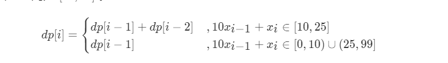

#### [剑指 Offer 46. 把数字翻译成字符串](https://leetcode-cn.com/problems/ba-shu-zi-fan-yi-cheng-zi-fu-chuan-lcof/)


# 动态规划

**状态定义**

 dp[i]:以$x_i$为结尾的数字的翻译方案数量

**状态转移方程：**

- 若$x_{i-1}$和  $x_i$ 不能组合（即$x_{i}x_{i-1}$不在[10-25]之间），则dp[i]=dp[i-1]

- 若$x_{i-1}$和  $x_i$ 能组合（即$x_{i}x_{i-1}$在[10-25]之间）
  - 能组合且选择组合，则dp[i]=dp[i-2]。因为此时$x_{i}$、$x_{i-1}$均已被暂用。
  - 能组合但是选择不组合
  - 故此时dp[i]=dp[i-1] + dp[i-2]



```python
class Solution:
    def translateNum(self, num: int) -> int:
        s = str(num)
        n = len(s)
        dp = [1] * (n+1)
        for i in range(2,n+1):
            tmp = int(s[i-2])*10 + int(s[i-1])
            if tmp>=10 and tmp<=25:
                dp[i] = dp[i-1] + dp[i-2]
            else:
                dp[i] = dp[i-1]
        return dp[n]

```

#### 优化一：

- 代码：不用int转str又转回int，直接用切片的方式取出最后$x_{i-1},x_i$。而且可以直接tmp>="10"这样比较（利用ASSIC码）
- 空间优化：dp[i]只与dp[i-1]和dp[i-2]有关，不用存储整个数组

```python
class Solution:
    def translateNum(self, num: int) -> int:
        s = str(num)
        n = len(s)
        p2, p1, c= 1, 1, 1
        for i in range(1, n):
            tmp = s[i-1:i+1]
            if tmp>="10" and tmp <="25":
                c = p1+p2
            else:
                c = p1
            p2,p1 = p1, c
        return c
```

