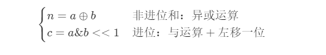

#### [剑指 Offer 65. 不用加减乘除做加法](https://leetcode-cn.com/problems/bu-yong-jia-jian-cheng-chu-zuo-jia-fa-lcof/)


# 自己

不能加减乘除位运算，就考虑位运算。只是单靠 移位 怎么实现加法呢？


# 其他解

> 计算机中的有符号数有三种表示方法，即[原码](https://baike.baidu.com/item/原码/1097586)、[反码](https://baike.baidu.com/item/反码/769985)和补码。三种表示方法均有符号位和数值位两部分，符号位都是用0表示“正”，用1表示“负”，而数值位，三种表示方法各不相同。在[计算机](https://baike.baidu.com/item/计算机/140338)系统中，数值一律用补码来表示和存储。原因在于，使用补码，可以将符号位和数值域统一处理；同时，加法和减法也可以统一处理。


原码：最高位表示数的符号，其他位表示数值。

- 例：$[+7]_{原}=00000111B$， $[-7]_原=10000111B

反码：正数的反码与原码相同。负数的反码是由其原码的符号位不变，其余位按位取反

- 例：$[+7]_反=00000111B$，$[-7]_反=11111000B$

补码：正数的补码依然与原码相同。负数的补码是由其原码的符号位不变，**其余位按位取反，再在最低位加一**

例：$[+7]_补=00000111B$，  $[-7]_补=11111001B$	

#### 解题思路：

本题考察对位运算的灵活使用，即使用位运算实现加法。

设两数字的二进制形式a*,*b，其求和 s = a + b，*a*(*i*) 代表 a 的二进制第 i 位，则分为以下四种情况：

| *a*(*i*) | *b*(*i*) | **无进位和** n(i) | **进位** c(i+1) |
| -------- | -------- | ----------------- | --------------- |
| 0        | 0        | 0                 | 0               |
| 0        | 1        | 1                 | 0               |
| 1        | 0        | 1                 | 0               |
| 1        | 1        | 0                 | 1               |

观察发现，**无进位和** 与 **异或运算** 规律相同，**进位** 和**与运算** 规律相同（并需左移一位）。因此，无进位和 n与进位 c 的计算公式如下：



（和 s ） = （非进位和 n）+ （进位 c）。即可将 s = a + b转化为：
$$
s=a+b \Rightarrow s=n+c
$$
循环求 n 和 c ，直至进位 c = 0 ；此时 s = n，返回 n 即可。


> **Q ：** 若数字 a 和 b 中有负数，则变成了减法，如何处理？
>
> **A ：** 在计算机系统中，数值一律用 **补码** 来表示和存储。**补码的优势：** 加法、减法可以统一处理（CPU只有加法器）。因此，以上方法 **同时适用于正数和负数的加法** 。

##### 复杂度分析：

- **时间复杂度 O(1)：** 最差情况下（例如*a*= 0x7fffffff , b = 1时），需循环 32 次，使用 O(1) 时间；每轮中的常数次位操作使用 O(1) 时间。
- **空间复杂度 O(1)** ：使用常数大小的额外空间。

```python
class Solution:
    def add(self, a: int, b: int) -> int:
        x = 0xffffffff
        a, b = a & x, b & x
        while b != 0:
            a, b = (a ^ b), (a & b) << 1 & x
        return a if a <= 0x7fffffff else ~(a ^ x)
```

> 由于 Python 的数字存储特点，需要做特殊考虑，以下详细介绍。

##### Python 负数的存储：

Python，Java 等语言中的数字都是以 **补码** 形式存储的。但 Python 没有`int`，`long`等不同长度变量，即在编程时无变量位数的概念。

**获取负数的补码：**需要将数字与十六进制数 `0xffffffff`相与。可理解为舍去此数字 32 位以上的数字（将 32 位以上都变为 0 ），从无限长度变为一个 32 位整数。

**返回前数字还原：** 若补码 a 为负数(`0x7fffffff`是最大的正数的补码)，需执行 `~(a ^ x)`操作，将补码还原至 Python 的存储格式。 `a ^ x`运算将 1 至 32 位按位取反；`~`运算是将整个数字取反；因此，`~(a ^ x)`是将 32 位以上的位取反，1 至 32 位不变。

```python
print(hex(1)) # = 0x1 补码
print(hex(-1)) # = -0x1 负号 + 原码 （ Python 特色，Java 会直接输出补码）

print(hex(1 & 0xffffffff)) # = 0x1 正数补码
print(hex(-1 & 0xffffffff)) # = 0xffffffff 负数补码

print(-1 & 0xffffffff) # = 4294967295 （ Python 将其认为正数）
```


```c++
class Solution {
public:
    int add(int a, int b) {
//因为不允许用+号，所以求出异或部分和进位部分依然不能用+ 号，所以只能循环到没有进位为止        
        while(b!=0)
        {
//保存进位值，下次循环用
            int c=(unsigned int)(a&b)<<1;//C++中负数不支持左移位，因为结果是不定的
//保存不进位值，下次循环用，
            a^=b;
//如果还有进位，再循环，如果没有，则直接输出没有进位部分即可。
            b=c;   
        }
        return a;
    }
};
```

