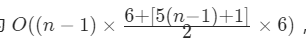

#### [剑指 Offer 60. n个骰子的点数](https://leetcode-cn.com/problems/nge-tou-zi-de-dian-shu-lcof/)


# 自己解

尝试动态规划

思路：定义二维数组dp\[i][j]，其中i代表n的取值,0~n-1,j代表dp[i]列表的每个值。一开始全部初始化为0

则baseCase:  dp\[i][j]全为0，dp[1]=[1/6]*6

状态转移方程：


$$
f(x)=\left\{ \begin{aligned} dp[i][j] & = dp[i-1][j] , if \quad j=0 \\ dp[i][j] & = dp[i-1][j] + dp[i][j-1] / 6 , if \quad j\neq0 \end{aligned} \right.
$$
n=3就不行


# 动态规划

>  设输入 n 个骰子的解（即概率列表）为 f(n)，其中「点数和」 x 的概率为 f(n, x) 。

假设已知 n - 1 个骰子的解 f(n - 1) ，此时添加一枚骰子，求 n 个骰子的点数和为 x 的概率 f(n, x) 。

当添加骰子的点数为 1 时，前 n - 1 个骰子的点数和应为 x−1 ，方可组成点数和 x ；同理，当此骰子为 2 时，前 n - 1 个骰子应为 x - 2；以此类推，直至此骰子点数为 6 。将这 6 种情况的概率相加，即可得到概率 f(n, x)。递推公式如下所示：


根据以上分析，得知通过子问题的解 f(n - 1) 可递推计算出 f(n)，而输入一个骰子的解 f(1) 已知，因此可通过解 f(1) 依次递推出任意解 f(n) 。

> 如下图所示，为 n = 2 , x = 7 的递推计算示例。


观察发现，以上递推公式虽然可行，但f(n−1,x−i) 中的 x - i会有越界问题(x-i<0)。例如，若希望递推计算 f(2, 2)，由于一个骰子的点数和范围为 [1,6] ，因此只应求和 f(1,1) ，即 f(1, 0) , f(1, -1) , ... , f(1, -4) 皆无意义。此越界问题导致代码编写的难度提升。

> 如下图所示，以上递推公式是 “逆向” 的，即为了计算 f(n, x) ，将所有与之有关的情况求和；而倘若改换为 “正向” 的递推公式，便可解决越界问题。
>


具体来看，由于新增骰子的点数只可能为 1 至 6 ，因此概率 f(n - 1, x) 仅与 f(n,x+1) , f(n,x+2), ... , f(n,x+6) 相关。因而，遍历f(n−1) 中各点数和的概率，并将其相加至 f(n) 中所有相关项，即可完成 f(n−1) 至 f(n) 的递推。

> 将 f(i) 记为动态规划列表形式 dp[i] ，则 i = 1, 2, ..., n的状态转移过程如下图所示。

##### 复杂度分析：

- **时间复杂度** **$O(n^2) $：** 状态转移循环 n - 1 轮；每轮中，当 i = 2, 3, ..., n时，对应循环数量分别为 6×6,11×6,...,[5(*n*−1)+1]×6 ；因此总体复杂度为

即等价于 $O(n^2)$ 。

- **空间复杂度 O(n)：** 状态转移过程中，辅助数组 tmp 最大长度为 6(n-1) - [(n-1) - 1] = 5n - 4，因此使用 O(5n - 4) = O(n)大小的额外空间。

#### 代码：

通常做法是声明一个二维数组 dp ，dp\[i][j]代表前 i 个骰子的点数和 j 的概率，并执行状态转移。而由于 dp[i] 仅由 dp[i−1] 递推得出，为降低空间复杂度，只建立两个一维数组 dp , tmp交替前进即可。

```python
class Solution:
    def dicesProbability(self, n: int) -> List[float]:
        dp = [1 / 6] * 6
        for i in range(2, n + 1):
            tmp = [0] * (5 * i + 1)  # new dp
            for j in range(len(dp)):
                for k in range(6):
                    tmp[j + k] += dp[j] / 6
            dp = tmp
        return dp
```

其实规律找的是一样的，还是自己的状态转移方程有问题


