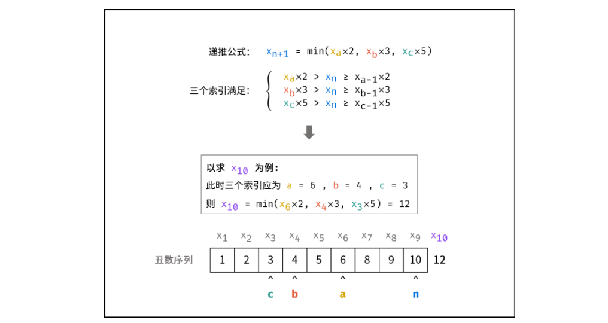

#### [剑指 Offer 49. 丑数](https://leetcode-cn.com/problems/chou-shu-lcof/)

 

# 自己解

尝试动态规划，未找到第n个丑数与第n-1个丑数之间的状态转移方程


# 动态规划

#### 解题思路：

> 丑数的递推性质： 丑数只包含因子 2, 3, 5，因此有 “丑数 == 某较小丑数 × 某因子” （例如：10=5×2）。

设已知长度为 n*n* 的丑数序列$x_1,x_2,,,,x_n$，求第 n+1个丑数 $x_{n+1}$ 。根根据递推性质，丑数$ x_{n+1}$只可能是以下三种情况其中之一（索引 a, b, c 为未知数）：


**丑数递推公式：**

若索引 a*,*b*,*c 满足以上条件，则下个丑数 $x_{n+1}$ 为以下三种情况中的 **最小值** ；
$$
x_{n+1} = min(x_a *2, x_b*3, x_c*5)
$$
由于 $x_{n+1}$ 是 **最接近** $x_n$ 的丑数，因此索引 a, b, c 需满足以下条件：




因此，可设置指针 a,b,c 指向首个丑数（即 1 ），循环根据递推公式得到下个丑数，并每轮将对应指针执行 +1 即可。

##### 动态规划解析：

- **状态定义：** 设动态规划列表 dp ，dp[i]代表第 i + 1 个丑数；

- **转移方程：**

1. 当索引 a, b, c 满足以下条件时， dp[i] 为三种情况的最小值；

2. 每轮计算 dp[i] 后，需要更新索引 a, b, c 的值，使其始终满足方程条件。实现方法：**分别独立判断** dp[i] 和 dp[a]×2 , dp[b]×3 , dp[c]×5 的大小关系，若相等则将对应索引 a , b , c 加 1 ；

   

- **初始状态：**  dp[0] = 1 

- **返回值：** dp[n-1]，即返回第 n*n* 个丑数；

**复杂度分析：**

- **时间复杂度 O(N)\：** 其中 N = n，动态规划需遍历计算 dp 列表。
- **空间复杂度 O(N) ：** 长度为 N 的 dp 列表使用 O(N) 的额外空间。

```python
class Solution:
    def nthUglyNumber(self, n: int) -> int:
        dp, a, b, c = [1] * n, 0, 0, 0
        for i in range(1, n):
            n2, n3, n5 = dp[a] * 2, dp[b] * 3, dp[c] * 5
            dp[i] = min(n2, n3, n5)
            if dp[i] == n2: a += 1
            if dp[i] == n3: b += 1
            if dp[i] == n5: c += 1
        return dp[-1]
```

