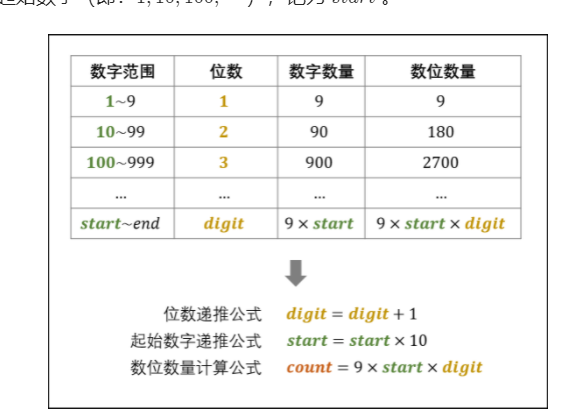

#### [剑指 Offer 44. 数字序列中某一位的数字](https://leetcode-cn.com/problems/shu-zi-xu-lie-zhong-mou-yi-wei-de-shu-zi-lcof/)


# 自己尝试

无果，关键是怎么创建字符"01234567891011...."


# 迭代+求整/求余

#### 解题思路：

1. 将 101112 ⋯ 中的每一位称为 **数位** ，记为 n ；
2. 将 10, 11, 12, ⋯ 称为 **数字** ，记为 num；
3. 数字 10 是一个两位数，称此数字的 **位数** 为 2 ，记为 digit ；
4. 每 digit 位数的起始数字（即：1, 10, 100,...），记为 start 。



观察上表，可推出各 digit 下的数位数量 count 的计算公式：


根据以上分析，可将求解分为三步：

1. 确定 n 所在 **数字** 的 **位数** ，记为 digit；
2. 确定 n 所在的 **数字** ，记为 num；
3. 确定 n 是 num 中的哪一数位，并返回结果。

##### 1. 确定所求数位的所在数字的位数

如下图所示，循环执行 n 减去 一位数、两位数、... 的数位数量 count，直至 n≤count 时跳出。

由于 n 已经减去了一位数、两位数、...、(digit-1) 位数的 数位数量 count ，因而此时的 n 是从起始数字 start开始计数的。

```python
digit, start, count = 1, 1, 9
while n > count:
    n -= count
    start *= 10 # 1, 10, 100, ...
    digit += 1  # 1,  2,  3, ...
    count = 9 * start * digit # 9, 180, 2700, ...
```

**结论：** 所求数位 ① 在某个 digit 位数中； ② 为从数字 start 开始的第 n 个数位。


##### 2. 确定所求数位所在的数字

如下图所示，所求数位 在从数字 start 开始的第 [(n−1)/digit] 个 **数字** 中（ start 为第 0 个数字）。

```
num = start + (n - 1) // digit
```

**结论：** 所求数位在数字 num 中。


##### 3. 确定所求数位在 num 的哪一数位

如下图所示，所求数位为数字 num 的第  (*n*−1)%digit 位（ 数字的首个数位为第 0 位）。

```
s = str(num) # 转化为 string
res = int(s[(n - 1) % digit]) # 获得 num 的 第 (n - 1) % digit 个数位，并转化为 int
```

**结论：** 所求数位是 res。


```python
class Solution:
    def findNthDigit(self, n: int) -> int:
        digit, start, count = 1, 1, 9
        while n > count: # 1.
            n -= count
            start *= 10
            digit += 1
            count = 9 * start * digit
        num = start + (n - 1) // digit # 2.
        return int(str(num)[(n - 1) % digit]) # 3.
```

##### 复杂度分析：

- **时间复杂度O(logn)** ： 所求数位 n 对应数字 num 的位数 digit 最大为 O*(log*n) ；第一步最多循环 O(logn) 次；第三步中将 num 转化为字符串使用 O(logn) 时间；因此总体为 O(logn) 。
- **空间复杂度O(logn) ：** 将数字 num 转化为字符串 `str(num)` ，占用 O*(log*n) 的额外空间。