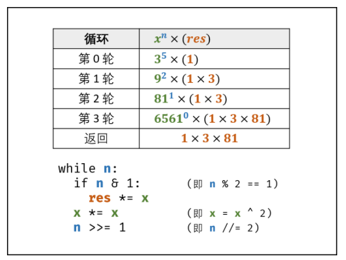

#### [剑指 Offer 16. 数值的整数次方](https://leetcode-cn.com/problems/shu-zhi-de-zheng-shu-ci-fang-lcof/)


# 自己解

```python
class Solution:
    def myPow(self, x: float, n: int) -> float:
        sum = 1
        while n > 0:
            sum *= x
            n-=1
        while n < 0:
            sum /= x
            n+=1
        return sum
```

时间复杂度:   $O(n)$，超时


#  快速幂（二分法）

- **二分推导：**  $x^n = x^{n/2} \times x^{n/2} = (x^2)^{n/2}$, ，令 n/2为整数，则需要分为奇偶两种情况（设向下取整除法符号为 "//" ）：、
  - 当 n 为偶数：$x^n = (x^2)^{n//2}$;
  - 当 n 为奇数：$x^n= x(x^2)^{n//2}$，即会多出一项 x ；

- **幂结果获取：**
  - 根据二分推导，可通过循环 $x = x^2$ 操作，每次把幂从 n 降至 n//2 ，直至将幂降为 0 ；
  - 设 res=1 ，则初始状态 $x^n = x^n \times res$。在循环二分时，每当n为奇数，将多出的一项x乘入res，则最终可化至 $x^n = x^0 \times res$， 返回res即可。



- **转化为位运算：**
  - 向下整除 n // 2 **等价于** 右移一位 n >> 1 ；
  - 取余数 n%2  **等价于** 判断二进制最右一位值 n \& 1 ；

##### 算法流程：

1. 当 x = 0 时：直接返回 0 （避免后续 x = 1  操作报错）。
2. 初始化 res = 1 ；
3. 当 n < 0：把问题转化至 n*≥0 的范围内，即执行 x = 1/x ，n = - n；
4. 循环计算：当 n = 0 时跳出；
   1. 当 n \& 1 = 1 时：将当前 x 乘入 res（即 res *= x）；
   2. 执行 x = x^2 （即 x*∗=*x ）；
   3. 执行 n 右移一位（即 n >>= 1）。
5. 返回 res 。

##### 复杂度分析：

- **时间复杂度 $O(log_2 n)$：** 二分的时间复杂度为对数级别。
- **空间复杂度 O(1)**


```python
class Solution:
    def myPow(self, x: float, n: int) -> float:
        if x == 0: return 0
        res = 1
        if n < 0: x, n = 1 / x, -n
        while n:
            if n & 1: res *= x
            x *= x
            n >>= 1
        return res
```

