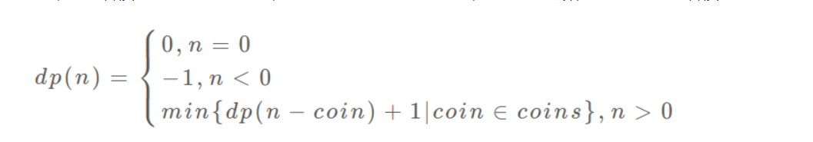

0202

- 为节省时间复杂度，**查询列表元素的索引 可以用 哈希表**（本质是将待查元素存储在一个可以函数映射到的位置）

0203

- **复制列表比枚举更高效**   
- **python一个等号可以赋值多个变量**  
- 直接**使用移位运算符  ">>"  表示2的多少次方**
- 可以使用**三目运算符代替if-else**

0204

- **sum（list） 求列表的和**
- **max (list)  求列表中最大值**
- **str.join(list) 函数的用法  将list转换为str**

```python
str = "-";
seq = ("a", "b", "c"); # 字符串序列
print str.join( seq );
#输出 a-b-c
```

- **字符串为“不可变对象“**，最后不要for循环里每次都str[i]，这相当于每次都新建了一个字符串

0205

- **python中字符不可直接相减，使用ord()函数化为对应ASCII码**
- **滑动窗口法求解子区间问题**

```python
sums = 0
res = 0
N = len(arr)
right, left = 0, 0
while right < N:
    sums += arr[right]
    while sums > max_sum:
        sums -= arr[left]
        left += 1
    res = max(res, right-left+1)
    right += 1
return res
    
```

0207

- **for...in...break...else...**用法：

> 当for循环执行完毕（没有被break打断）后会执行与之匹配的else里的内容

- **list.count(i)**    统计列表中某元素出现的次数

0208

- **str.count(i)**   统计字符串中某字符出现的次数
- 返回一个列表     **[`operation` for x in list1]**

- <font color=red>**动态规划**</font>（还未理解透！！）

02/09

- **str.replace('a', 'b')**

- 字符串也可以直接`for i in str:...`

02/10

- 用**滑动窗口法**解决固定长度子串问题
- **collections.Counter(list/str/dic)**     统计列表/字符串/字典中每个元素包含的个数，返回一个dict

02/11

- <font color=red>**top  K**问题  使用小根堆解决，相比数组速度飞快。</font>

02/14

- 二维数组的定义与使用:

```python
_2d_list = [[] for i in range(row)] 
_2d_list[0].append(1)
```

03/05

- python的list的append方法和pop方法类似于stack的push和pop，list[-1]类似于stack.top()
- python判断list是否为空的方法：`if not list:`

- 当有三个分支时，考虑使用dict而不是if-if

03/06

- 实现循环数组的两种方法：`数组拼接` 或者`for i in range(2*N):    i%N`，推荐后者
- 单调递减栈  求下一个更大的元素

03/07

- 使用栈来实现递归(使用栈实现前序遍历)

```python
class Solution(object):
    def preorder(self, root):
        """
        :type root: Node
        :rtype: List[int]
        """
        if root is None:
            return []
        
        stack, output = [root, ], []            
        while stack:
            root = stack.pop()
            output.append(root.val)
            stack.extend(root.children[::-1])
                
        return output
```

03/09

- `栈`是一种能进行数据缓冲的数据结构

- 一个函数执行多次，使用**map**函数。`map(function, sequence), return iterator`

03/11  

- 二叉搜索树BST的中序遍历是升序的
- python中的`//`是地板除， `int(-3/2)=-1`，抛去小数部分
- `char in string`快速判断是否存在
- `char.isdict()`函数判断某个字符是否是 数字字符，通过 int(char)可转为数字

03/13

- hashTable的创建：hash函数常用`对桶树取余`
- UnionFindSet:
  - 用途：解决图的动态连接问题
  - 定义：
    - find()函数：路径压缩
    - union()函数：路径压缩
    - connected()函数
    - count()函数

03/05

- **将二维坐标映射到一维的常用技巧**：  $(x,y) \rightarrow x*n+y$
- **上下左右搜索的常用手法：**    方向数组d  $[(1,0), (0,1), (0,-1), (-1, 0)]$

点(x,y)上下左右四个点：

```python
d = [(1,0), (0, 1), (0, -1), (-1, 0)]
for k in range(4):
    x = i + d[k][0]
    y = j + d[k][1]
    ...
```


03/17

- 恶心人的最值问题  -->  是否具有最优子结构？  -->  写出状态转移方程

- 使用**迭代法实现前、中、后序遍历二叉树的模板**：

```python
class Solution:
    def inorderTraversal(self, root: TreeNode) -> List[int]:
        stack,rst = [root],[]
        while stack:
            i = stack.pop()
            if isinstance(i,TreeNode):
                stack.extend([i.right,i.val,i.left])
            elif isinstance(i,int):
                rst.append(i)
        return rst
```

**层序遍历的迭代法模板**：

```python
class Solution:
    def levelTraversal(self, root: TreeNode) -> List[int]:
        queue,rst = [root],[]
        while queue:
            i = queue.pop(0)
            if isinstance(i,TreeNode):
                queue.extend([i.val,i.left,i.right])
            elif isinstance(i,int):
                rst.append(i)
        return rst
```

0315

- 遍历list时，若list有可能为空，则`list=[None,]`

0322

- python将一个整数转化为二进制：`bin(int)->str`

0324

- **单调栈**解决  `Next Greater Number`问题

- **单调栈**模板：

```C++
vector<int> nextGreaterElement(vector<int>& nums)
{
    vector<int> res(nums.size()); // 存放答案的数组
    stack<int> s;
    // 倒着往栈里放（栈中除了存放元素，也可以存放索引）
    for (int i = nums.size() - 1; i >= 0; i--)
    {
        // 判定个子高矮
        while (!s.empty() && s.top() <= nums[i]) 
        {
            // 矮个起开，反正也被挡着了。。。
            s.pop();
        }
        // nums[i] 身后的 next great number----------->operation
        res[i] = s.empty() ? -1 : s.top();
        // 入栈
        s.push(nums[i]);
    }
    return res;
}
```

- `索引求模  i%n` 是 模拟循环数组的方法

0329

- **位运算**
  - `n & 1`表示取n的末位二进制数！
  - `res = (res<<1) | (n & 1)`表示将n的最后一位加到res的最后一位中（实现倒序）
  - `分而治之`的做法：


```python
class Solution:
    # @param n, an integer
    # @return an integer
    def reverseBits(self, n):
        n = (n >> 16) | (n << 16)
        n = ((n & 0xff00ff00) >> 8) | ((n & 0x00ff00ff) << 8)
        n = ((n & 0xf0f0f0f0) >> 4) | ((n & 0x0f0f0f0f) << 4)
        n = ((n & 0xcccccccc) >> 2) | ((n & 0x33333333) << 2)
        n = ((n & 0xaaaaaaaa) >> 1) | ((n & 0x55555555) << 1)
        return n
```

0330

遇到`升序数组+查找问题` ----->  **二分查找法**

```python
class Solution:
    def searchMatrix(self, matrix: List[List[int]], target: int) -> bool:
        if not matrix or not matrix[0]:
            return False
        left, right = 0, len(matrix) * len(matrix[0]) - 1
        array = [column for row in matrix for column in row]
        while left <= right:
            mid = ((right - left) >> 1) + left
            if array[mid] == target:
                return True
            elif array[mid] < target:
                left = mid + 1  
            else:
                right = mid - 1
        return False
```

- 二维矩阵转为一维向量的方式：`array = [ col for row in matrix for col in row]`

- 一维数组二分查找法的模板

不转为一维数组，利用求余运算和整除运算直接在二维数组上  二分查找

```python
class Solution(object):
    def searchMatrix(self, matrix, target):
        M, N = len(matrix), len(matrix[0])
        left, right = 0, M * N - 1
        while left <= right:
            mid = left + (right - left) // 2
            cur = matrix[mid // N][mid % N]
            if cur == target:
                return True
            elif cur < target:
                left = mid + 1
            else:
                right = mid - 1
        return False
```

0331

**解决一个回溯问题，实际上就是一个决策树的遍历过程**。回溯算法的框架：

```python
result = []
def backtrack(路径， 选择列表):
    if 满足结束条件:
        result.add(路径)
        return
    for 选择 in 选择列表:
        做选择
        backtrack(路径， 选择列表)  进入下一层决策树
        撤销选择
```


0401

- C++变量定义时不要定义在局部if或者while内，否则出了括号会消失
- C++定义长整型: `long long int`， 最大/小值：`LONG_MIN, LONG_MAX`
- C++类型判断：`if (typeid(node)== typeid(int))`
- C++实现中序遍历：

```c++
/**
 * Definition for a binary tree node.
 * struct TreeNode {
 *     int val;
 *     TreeNode *left;
 *     TreeNode *right;
 *     TreeNode() : val(0), left(nullptr), right(nullptr) {}
 *     TreeNode(int x) : val(x), left(nullptr), right(nullptr) {}
 *     TreeNode(int x, TreeNode *left, TreeNode *right) : val(x), left(left), right(right) {}
 * };
 */
class Solution {
public:
    bool isValidBST(TreeNode* root) {
        stack<TreeNode *> stack;
        
        long long int lower = LONG_MIN;
        while (!stack.empty()  || root != nullptr)
        {
            while (root != nullptr)
            {
                stack.push(root);
                root = root->left;
            }
            root = stack.top();
            stack.pop();
            if (root->val <= lower)
            { 
                return false;
            }
            lower = root->val;
            root = root->right;
        }
        return true;
    }
};
```

0403

- dp经典问题 : 凑零钱问题
  - dp数组的迭代解法
    - **dp数组的定义：当目标金额为`i`时，至少需要`dp[i]`枚硬币凑出**

```java
int coinChange(vector<int>& coins, int amount){
    //  数组大小为 amount+1, 初始值也为 amount+1
    vector<int> dp(amount+1, amount+1);
    // base case
    dp[0] = 0;
    //  外层for循环在遍历所有状态的所有取值
    for (int i=0; i<dp.size();i++)
    {
        //  内层for循环在求所有选择的最小值
        for(int coin : coins){
            // 子问题无解，跳过
            if (i-coin<0) continue;
            dp[i] = min(dp[i], 1+dp[i-coin]);
        }
    }
    return (dp[amount]==amount+1) ? -1:dp[amount]; 
}
```

PS：为啥 `dp` 数组初始化为 `amount + 1` 呢，因为凑成 `amount` 金额的硬币数最多只可能等于 `amount`（全用 1 元面值的硬币），所以初始化为 `amount + 1` 就相当于初始化为正无穷，便于后续取最小值。



0405

- C++求vector子集的和

```c++
int sum = accumulate(cardPoints.begin(), cardPoints.begin() + windowSize, 0)
```

- C++中二维数组的赋值：  通过push一维数组，和python不同
- 判断一个数是否为偶数 ： `i&1`
- C++翻转数组: `reverse(v.begin(), v.end())`


0417

python:

- `from sortedcontainers import SortedList`     有序列表
- `idx = bisect.bisect_left(有序列表，值) `     查找值应该插入有序列表的位置，但不插入。这个用于查找u的范围`[u-t, u+t]`有奇效。

