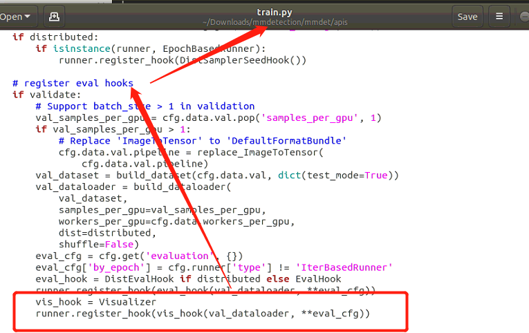

# mmdetection2.0中利用visdom绘制mAP动态图

Vidsom是Facebook专门为PyTorch开发的一款可视化工具 ，可以直接对Tensor进行操作。能够胜任大部分的数据可视化任务。关于visdom的详细介绍请参考[PyTorch的远程可视化神器visdom](https://zhuanlan.zhihu.com/p/34692106)

在mmdetection中想要完成动态可视化过程，需要用到Hook。关于Hook，其实就是在不改变网络输入输出的结构的前提下，方便地获取、改变网络中间层变量的值和梯度。

下面是在**mmdetection**中利用**visdom**绘制**mAP**动态图的方法步骤。

**1. 首先创建<font color=red>visualization.py</font>文件**

```python
import visdom
import numpy as np
from mmcv.runner import Hook
from torch.utils.data import DataLoader


class Visualizer(Hook):
    def __init__(self, dataloader, interval=1, **eval_kwargs):
        if not isinstance(dataloader, DataLoader):
            raise TypeError('dataloader must be a pytorch DataLoader, but got'
                            f' {type(dataloader)}')
        self.vis = visdom.Visdom(env='test')
        self.flag={}
        self.log_text = ""

    def after_train_epoch(self, runner):
        self.plot_many(runner.log_buffer.output, runner.epoch)


    def plot_many(self, d,epoch):
        for k, v in d.items():
            if type(v) is float:
                self.plot(k, epoch,v)

    def plot(self, name, x, y, **kwargs):
        flag = self.flag.get(name,True)
        self.vis.line(Y=np.array([y]), X=np.array([x]),
                      win=name,
                      opts=dict(title=name),
                      update=None if flag else 'append',
                      **kwargs)
        self.flag[name]=False
```

将文件放入一个你指定的文件夹中，并更改对应的**init**.py文件，例如我放到了mmdet/utils/下。

2. **更改mmdet/apis/train.py文件**

导入模块

```python
from mmdet.utils import Visualizer
```

在验证集部分代码注册钩子Hook



```python
vis_hook = Visualizer
runner.register_hook(vis_hook(val_dataloader, **eval_cfg))
```

3. **训练结果展示**

确保所在的虚拟环境中安装了visdom

```python
pip install visdom
```

开启visdom服务

```python
(open-mmlab) username@name:~$ python -m visdom.server
/home/dreamdeck/anaconda3/envs/open-mmlab/lib/python3.7/site-packages/visdom/server.py:39: DeprecationWarning: zmq.eventloop.ioloop is deprecated in pyzmq 17. pyzmq now works with default tornado and asyncio eventloops.
  ioloop.install()  # Needs to happen before any tornado imports!
Checking for scripts.
It's Alive!
INFO:root:Application Started
You can navigate to http://localhost:8097
```

复制最后一行的地址，打开浏览器并打开地址。开启训练，并选择**test**环境

