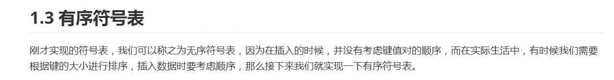
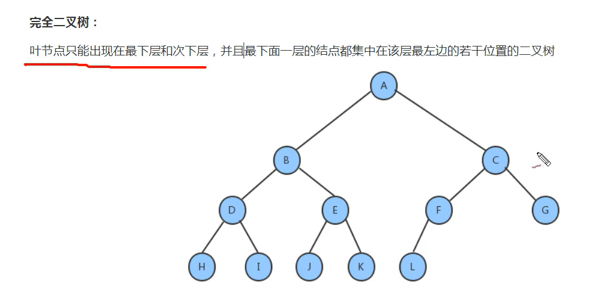
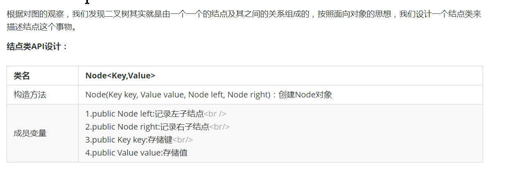
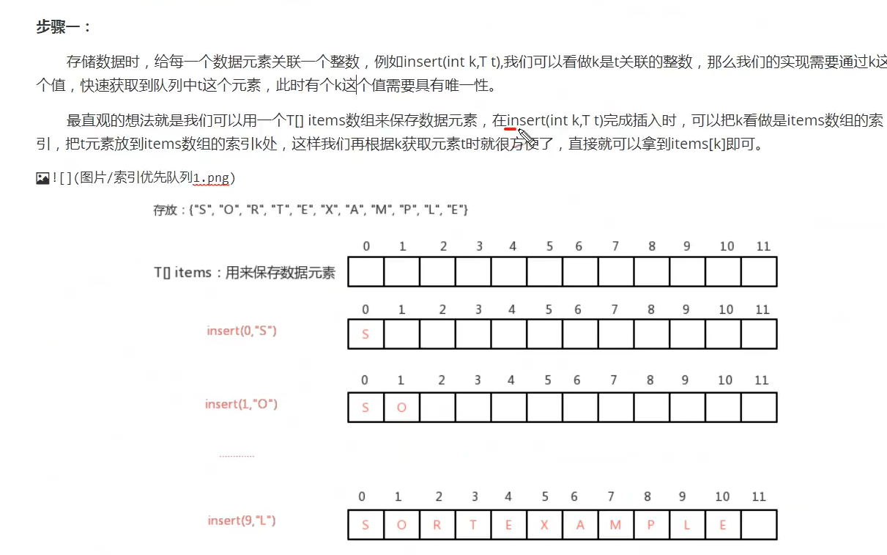
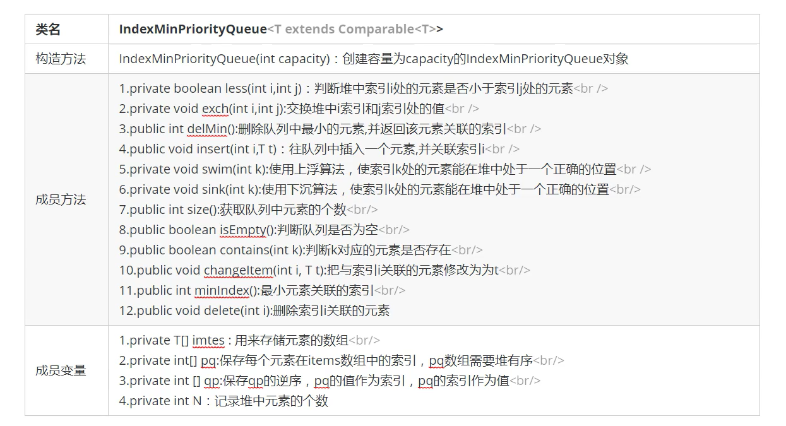
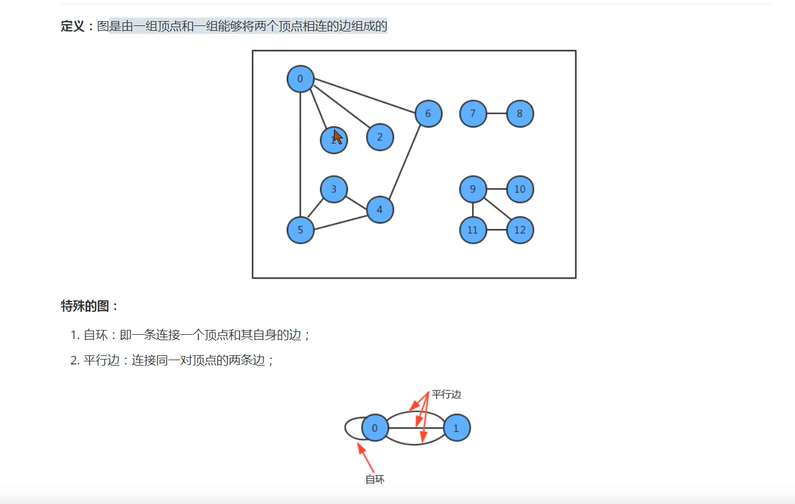
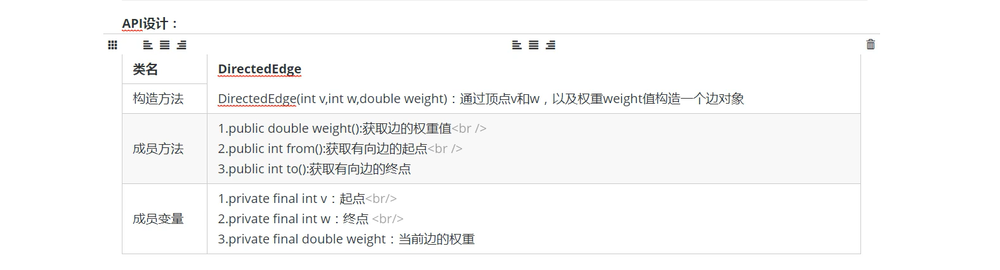
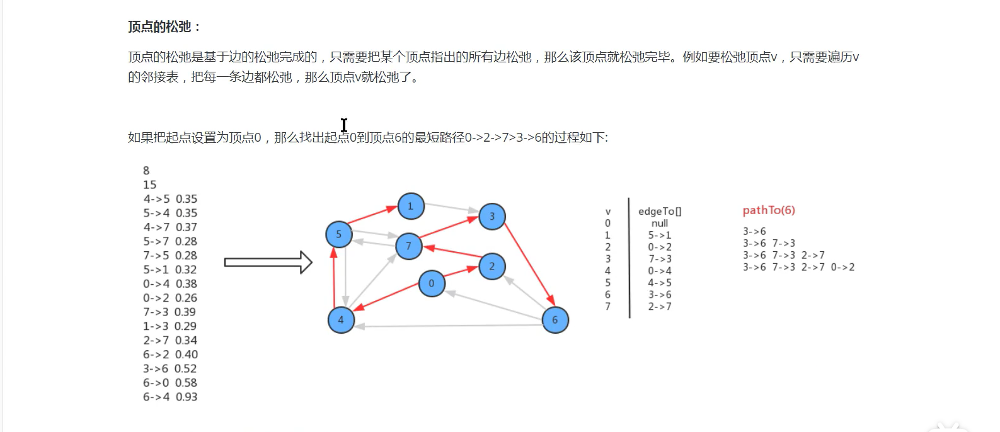

1  算法分析

## 1.1  算法的时间复杂度分析

 ### 1.1.1  大O计数法：


### 1.1.2  函数调用的时间复杂度分析

### 1.1.3  最坏情况

## 1.2  算法的空间复杂度分析

### 1.2.1  java中常见内存占用

1. 基本数据类型内存占用情况：


2. 计算机访问内存的方式都是一次一个字节

3. 一个引用需要8个字节表示

   如：；Date date = new Date()，则date这个变量需要占用8个字节来表示

4. 创建一个对象，比如new Date()，除了Date对象内部存储的数据（例如年月日等信息）占用的内存，该对象本身也有内存开销，每个对象的自身开销是16个字节，用来保存对象的头信息

5. 一般内存的使用，如果不够8个字节，都会被自动填充为8字节

6. java中数组被限定为对象，他们一般都会因为记录长度而需要额外的内存，一个原始数据类型的数组一般需要24个字节的头信息（16个自己的对象开销，4字节用于保存长度以及4个填充字节）再加上保存值所需的内存。

### 1.2.2  算法的空间复杂度

分析算法的内存占用	

一般java开发都是基于服务器开发，可以不考虑空间复杂度分析；嵌入式开发内存小，对空间复杂度有要求。

一般说分析算法的复杂度，如果不指明空间复杂度，都是分析时间复杂度

# 2  排序

## 2.1  简单排序

### 2.1.1  Comparable 接口

### 2.1.2  冒泡排序（Bubble Sort）

排序原理：

1.比较**相邻**的元素。如果前一个元素比后一个元素大，就**交换**这两个元素的位置
2.对每一对相邻元素做同样的工作，从开始第一对元素到结尾的最后一对元素。最终最后位置的元素就是最大值


<font color=red>**时间复杂度：$O(n^{2})$**</font>

python实现：

```python
def BubbleSort_1(arr):
    for i in range(len(arr)-1,0,-1):
        for j in range(i):
            if arr[j]>arr[j+1]:
                arr[j],arr[j+1] = arr[j+1], arr[j]
        print('第%d次排序结果':%(8-i),end=' ')
        for j in range(len(arr)):
            print('%3d'%arr[j])
```

### 2.1.3  选择排序

选择排序是一种更加简单直观的排序方法

排序原理：

​	1.每一次遍历的过程中，都假定第一个索引处的元素是最小值，和其他索引处的值依次进行比较，如果当前索引处的值大于其他某个索引处的值，则假定其他索引处的为最小值，最后可以找到最小值所在的索引

​	2.交换第一个索引处和最小值所在的索引处的值		


python实现：

```python
def selection_sort(arr):
    for i in range(len(arr)-1):
        min = i
        for j in range(i+1,len(arr)-1,1):
            if arr[j]>arr[min]:
                min = j
        arr[i],arr[min] = arr[min], arr[i]
```

<font color=red>**时间复杂度：$O(n^{2})$**</font>

### 2.1.4  插入排序

原理：

1. 把所有的元素分为两组，已经排序的和未排序的
2. 找到未排序的组中的第一个元素，向已经排序的组中进行插入
3. 倒叙遍历已经排序的元素，依次和待插入元素进行比较，直到找到一个元素小于等于插入元素，那么就将待插入元素放到这个位置，其他的元素向后移动一位

python实现：

```python
def insertion_sort(arr):
    for i in range(1, len(arr), 1):
        for j in range(i, 0, -1):
            if a[j-1]>a[j]:
                a[j-1], a[j] = a[j], a[j-1]
             elif
            	break
             
```

<font color=red>**时间复杂度：$O(n^{2})$**</font>

## 2.2  高级排序

### 2.2.1  希尔排序

排序原理：

1. 选定一个增量h，按照增量h作为数据分组的依据，对数据进行分组

2. 对分好组的每一组数据完成插入排序

3. 减小增量，最小减为1，重复第二步操作


python实现：

```python
def shell_sort(alist):
    n = len(alist)
    gap = n // 2
    while gap>0:
        for i in range(gap, n):
            j = i
            while j >= gap and alist[j - gap] > alist[j]:
                alist[j - gap], alist[j] = alist[j], alist[j-gap]
                j -= gap
        gap = gap // 2         

```

时间复杂度比插入排序低，事后分析法

### 2.2.2  归并排序

原理：


```python
def merge(a, b):
    c=[]
    h = j = 0
    while j < len(a) and h< len(b):
        if a[j] < b[h]:
            c.append(a[j])
            j += 1
        else:
            c.append(b[h])
            h += 1
    if j == len(a):
        for i in b[h:]:
            c.append(i)
    else:
        for i in a[j:]:
            c.append(i)
        return c

def merge_sort(lists):
    if len(lists) <= 1:
        return lists
    middle = len(lists)/2
    left = merge_sort(lists[:middle])
    right = merge_sort(lists[middle:])
    return merge(left, right)
if __nam__ == '__main__':
    a = [4, 7, 8, 3, 5, 9]
    print merge_sort(a)
```

### 2.2.3  快速排序

排序原理：

1. 首先设定一个分界值，通过该分界值将数组分为左右两部分
2. 将大于或等于分界值的数据放到数组右边，小于分界值的数据放到数组左边。此时左边中各元素都小于或等于分界值，而右边部分各元素都大于或等于分界值
3. 然后，左边和右边的数据可以独立排序。对于左侧的数据，又可以取一个分界值，将该部分数据分成左右两部分，同样在左边放置较小值，右边放置较大值。右侧的数组数据也可以做类似处理
4. 重复上述过程，可以看出，这是一个递归定义。通过递归后将左侧部分排序后，再递归排好右侧部分的顺序。当左侧和右侧两个部分的数据拍完序后，整个数组的排序也就完成了。

###  2.2.4  排序的稳定性

 **稳定性的定义**：数组arr中有若干元素，其中A元素与B元素相等，并且A元素在B元素前面，如果使用某种排序算法排序后，能够保证A元素依然在B元素前面，可以说该算法是稳定的。


**稳定性的意义：**如果一组数据只需要一次排序，则稳定性一般是没有意义的，如果一组数据需要多次排序，稳定性是有意义的。例如要排序的内容是一组商品对象，第一次排序按照价格由低到高排序，第二次排序按照销量由高到低排序，如果第二次排序使用稳定性算法，就可以使得相同销量的对象依旧保持着价格高低的顺序展现，只是销量不同的对象才需要重新排序。这样既可以包场吃第一次排序的原有意义，而且可以减少系统开销。 

**常见算法的稳定性：**

- 冒泡排序：稳定
- 选择排序：不稳定
- 插入排序：稳定
- 希尔排序：不稳定
- 归并排序：稳定
- 快速排序：不稳定

#  3   线性结构

- 按复杂程度分：
  - 简单的：线性表、栈、队列、散列表
  - 高级的：广义表、多维数组、文件
- 按访问方式分：
  - 直接访问型
  - 顺序访问型
  - 目录索引型


## 3.1  顺序表

## 3.2  链表

java:

通过类（对象）来实现节点。


### 3.2.1  单向链表


- 头结点数据域为空，起到入口作用

### 3.2.2  双向链表


相比顺序表，链表插入和删除的时间复杂度虽然一样，但仍然有很大的优势，因为链表的物理地址是不连续的，它不需要预先指定存储空间的大小，或者在存储过程中涉及到的扩容等操作，同时它并没有涉及到元素的交换。

相比较顺序表，链表的查询操作性能会较低。因此，如果我们的程序中查询操作比较多，建议使用顺序表，增删操作比较多，建议使用链表。

### 3.2.3  快慢指针

快慢指针指的是定义两个两个指针，这两个指针的移动速度一快一慢，以此来制造出自己想要的差值，这个差值可以让我们找到链表上相应的结点，一般情况下，快指针的移动步长为慢指针的两倍。

- 中间值问题


- 单向链表是否有环问题


- 有环链表入口问题 


### 3.2.4  循环链表

要实现循环链表，只需让单向链表的最后一个节点的指针指向头节点即可。


### 3.2.5  约瑟夫问题


```java
public class JosephTest{
    public static void main(String[] args){
        //  解决约瑟夫问题
        //  1.构建循环链表，包含41个节点，分别存储1-41之间的值
        //  记录首节点
        Node<Integer> first = null;
        //  记录前一个节点
        Node<Integer> pre = null;
        for(int i = 1; i<=41; i++)
        { 
            //  如果是第一个节点
            if(i==1)
            {
                first = new Node<>(i, null);
                pre = first;
                continue;
            }
            //  如果不是第一个节点
            Node<Integer> newNode = new Node<>(i, null);
            pre.next = newNode;
            pre=newNode;
        }
        //如果是最后一个节点，变为循环链表
        if(i==41)
        {
            pre.next = first;
        }
    }
    // 2. 需要count计数器模拟报数
    int count =0;
    //  3.  遍历循环链表
    //  记录每次遍历拿到的节点，默认从首节点开始
    Node<Integer> n = first;
    //  记录当前节点的上一个节点
    Node<Integer> before = null;
    while(n != n.next){
        //  模拟报数
        count++;
        //  判断当前报数是否为3
        if(count==3)
        {
            //  若是3，删除当前节点并打印当前节点
            before.next = n.next;
        	System.out.print(n.item+",");
            count=0;
            n=n.next;
        }
        else
        {
            // 如果不是3，让before变为当前结点，让当前结点后移
            before=n;
            n=n.next; 
        }
    }
   //  打印最后一个元素
    System.out.println(n.item);
}

 //  节点类
private static class Node<T> {
        //  存储数据
        T item;
        //  下一个节点
        Node next;
        public Node(T item, Node next){
            this.item = item;
            this.next = next;
        }
    }
```

## 3.3  栈


栈既可以用数组实现也可以用链表实现。


- 解决诸如逆波兰表达式等问题有奇效

## 3.4  队列


##  3.5  符号表




 

 # 4  二叉查找树

之前我们实现的符号表中，不难看出，符号表的增删查操作，随着元素个数N的增多，其耗时也是线性增多的，时间复杂度都是O(n)，为了提高运算效率，接下来学习树这种数据结构。

> 树的底层不管是用链表实现还是用数组实现，都可以使用它们的优点，并且对他们的缺点进行改善。

## 4.1  数的基本定义


## 4.2  树的相关定义

**结点的度：**一个结点含有的子树的个数称为该结点的度

**叶结点：**度为0的结点称为叶结点，也可以叫做终端结点

**分支结点：**度不为0的结点称为分支结点，也可以叫做非终端结点

**结点的层次：**从跟结点开始，根结点的层次为1，根的直接后继层次为2，以此类推

**结点的层序编号：**将树中的结点，按照从上层到下层，同层从左到右的次序排成一个线性序列，把他们编成连续的自然数

**树的度：**树中所有节点的度的最大值

**树的高度（深度）：**树中结点的最大深度

**森林：**m(m≥0)个互不相交的树的集合，将一颗非空树的根结点删去，树就变成了一个森林；给森林增加一个统一的根结点，森林就变成了一棵树

**孩子节点：**一个结点的直接后继结点称为该结点的孩子结点

**双亲结点（父节点）：**一个结点的直接前驱

**兄弟结点**：同一双亲结点的孩子结点间互称为兄弟结点

## 4.3  二叉树的基本定义

 




## 4.4  二叉查找树的创建




```java
public class BinaryTree<key extends Comparable<key>,Value>{
    private Node root;
    private int N;
    
    private class Node{
        public key key;
        private Value value;
        public Node left;
        public Node right;
        
        public NOde(Key key, Value value, Node left, Node right){
            this.key = key;
            this.value=value;
            this.left = left;
            this.right = right;
        }
    }
    
    //  获取树中元素的个数
    public int size(){
        return N;
    }
    //  向树中添加元素key,value
    public void put(Key key, Value value){
        root = put(root, key, valule);
    }
    //  向指定的树中添加key-value，并返回添加元素后的新树
    public Node put(Node x, Key key, Value value){
        //  如果x子树为空
        if (x==null){
            N++;
            return new Node(key, value, null, null)
        }
        //  如果x子树不为空
        //  比较x结点的键和key的大小：
        //  若key＜x结点的键，则继续找x结点的左子树
        int cmp = key.compareTo(x.key);
        if (cmp>0){
            x.right =  put(x.right, key, value);
        }
        //  若key＞x结点的键，则急需找x结点的右子树
        else if(cmp<0){
            x.left = put(x.left, key, value);
        }
        //  若key=x结点的键，则直接替换
        else{
            x.value = value;
        }
        return x;
    }
    // 查询树中指定key对应的value
    public Value get(Key key){
        return get(root, key);
    }
    //  从指定的树x中，查找key对应的值
    public Value get(Node x, Key key)
    {
        // x树为null
        if (x==null){
            return null
        }
        //  x树不为null
        int cmp = key.compareTo(x.key);
        if (cmp>0){
            get(x.right,key);
        }
        //  若key＞x结点的键，则急需找x结点的右子树
        else if(cmp<0){
            get(x.left, key);
        }
        //  若key=x结点的键，则直接替换
        else{
            return x.value;
        }
    }
    //  删除树中key对应的value
    public void delete(Key key){
        delete(root, key);
    }
    //  删除指定树x中的key对应的value，并返回删除后的新树
    public Node delete(Node x, Key key)
    {
        //  x树为null
        if(X==null){
            return null;
        }
        //  x树不为null
        int cmp = key.compareTo(x.key);
        if (cmp>0){
            x.right = delete(x.right, key);
        }
        //  若key＞x结点的键，则急需找x结点的右子树
        else if(cmp<0){
            x.left = delete(x.left, key);
        }
        //  找到待删除结点x
        else{
            N--;
             //  如果key等于x结点的键，完成真正的删除结点动作，要删除的结点就是x
            if (x.right==null){
                return x.left;
            }
            if (X.left==null){
                x.right;
            }
            Node minNode = x.right;  //  待删除结点右子树的最小结点
            while(minNode.left!=null){
                minNode = minNode.left;
            }
            //  删除右子树中最小的结点
            Node n = x.right;
            while(n.left!=null)
            {
                if(n.left.left==null)
                {
                    n.left = null;
                }
                else{
                    //  变换n结点即可
                    n = n.left;
                }
            }
            //  让x结点的左子树成为minNode的左子树
            minNode.left = x.left;
            //  让x结点的右子树成为minNode的右子树
            minNode.right = x.right;  
            //  让x结点的父节点指向minNode
            x = minNode;
        }
        return x;	
    }
    //  查找整个树中最小的键
    public Key min(){
        return min(root).key;
    }
    //  在指定树x中找出最小建所在的结点
    private Node min(Node x){
        if(X.left!=null){
            return min(x.left);
        }
        else{
            return x;
        }
    }
    //  在整个树中找到最大的键
    public Key max(){return max(root).key;}
    
    //  在指定的树x中，找到最大的键所在的结点
    public Node max(Node x){
        if(X.right!=null){
            return max(x.right);
        }
        else{
            return x;
        }
    }
    
    
    //  使用前序遍历获取整个树中所有的键
    public Queue<key> preErgodic(){
        Queue<key> keys = new Queue<key>();
        preErgodic(root, keys);
        return keys;
    }
    
    //  获取指定树x的所有键，并放到key队列中
    public void preErgodic(Node x, Queue<key> keys){
        if(x==null){
            return ;
        }
        //  把x结点的key放到keys中
        keys.enqueue(x.key);
        //  递归遍历x结点的左子树
        if(x.left!=null){
            preErgodic(x.left, keys);
        }
        //  递归遍历x结点的右子树
        if(x.right!=null){
            preErgodic(x.righr, keys);
        }
    }
    
    //  使用中序遍历获取树中所有的键
    public Queue<key> midErgodic(){
        Queue<key> keys = new Queue<key>();
        minErgodic(root, keys);
        return keys;
    }
    //  使用中序遍历，获取指定树x中所有的键，并存放到key中
    private void midErgodic(Node x, Queue<key> keys){
        if(x==null){
            return ;
        }
        //  先递归把左子树中的键放到keys中
        if (x.left!=null){
            return midErgodic(x.left,keys);
        }
        //  把当前节点x的键放到keys中
        keys.enqueue(x.key);
        //  再递归把右子树中的键放到keys中
        if(x.right!=null){
            midErgodic(x.right, keys);
        }
    }
    //  使用后序遍历获取树中所有的键
    public Queue<key> afterErgodic(){
        Queue<key> keys = new Queue<key>();
        afterErgodic(root, keys);
        return keys;
    }
    //  使用后序遍历，获取指定树x中所有的键，并存放到key中
    private void afterErgodic(Node x, Queue<key> keys){
        if(x==null){
            return ;
        }
        if (x.left!=null){
            return afterErgodic(x.left,keys);
        }
        if(x.right!=null){
            return afterErgodic(x.right, keys);
        }
        keys.enqueue(x.key);
    }
    
    //  使用层序遍历，获取整个树中所有的键
    public Queue<key> layerErgodic()
    {
        //  定义两个队列，分别存储树中的键和树中的结点
        Queue<key> keys = new Queue<>() ;
        Queue<Node> nodes = new Queue<>();
        
        //  默认，往队列中放入根结点
        nodes.enqueue(root);
        while(nodes.isEmpty())
        {
            //  从队列中弹出一个结点，把key放入到keys中
            Node n = nodes.dequeue();
            keys.enqueue(n.key);
            //  判断当前节点是否还有左子节点，若有，放入到nodes中
            if (n.left!=null)
            {
                nodes.enque(n.left);
            }
            //  判断当前节点是否还有右子节点，若有，放入到nodes中
            if(n.right!=null)
            {
                nodes.enque(n.right); 
            }
        }
        return keys;
    }
    
    //  获取整个树的最大深度
    public int maxDepth()
    {
        return maxDepth(root);
    }
    //  获取指定树x的最大深度
    private int maxDepth(Node x)
    {
        if(X==null){
            return 0;
        }
        int max=0;  // x的最大深度
        int maxL=0;  //  x的左子树的最大深度
        int maxR=0;  //  x的右子树的最大深度
        //  计算x结点左子树的最大深度
       if(X.left!=null)
       {
           maxL = maxDepth(x.left);
       }
        //  计算x结点右子树的最大深度
        if(x.right!=null)
        {
            maxR = maxDepth(x.right);
        }
        //  比较左子树最大深度和右子树最大深度，取较大值+1
        max = maxL>maxR?maxL+1:maxR+1;
        return max;
    }
}
```


##  4.5  二叉树的基础遍历


### 4.5.1  前序遍历


### 4.5.2  中序遍历


### 4.5.3  后序遍历

## 4.6  层序遍历


## 4.7  二叉树的最大深度问题

## 4.8  折纸问题


```java
public class PagerFoldTest
{
    public static void main(String[] args)
    {
        //  模拟折纸过程，产生树
        Node<String> tree = creatTree(3);
        //  遍历树，打印每个节点
        printTree(tree);
    }
    //  通过模拟对折纸，产生树
    public static Node creatTree(int N)
    {
        Node<string> root = null;
        for(int i=0; i<N;i++)
        {
            //  当前树是空树（第一次对折）
            if(i==0)
            {
                root = new Node<>("down", null, null);
                continue; 
            }
            //  非第一次对折
            //  定义一个辅助队列，通关层序遍历的思想，找到叶子结点，给叶子结点添加子节点
            Queue<Node> queue=new Queue<>();
            queue.enque(root);
            
            //  循环遍历队列
            while(!queue.isEmpty())
            {
                //  从队列中弹出一个结点
                Node<String> tmp = queue.dequeue()
                //  若有左子节点，则将左子节点放入队列中
                if(tmp.left!=null)
                {
                    queue.enqueue(tmp.left);
                }
                //  若有右子节点，则将右子节点放入队列
                if(tmp.right!=null)
                {
                    queue.enqueue(tmp.right);
                }
                //  若没有左右子节点， 证明该结点是叶子结点，只需给该结点添加左子节点和右子结点即可
                if(tmp.left==null &&  tmp.right==null)
                { 
                    tmp.left = new Node("down", null, null);
                    tmp.right = new Node("up", null, null);
                }	
            }
        }
    }
    
    public static void printTree(Node<string> root)
    {
        //  需要使用中序遍历
        if(root==null)
        {
            return;
        }
        //  打印左子树每个结点
        if(root.left!=null)
        {
            printTree(root.left);
        }
        //  打印当前节点
        System.out.println(root, item+" ");
        //  打印右子树每个结点
        if(root.right!=null)
        {
            printTre(root.right); 
        }
    }
    
    public static class Node<T>
    {
        public Node left;
        public Node right;
        
        public Node(T item, Node left, Node right)
        {
            this.item = item;
            this.left = left;
            this.right = right;
        }
    }
}3 
```

# 5  堆

## 5.1  堆的定义

堆是计算机科学中一类特殊的数据结构的统称，堆通常可以看做是一颗完全二叉树的数组对象。

**堆的特性：**


​	


如果一个结点的位置为k，则它的父结点的位置为[k/2]，而它的两个子结点的位置分为别2k和2k+1。这样，在不使用指针的情况下，我们也**可以通过计算数组的索引在树中上下移动**：从a[k]向上一层，就令k等于k/2，向下一层就令k等于2k或2k+1。


​			  4.堆数组的前一半为分支结点，后一半为叶子结点。

## 5.2  堆的API设计


```java
package cn.itcast.algorithm.heap;

public class Heap<T extends Comparable<T>>
{
    //  存储堆中的元素
    private T[] items;
    //  记录堆中元素的个数
    private int N;
    
    public Heap(int capacity)
    {
        this.items = (T[])new Comparable[capacity+1];
        this.N = 0;
    }
    
    //  判断堆中索引i处的元素是否小于j处的元素
    private boolean less(int i, int j)
    {
        return items[i].compareTo(items[j])<0;
    }
    
    //  交换堆中i索引和j索引处的值
    private void exch(int i, int j)
    {
        T temp = items[i];
        items[i] = items[j];
        items[j] = temp;
    }
    
    //  往堆中插入一个元素
    public void insert(T t)
    {
        items[++N]=t;
        swim(N);
    }
    
    //  使用上浮算法，使索引k处的元素能在堆中处于一个正确的位置
    private void swim(int k)
    {
        //  通过循环，不断比较当前结点的值和其父节点的值，若发现父结点的值比当前结点的值小，则交换位置
        while(k>1)
        {
            //  比较当前结点与其父节点
            if(less(k/2,k))
            {
                exch(k/2, k);
            }
            k = k/2;
        }
    }
    
    //  删除堆中最大的元素，并返回这个最大的元素
    public T delMax()
    {
        T max = items[1];
        //  交换索引1处的元素与最大索引处的元素，让完全二叉树中最右侧的元素变为临时根结点
        exch(1, N);
        //  删除最大索引处的元素
        items[N] = null;
        //  元素个数-1
        N--;
        //  通过下沉调整堆，让堆重新有序
        sink(1);
        return max;
    }
    
    //  使用下沉算法，使索引k处的元素能在堆中处于一个正确的位置
    private void sink(int k)
    {
        //  通过循环不断对比当前k结点和其左子子结点2K和右子2K+1中的较大值的元素大小，如果当前结点小，则需要交换位置
        while(2*k<=N)
        {
            //  获取当前结点的子结点中的较大结点
            int max;  // 记录子节点中较大结点所在的索引
            if(2*k+1<=N)
            {
                if(less(2*k, 2*k+1))
                {
                    max = 2K+1;
                }
                else
                {
                    max=2*k;
                }
            }
            else
            {
                max=2*k;
            } 
            //  比较当前结点和较大结点的值
            if(!less(k, max))
            {
                break;
            }
            // 交换k索引处的值和max索引处的值
            exch(k, max);
            // 变换k的值
            k = max;
        }
    }
}
```

 ## 5.3  <font color=red>堆排序</font>


```java
package cn.itcast.algorithm.heap;

public class HeapSort
{
    //  判断heap堆中索引i处的元素是否小于索引j处的元素
    private static boolean less(Comparable[] heap, int i, int j)
    {
        return heap[i].compareTo(heap[j])<0;
    }
    
    //  交换heap堆中i索引和j索引处的值
    private static void exch(Comparable[] heap, int i, int j)
    {
        Comparable tmp = heap[i];
        heap[i] = heap[j];
        heap[j] = tmp;
    }
    
    //  根据原数组source，构造出堆heap
    private static void creatHeap(Comparable[] source, Comparable[] heap)
    {
     	//  把source中元素拷贝到heap中，heap中元素形成一个无序的堆
        System.arraycopy(source, heap, 1, source.length);
        //  对堆中元素做下沉调整（从长度的一半处开始，往索引1扫描）
        for(int i = (heap.length)/2; i>0; i--)
        {
           sink(heap, i, heap.length-1); 
        }
    }
    
    //  在heap堆中，对target处的元素做下沉，范围是0-range
    private static void sink(Comparable[] heap, int target, int range)
    {
        while(2*target<=range)
        {
            //  找出当前结点的较大的子结点
            int max;
            if(2*target+1<range)
            {
                if(less(heap, 2*target, 2*target+1))
                {
                    max = 2*target+1;
                }
                else
                {
                    max = 2*target;
                }
            }
            else
            {
                max = 2*target;
            }
            //  比较当前结点的值和较大子结点的值
            if(!less(heap, target, max))
            {
                break;
            }
            exch(heap, target, max);
            target = max; 
        }
    }
    
    //  对source数组中的数据从小到大排序
    public static void sort(Comparable[] source)
    {
        //  构建堆
        Comparable[] heap = new Comparable[source.length+1];
        creatHeap(source, heap);
        //  根据堆进行排序
        //  定义一个变量，记录未排序的元素中最大的索引
        int N = heap.length-1;
        //  通过循环，交换1索引处的元素和排序的元素中最大索引处的元素
        while(N!=1)
        {
            exch(heap. 1, N); 
            //  排除交换后最大元素所在的索引，让它不要参与下沉调整
            N--;
            //  对索引1处的元素进行下沉调整
            sink(heap, 1, N);
        }
        //  将heap中的数据复制到原数组source中
        System.arraycopy(heap, 1, souce, 0, source.length);
    }
}
```

# 6  优先队列


## 6.1  最大优先队列


```java
public class MaxPriorityQueue<T extends Comparable<T>>
{
    //  存储堆中的元素
    private T[] items;
    //  记录堆中元素的个数
    private int N;
    
    public MaxPriorityQueue(int capacity)
    {
        this.items = (T[]) new Comparable[capacity+1];
        this.N = 0;
    }
    
    //  获取队列中元素的个数
    public int size()
    {
        return N;
    }
    
    //  判断队列是否为空
    public boolean isEmpty()
    {
        return N==0;
    }
    
    //  判断堆中i索引处的值是否小于索引j处的元素
    private boolean less(int i, int j)
    {
        return items[i].compareTo(items[j])<0;
    }
    
    //  交换堆中i索引和j索引处的值
    private void exch(int i, int j)
    {
        T tmp = items[i];
        items[i] = items[j];
        items[j] = tmp;
    }
    
    //  往堆中插入一个元素
    public void insert(T t)
    {
        items[++N]=t;
        swim(N);
    }
    
    //  删除堆中最大的元素，并返回这个最大元素
    public T demMax()
    {
        T max = items[1];
        exch(1, N);
        N--;
        sink(1);
        return max;
    }
    
    //  使用上浮算法，使索引k处的元素能在堆中处于一个正确的位置
    private void swim(int k)
    {
         while(k>1)
         {
              if(less(k/2,k))
              {
                  exch(k/2, k);
              }
             k = k/2;
         } 
    }
    
    //  使用下沉算法，使索引k处的元素能在堆中处于一个正确的位置
    private void sink(int k)
    {
        while(2*k<=N)
        {
            int max;
            if(2*k+1<=N)
            {
             	if(less(2*k, 2*k+1))
                {
                    max = 2*k+1;
                }
                else
                {
                    max = 2*k;
                }
            }
            else
            {
                max = 2*k;
            }
            if(!less(k, max))
            {
                return;
            }
            exch(k, max);
            k = max;
        }
    }
    
}
```

## 6.2  最小优先队列


```java
public class MinPriorityQueue<T extends Comparable<T>>
{
    //  存储堆中的元素
    private T[] items;
    //  记录堆中元素的个数
    private int N;
    
    public MaxPriorityQueue(int capacity)
    {
        this.items = (T[]) new Comparable[capacity+1];
        this.N = 0;
    }
    
    //  获取队列中元素的个数
    public int size()
    {
        return N;
    }
    
    //  判断队列是否为空
    public boolean isEmpty()
    {
        return N==0;
    }
    
    //  判断堆中i索引处的值是否小于索引j处的元素
    private boolean less(int i, int j)
    {
        return items[i].compareTo(items[j])<0;
    }
    
    //  交换堆中i索引和j索引处的值
    private void exch(int i, int j)
    {
        T tmp = items[i];
        items[i] = items[j];
        items[j] = tmp;
    }
    
    //  往堆中插入一个元素
    public void insert(T t)
    {
        items[++N]=t;
        swim(N);
    }
    
    //  删除堆中最大的元素，并返回这个最大元素
    public T demMax()
    {
        T min = items[1];
        exch(1, N);
        N--;
        sink(1);
        return min;
    }
    
    //  使用上浮算法，使索引k处的元素能在堆中处于一个正确的位置
    private void swim(int k)
    {
         while(k>1)
         {
              if(less(k,k/2))
              {
                  exch(k/2, k);
              }
             k = k/2;
         } 
    }
    
    //  使用下沉算法，使索引k处的元素能在堆中处于一个正确的位置
    private void sink(int k)
    {
        while(2*k<=N)
        {
            int min;
            if(2*k+1<=N)
            {
             	if(less(2*k, 2*k+1))
                {
                    min = 2*k;
                }
                else
                {
                    min = 2*k+1;
                }
            }
            else
            {
                min = 2*k;
            }
            if(less(k, min))
            {
                break;
            }
            exch(k, min);
            k = min;
        }
    }
    
}
```

## 6.3  索引优先队列




 




```java
public class IndexMinPriorityQueue<T extends Comparable<T>>
{
    //  存储堆中元素
    private T[] items;
    //  保存每个元素在items数组中的索引，pq数组需要堆有序
    private int[] pq;
    //  保存qp的逆序，pq的值作为索引，qp的索引作为值
    private int[] qp;
    //  记录堆中元素的个数
    private int N;
    
    public IndexMinPriorityQueue(int capacity)
    {
        this.items = (T[]) new Comparable[capacity+1];
        this.pq = new int[capacity+1];
        this.qp = new int[capacoty+1];
        this.N = 0;
        
        //  默认情况下，队列中没有存储任何数据，让qp中的元素都为-1
        for(int i=0; i<qp.length; i++)
        {
            qp[i] = -1;
        }
    }
    
    //  获取队列中元素的个数
    public int size()
    {
        return N;
    }
    
    //  判断队列是否为空
    public boolean isEmpty()
    {
        return N==0;
    }
    
    //  判断堆中索引i处的元素是否小于索引j处的元素
    private boolean less(int i, int j)
    {
        return items[pq[i]].compareTo(items[pq[j]]);
    }
    
    //  交换堆中i索引和j索引处的值
    private void exch(int i, int j)
    {
        //  交换pq中的数据
        int tmp = pq[i];
        pq[i] = pq[j];
        pq[j] = tmp;
        //  更新qp中的数据
        qp[pq[i]] = i;
        qp[pq[j]] = j;
    }
    
    //  判断k对应的元素是否存在
    public boolean contains(int k)
    {
        return pq[k]!=-1;
    }
    
    //  最小元素关联的索引
    public int MinIndex()
    {
        return pq[1];
    }
    
    //  往队列中插入一个元素，并关联索引i
    public void insert(int i, T t)
    {
        //  判断i是否已经被关联，如果已经·被关联，则不让插入
        if(contains(i))
        {
            return ;
        }
        //  元素个数+1
        N++;
        //  把数据存储到items对应的i位置处
        items[i] = t;
        //  把i存储到qp中
        pq[N] = i;
        //  通过qp记录pq中的i
        qp[i] = N;
        
        //  通过堆上浮完成堆的调整
        swim(N);
    }
    
    //  删除队列中最小元素，并返回该元素关联的3索引
    public int delMin()
    {
        //  获取最小元素关联的索引
        int minIndex = pq[1];
        
        //  交换pq中索引1处和最大索引处的元素
        exch(1, N);
        //  删除qp中对应的内容
        qp[pq[N]] = -1;
        //  删除pq最大索引处的内容
        pq[N] = -1;
        //  删除items中对应的内容
        items[minIndex] = null;
        
        //  元素个数-1
        N--;
        //  堆进行下沉调整
        sink(1);
        
        return minIndex;
    }
    
    //  删除items中索引i关联的元素
    public void delete(int i)
    {
        //  找到i在pq中的索引
        int k = qp[i];
        //  交换pq中索引k处的值和索引N处的值
        exch(k, N);
        //  删除qp中的内容
        qp[pq[N]] = -1;
        //  删除pq中的内容
        pq[N] = -1;
        //  删除items中的内容
        items[k] = null;
        //  元素个数-1
        N--;	
        //  堆的调整
        sink(k);
        swim(k);
    }
    
    //  把与索引i关联的元素修改为t
    public void changeItem(int i, T t)
    {
        //  修改items数组中i位置的元素为t
        items[i] = t;
        //  找到i在pq中出现的位置
        int k = qp[i];
        //  堆调整
        sink(k);
        swim(k);
    }
    
    //  使用上浮算法，使索引k处的元素能在堆中处于一个正确的位置
    private void swim(int k)
    {
        while(k>1)
        {
            if(less(k, k/2))
            {
                exch(k, k/2);
            }
            k =  k/2;
        }
    }
    
    //  使用下沉算法，使索引k处的元素能在堆中处于一个正确的位置
    private void sink(int k)
    {
        while(2*k<=N)
        {
            //  找到子结点中的较小值，再进行比较
            int min;
            if(2*k+1<=N)
            {
                if(less(2*k, 2k+1))
                {
                    min = 2*k;
                }
                else
                {
                    min = 2*k+1;
                }
            }
            else
            {
                min = 2*k;
            }
            //  比较当前结点与较小值
            if(less(k ,min))
            {
                break;
            }
            exch(k ,min);
            k = min;
        }
    }
}
```

# 7  平衡树


## 7.1  2-3查找树


## 7.2  红黑树


​	


```java
public class RedBlackTree<key extends Comparable<key>, Value>
{
    public Node root;
    public int N;
    private static final boolean RED = true;
    private static final boolean BLACK = false;
    
    // 节点类
    private class NOde
    {
        public Key key;
        public Value value;
        public Node left;
        public Node right;
        public boolean color;
        
        public Node(Key key, Value value, Node left, Node right, boolean color)
        {
            this.key = key;
            this.value = value;
            this.left = left;
            this.right = right;
            this.color = color;
        }
    }
    
    //  获取树中元素个数
    public int size()
    {
        return N;
    }
    
    //  判断当前结点的父指向链接是否为红色
    private boolean isRed(Node x)
    {
        if(x==null)
        {
            return false;
        }
        return x.color==red;
    }
    
    //  左旋
    public Node rotateLeft(Node h)
    {
        // 获取h结点的右子结点，表示为x
        Node x = h.right;
        // 让h称为x结点的左子节点
        h.right = x.left;
        //  让x结点的color属性等于h结点的color属性
        x.color = h.color;
        //  让h结点的color属性变为红色
        h.color=RED;
        return x;
    }
    
    //  右旋
    private Node rotateRight(Node h)
    {
        //  获取h结点的左子节点，表示为x
    }
}
```


## 7.3  B树


 	 	 


## 7.4  B+树


# 8 并查集


```java
public class UF
{
    //  记录结点元素和该元素所在的分组的标识
    private int[] eleAndGroup;
    //  记录并查集中数据的分组个数
    private int count;
    //  构造器
    public int UF(int N)
    {
        //  初始化分组的数量
        this.count = N;
        //  初始化eleAndGroup数组
        this.eleAndGroup = new int[N];
        //  初始化eleAndGroup中的元素及其所在组的标识符，让eleAndGroup数组的索引作为并查集的每个结点的元素
        //  并且让每个索引处的值(该元素所在组的标识符)就是该索引
        for(int i=0; i< eleAndGroup.length;i++)
        {
           eleAndGroup[i] = i;
        }
    }
    
    //  获取当前并查集中的数据有多少个分组
    public int count()
    {
        return count;
    }
    
    //  元素p所在分组的标识符
    public int find(int p)
    {
        return eleAndGroup[p];
    }
    
    //  判断并查集中元素p和元素q是否在同一分组中
    public boolean connected(int p, int q)
    {
        return find(p) == find(q);
    }
    
    //  把p元素所在分组和q元素所在分组合并
    public void union(int p, int q)
    {
        //  判断元素q和元素q是否已经在同一分组中，如果已经在同一分组中，则结束方法
        if(connected(p,q))  {return;}
        //  找到p所在分组的标识符
        int pGroup = find(p);
        //  找到q所在分组的标识符
        int qGropu = find(q);
        //  合并组：让p所在组的所有元素的组标识符变为q所在分组的标识符
        for(int i=0;i<eleGroup.length;i++)
        {
            if(eleGroup[i] == pGroup)
            {
                eleGrou[[i] = qGroup;
            }
        }
        this.count--;
    }            
}
```


```java
public class UF_Tree
{
    //  记录结点元素和该元素所在的分组的标识
    private int[] eleAndGroup;
    //  记录并查集中数据的分组个数
    private int count;
    //  构造器
    public int UF_Tree(int N)
    {
        //  初始化分组的数量
        this.count = N;
        //  初始化eleAndGroup数组
        this.eleAndGroup = new int[N];
        //  初始化eleAndGroup中的元素及其所在组的标识符，让eleAndGroup数组的索引作为并查集的每个结点的元素
        //  并且让每个索引处的值(该元素所在组的标识符)就是该索引
        for(int i=0; i< eleAndGroup.length;i++)
        {
           eleAndGroup[i] = i;
        }
    }
    
    //  获取当前并查集中的数据有多少个分组
    public int count()
    {
        return count;
    }
    
    //  判断并查集中元素p和元素q是否在同一分组中
    public boolean connected(int p, int q)
    {
        return find(p) == find(q);
    }
    
    public int find(int p)
    {
        while(true)
        {
            if(p == eleGroup[p])
            {
                return p;
            }
            p = eleAndGroup[p];
        }
    }
    
    // 把p元素所在分组和q元素所在分组合并
    public void union(int p, int q)
    {
     	// 找到p元素和q元素所在组对应树的根结点
        int pRoot = find(p);
        int qRoot = find(q);
        
        //  如果p和q已经在同一分组，则不需要合并了
        if(pRoot == qRoot)
        {
            return;
        }
        
        //  让p所在树的根结点的父节点为q所在树的根结点
        eleAndGroup[pRoot] = qRoot;
        
        //  组的数量-1
        this.count--;
    }
} 
```


路径压缩：


```java
public class UF_Tree_Weighted
{
    //  记录结点元素和该元素所在的分组的标识
    private int[] eleAndGroup;
    //  记录并查集中数据的分组个数
    private int count;
    //  用于存储每个根结点对应的树中保存的结点的个数
    private int[] sz;
    //  构造器
    public int UF_Tree_Weighted(int N)
    {
        //  初始化分组的数量
        this.count = N;
        //  初始化eleAndGroup数组
        this.eleAndGroup = new int[N];
        //  初始化eleAndGroup中的元素及其所在组的标识符，让eleAndGroup数组的索引作为并查集的每个结点的元素
        //  并且让每个索引处的值(该元素所在组的标识符)就是该索引
        for(int i=0; i< eleAndGroup.length;i++)
        {
           eleAndGroup[i] = i;
        }
        this.sz = new int[N];
        //  默认情况下，sz中每个索引处的值都是1
        for(int i=0; i< sz.length;i++)
        {
            sz[i] = 1;
        }
    }
    
    //  获取当前并查集中的数据有多少个分组
    public int count()
    {
        return count;
    }
    
    //  判断并查集中元素p和元素q是否在同一分组中
    public boolean connected(int p, int q)
    {
        return find(p) == find(q);
    }
    
    public int find(int p)
    {
        while(true)
        {
            if(p == eleGroup[p])
            {
                return p;
            }
            p = eleAndGroup[p];
        }
    }
    
    // 把p元素所在分组和q元素所在分组合并
    public void union(int p, int q)
    {
     	// 找到p元素和q元素所在组对应树的根结点
        int pRoot = find(p);
        int qRoot = find(q);
        
        //  如果p和q已经在同一分组，则不需要合并了
        if(pRoot == qRoot)
        {
            return;
        }
        
        //  判断pRoot对应的树大还是qRoot对应的树大
        if(sz[pRoot] < sz[qRoot])
        {
            eleAndGroup[pRoot] = qroot;
            sz[qRoot] += sz[pRoot];
        }
        else{
            eleAndGroup[qRoot] = pRoot;
            sz[pRoot] += sz[qRoot];
        }
        
        //  组的数量-1
        this.count--;
    }
} 
```


```java
public class Traffic_Project_Test
{
    public static void main(String[] args) throws Exception
    {
        //  构建一个缓冲读取流BufferedReader
        BufferedReader br = new BufferedReader(new InputStreamReader(Traffic_Project_Test.class.getClassLoader().getResourceAsStream("traffic_project.txt")));
        //  读取第一行数据20
        int totalNumber = Integer.parseInt(br.readLine());
        //  构建一个并查集对象
        UF_Tree_Weighted uf = new UF_Tree_Weighted(totalNumber);
        //  读取第二行数据7， 	
        int roadNumber = Integer.parseInt(br.readLine());
        //  循环读取7条道路
        for(int i=1;i<=roadNumber;i++)
        {
            String line = br.readLine();
            String[] str = Line.split(" ");
            int p = Integer.parseInt(str[0]);
            int q = Integer.parseInt(str[1]);
            
            //  调用并查集对象的union方法让两个城市相通
            uf.union(p, q);
        }
        
        
        //  获取当前并查集中分组的数量-1. 就可以得到还需要修建的道路数目
        int roads = uf.count() - 1;
        
        System.out.println("还需要修建"+roads+"条道路，才能实现畅通工程");
    }
}
```

# 9  图的入门

## 9.1  图的实际应用


## 9.2  图的定义及分类



## 9.3  无向图


```java
public class Graph
{
    //  顶点数目
    private final int V;
    //  边的数目
    private int E;
    //  邻接表
    private Queue<Integer>[] adj;
    //  构造器
    public Graph(int V)
    {
        //  初始化顶点数量
        this.V = V;
        //  初始化边的数量
        this.E = 0;
        //  初始化邻接表
        this.adj = new Queue[V];
        for(int i=0;i<adj.length;i++)
        {
            adj[j] = new Queue<Integer>();
        }
    }
    //  获取顶点数目
    public int V()
    {
        return V;
    }
    //  获取边的数目
    public int E()
    {
        return E;
    }
    //  向图中添加一条边
    public void addEdge(int v, int w)
    {
        //  在无向图中，边是没有方向的，w要出现在v的邻接表中，v要出现在w的邻接表中
        adj[v].enqueue(w);
        adj[w].enqueue(v);
        //  边的数量+1
        E++;
    }
    //  获取和顶点v相邻的所有顶点
    public Queue<Integer> adj(int v)
    {
        return adj[v];
    }
}
```


```java
public class DepthFirstSearch
{
    //  索引代表顶点，值表示当前顶点是否已经被搜索
    private boolean[] marked;
    //  记录有多少个顶点与s顶点相通
    private int count;
    
    //  构造器
    public DepthFirstSearch(Graph G, int s)
    {
        //  初始化marked数组
        this.marked = new boolean[G.V()];
        //  初始化跟顶点s相通的顶点的数量
        this.count = 0;
        
        dfs(G, s);
    }
    
    //  使用深度优先搜索找出G图中v顶点的所有相通顶点
    private void dfs(Graph G, int v)
    {
        //  把顶点v标识为已搜索
        marked[v] = true;
        
        for(Integer w : G.adj(v))
        {
            //  判断当前w顶点是否被搜索过，如果没有，则递归调用dfs方法进行深度搜索
            if(!marked[w])
            {
                dfs(G, w);
            }
            
        }
        // 相通顶点数量+1
        count++;
    }
    
    
    //  判断w顶点与s顶点是否相通
    public boolean marked(int w)
    {
        return marked[w]; 
    }
    
    //  获取与顶点s相通的所有顶点的总数
    public int count()
    {
        return count;
    }
}
```


```java
public class BreadthFirstSearch
{
    //  索引代表顶点，值表示当前顶点是否已经被搜索
    private boolean[] marked;
    //  记录有多少个顶点与s顶点相通
    private int count;
    //  用来存储待搜索邻接表的点
    private Queue<Integer> waitSearch;
    
    //  构造广度优先搜索对象，使用广度优先搜索找出G图中s顶点的所有相邻顶点
    public BreadthFirstSearch(Graph G, int s)
    {
        this.marked = new boolean[G.V()];
        this.count = 0;
        this.waitSearch = new Queue<Integer>();
        
        bfs(G, s);
    }
    
    //  使用广度优先搜索找出G图中v顶点的所有相邻顶点
    private void bfs(Graph G, int v)
    {
        //  把当前顶点标识为已搜索
        marked[v] = true;
        //  让顶点v进入队列，待搜索
        waitSearch.enqueue(v);
        //  通过循环，如果队列不为空，则从队列中弹出一个待搜索的顶点进行搜索
        while(!waitSearch.isEmpty())
        {
            //弹出一个待搜索顶点
            Integer wait = waitSearch.dequeue();
            //  遍历wait顶点的邻接表
            for(Integer w : G.adj(wait))
            {
                if(!marked[w])
                {
                    bfs(G, w);
                }
            }
        }
    	//让相通的顶点+1  
    	count++;
    }
    
    //  判断w顶点与s顶点是否相通
    public boolean marked(int w)
    {
        return marked[w];
    }
    
    //  获取与s顶点相通的所有顶点的总数
    public int count()
    {
        return count;
    }
}
```


```java
public class Traffic_Project_Test2
{
    public static void main(Sting[] args) throws Exception
    {
        //  构建一个缓冲读取流
        BufferedReader br = new BufferedReader(new InputStreamReader(Traffic_project_Test2.class.getClassLoader().getResourceAsStream("traffic_project.txt")));
        //  读取第一行数据20
        int totalNumber = Integer.parseInt(br.readLine());
        //  构建一个Graph对象
        Graph G = new Graph(totalNumber);
        //  读取第二行数据7
        int roadNumber = Integer.parseInt(br.readLine());
        //  循环读取有限次（7），读取已经修建好的道路，
        for(int i=1;i<=roadNumber;i++)
        {
            String road = br.readLine();
            String[] str = road.split(" ");
            int v = Integer.parseInt(str[0]);
            int w = Integer.parseInt(str[1]);
            //  调用图的addEdge方法，把边添加到图中，表示已经修建好的道路
            G.addEdge(v, w); 
        }

        
        //  构建一个深度优先搜索对象，起点设置为顶点9
        DepthFirstSearch search  = new DepthFirstSearch(G, 9);
        //  调用marked方法，判断8顶点和10顶点是否与顶点9相同
        System.out.println("顶点8和顶点9是否相通"+search.marked(8));
        System.out.println("顶点8和顶点9是否相通"+search.marked(10));
    }
}
```


```java
public class DepthFirstPaths
{
    //  索引代表顶点， 值表示当前顶点是否已经被搜索
    private boolean[] marked;
    //  起点
    private int s;
    //  索引代表顶点，值代表从起点s到当前顶点路径上的最后一个顶点
    private int[] edgeTo;
    
    //  构造深度优先搜索对象，使用深度优先搜索找出G图中起点为s的所有路径
    public DepthFirstPaths(Graph G, int s)
    {
        //  初始化marked数组
        this.marked = new boolean[G.V()];
        //  初始化s起点
        this.s = s;
        //  初始化edgeTo数组
        this.edgeTo = new int[G.V()];
        
        dfs(G, s);
    }
    
    //  使用深度优先搜索找出G图中v顶点的所有相邻顶点
    private void dfs(Graph G, int v)
    {
        //  把v表示为已搜索
        marked[v] = true;
        
        //  遍历顶点v的邻接表，拿到每一个相邻的顶点，继续递归搜索
        for(Integer w : G.adj(v))
        {
            //  如果顶点w没有被搜索，则继续递归搜索
            if(!marked[w])
            {
                edgeTo[w] = v;  // 到达顶点w的路径的上一个顶点
                dfs(G, w);
            }
        }
    }
    
    //  判断w顶点与s顶点是否存在路径
    public boolean hasPathTo(int v)
    {
        return marked[v];
    }
    
    //  找出从起点s到顶点v的路径（就是该路径经过的顶点）
    public Stack<Integer> pathTo(int v)
    {
        if(!hasPathTo)
        {
            return null;
        }
        // 创建栈对象，保存路径中的所有顶点
        Stack<Integer> path = new Stack<>();
        
        //通过循环，从顶点v开始，一直往前找，到找到起点为止
        for(int x = v; x!=s; x = edgeTo[v])
        {
            path.push(x);
        }
        
        //  把起点放到栈中
        path.push(s);
        return path;
    }
}
```

# 10 图的进阶

## 10.1  有向图


```java
public class Digraph
{
    //  顶点数目
    private final int V;
    //  边的数目
    private int E;
    //  邻接表
    private Queue<Integer>[] adj;
    
    //  构造器
    public Digraph(int V)
    {
        //  初始化顶点数量
        this.V = V;
        //  初始化边的数量
        this.E = 0;
        //  初始化邻接表
        this.adj = new Queue[V];
        
        for(int i=0; i<adj.length;i++)
        {
            adj[i] = new Queue<Integer>();
        }
    }
    
    //  获取顶点数量
    public int V()
    {
        return V;
    }
    //  获取边的数量
    public int E()
    {
    	return E;    
    }
    
    //  向有向图中添加一条边v->w
    public void addEdge(int v, int w)
    {
        //  只需要让顶点w出现在顶点v的邻接表中 
        adj[v].enqueue(w);
        E++;
    }
    
    //  获取由v指出的边所连接的所有顶点
    public Queue<Integer> adj(int v)
    {
        return adj[v];
    }
    
    //  该图的反向图
    private Digraph reverse()
    {
		//  创建有向图对象
        Digraph r = new Digraph(V);
        
        for (int v=0;v< V; v++)
        {
            //  获取原图中由该顶点v指出的所有边
            for (Integer w : adj[v])  
            {
                r.addEdge(w,v);
            }
        }
        return r;
    }
}
```

## 10.2  拓扑排序


```java
public class DirectedCycle
{
    //  索引代表顶点，值表示当前顶点是否已经被搜索
    private boolean[] marked;
    //  记录图中是否有环
    private boolean hasCycle;
    //  索引代表顶点，使用栈的思想，记录当前顶点有没有已经处于正在搜索的有向路径上
    private boolean[] onStack;
    
    //  构造器
    public DirectedCycle(Digraph G, int v)
    {
        //  初始化marked数组
        this.marked = new boolean[G.V()];
        //  初始化hasCycle
        this.hasCycle = false;
        //  初始化onStack数组
        this.onStack = new boolean[G.V()];
        
        //  找到图中每一个顶点，让每一个顶点作为入口，调用一次dfs进行搜索，已搜索过的顶点无需再作为顶点
        //  marked标识为true的顶点
        for (int v = 0; v<G.V(); v++)
        {
            //  如果当前顶点还未被搜索过，则调用dfs进行搜索
            if(!marked[v])
            {
                dfs(G, v);
            }
        }
    }
    
    //  基于深度优先算法，检测图G中是否有环
    private void dfs(Digraph G, int v)
    {
        //  把顶点v标识为已搜索
        marked[v] = true;
        //  把当前顶点进栈
        onStack[v] = true;
        //  进行深度优先搜索
        for(Integer w : G.adj(v))
        {
            if(!marked[w])
            {
                dfs(G, w);
            }
            //  判断当前顶点是否已经在栈中，若在栈中，证明当前顶点之前处于正在搜索转态，那么现在又要搜索一次，则有环
            if(onStack(w))
            {
                hasCycle = true;
                return ;
            }
        }
        //  把当前顶点出栈
        onStack[v] = false;
        
    }
    
    //  判断当前有向图是否有环
    public boolean hasCycle()
    {
        return hasCycle;
    }
    
}
```


```java
public class DepthFirstOrder
{
    //  索引代表顶点， 值表示当前顶点是否已经被搜搜
    private boolean[] marked;
    //  使用栈，存储顶点队列
    private Stack<Integer> reversePost;
    
    public DepthFirstOrder(Digraph G)
    {
        //  初始化marked数组
        this.marked = new boolean[G.V()];
        //  初始化reversePost栈
        this.reversePost new Stack<Integer>();
        
        //  遍历图中的每一个顶点，让每一个顶点作为入口，完成一次深度优先搜索
        for(int v=0;v<G.V();v++)
        {
         	if(!marked[v])
            {
                dfs(G, v);
            }
        }
    }
    //  基于深度优先搜索，将顶点排序 
    private void dfs(Digraph G, int v)
    {
        marked[v] = true;
        for(Integer w : obj(v))
        {
            if(!marked[w])
            {
                dfs(G, w);
            }
        }
        //  让顶点v进栈
        reversePost.push(v);
    }
    
    //  获取顶点的线性序列
    public Stack<Integer> reversePost()
    {
        return reversePost;
    }
}
```


```java
public class TopoLogical
{
    //  顶点的拓扑排序
    private Stack<Integer> order;
    //  构造方法
    public TopoLogic(Digraph)
    {
        //  创建一个检测有向环对象
        DirectedCycle cycle = new DirectedCycle(G);
        //  判断G图中有没有环，如果没有环，则进行顶点排序：创建一个顶点排序对象
        if(!cycle.hasCycle())
        {
            DepthFirstOrder depthFirstOrder = new DepthFirstOrder(G);
            order = depthFirstOrder.reversePost();
        }
    }
    //  判断图G中是否有环
    private boolean isCycle()
    {
        return order==null;
    }
    //  获取拓扑排序的所有顶点
    public Stack<Integer> order()
    {
        return order;
    }
}
```

## 10.3  加权无向图


```java
public class Edge implements Comparable<Edge>
{
    private final int v;  // 顶点一
    private final int w;  // 顶点二
    private final double weight;  //  当前边的权重
    
    public Edge(int v, int w, double weight)
    {
    	this.v = v;
        this.weight = weight;
        this.w = w;
    }
    
    //  获取边的权重值
    public double weight()
    {
        return weight;
    }
    
    //  获取边上的一个顶点
    public int either()
    {
        return v;
    }
    
    public int other(int vertex)
    {
        if(vertex==v)
        {
            return w;
        }
        else
        {
            return v;
        }
    }
    
    @Override
    public int compareTo(Edge that)
    {
        //  使用一个变量记录比较的结果
        int cmp;
        //  如果当前边的权重值大，则让cmp=1，小则-1，一样大则0
        if(this.weight()> that.weight())
        {
            cmp = 1;
        }
        if(this.weight()<that.weight())
        {
            cmp=-1;
        }
        else
        {
            cmp = 0;
        }
        return cmp;
    }
}
```


```java
public class EdgeWeightedGraph
{
    //  顶点总数
    private final int V;
    //  边的总数
    private int E;
    //  邻接表，存储的不再是顶点，而是边
    private Queue<Edge>[] adj;
    
    //  创建一个含有V个顶点的空加权无向图
    public EdgeWeightGraph(int V)
    {
        //  初始化顶点数量
        this.V = V;
        //  初始化边的数量
        this.E = 0;
        //  初始化邻接表
        this.adj = new Queue(V);
        
        for (int i=0;i<adj.length;i++)
        {
            adj[i] = new Queue<Edge>();
        }
    }
    
    //  获取图中顶点的数量
    public int V()
    {
        return V;
    }
    
    //  获取图中边的数量
    public int E()
    {
        return E;
    }
    
    //  向加权无向图中添加一条边
    public void addEdge(Edge e)
    {
        //  需要让边e同时出现在e这个边的两个边的邻接表中
        int v = e.either();
        int w = e.other();
        
        adj[v].enqueue(e);
        adj[w].enqueue(e);
        
        //  边的数量+1
        E++;
    }
    
    //  获取和顶点v关联的所有边
    public Queue<Edge> adj(int v)
    {
        return adj[v];
    }
    
    //  获取加权无向图中的所有边
    public Queue<Edge> edges()
    {
        //  创建一个队列对象存储所有边
        Queue<Edge> allEdges = new Queue<>();
        //  遍历图中每个顶点，找到该顶点的邻接表，领接表中存储了该顶点关联的每一条边  
        //  无向图，同一条边同时出现两次，需只记录一次
        for(int v=0;v<V;v++)
        {
            //  遍历v顶点的领接表
            for(Edge e : add(v))
            {
                if(e.other(v)<v)
                {
                    allEdges.enqueue(e);
                }
            }
        }
        return allEdges;
    }
}
```

## 10.4  最小生成树

### 10.4.1  最小生成树定义及相关约定


### 10.4.2  切分定理


### 10.4.3  贪心算法


### 10.4.4  Prim算法


```java
public class PrimMST
{
    //  索引代表顶点，值表示当前顶点和最小生成树之间的最小边
    private Edge[] edgeTo;
    //  索引代表顶点，值表示当前顶点和最小生成树之间的最短边的权重
    private double[] distTo;
    //  索引代表顶点，如果当前顶点已经在树中，则值为true，否则为false
    private boolean[] marked;
    //  存放树中顶点与非树中顶点之间的有效横切边
    private IndexMinPriorityQueue<Double> pq;
    
    public PrimMST(EdgeWeightedGraph G)
    {
        //  初始化EdgeTO
        this.edgeTo = new Edge[G.V()];
        //  初始化disTo
        this.distTo = new double[G.V()];
        for(int i=0;i<distTo.length;i++)
        {
            disTo[i] = Double.POSITIVE_INFINITY;
        }
        //  初始化marked
        this.marked = new boolean[G.V()];
        //  初始化pq
        pq = new IndexMinPriorityQueue<Double>(G.V());
        
        //  默认让顶点0进入到树中，但是树中只有一个顶点0，因此顶点0默认没有和其他顶点相连，让disTo对应位置为0
        distTo[0] = 0.0;
        pq.insert(0, 0.0);
        
        // 遍历索引最小优先队列，拿到最小和N切边对应的顶点，把该顶点加入到最小生成树中
        while(!pq.isEmpty())
        {
            visit(G, pq.delMin());
        }
    }
    
    //  将顶点v添加到最小生成树中，并且更新数据
    private void visit(EdgeWeightedGraph G, int v)
    {
        //  把顶点v添加到最小生成树中
        marked[v] = true;
        //  更新数据
        for(Edge e : G.adj(v))
        {
            //  获取E边的另一个顶点
            int w = e.other(v)
            //  判断另一个顶点是否已经在树中，在则不作任何处理，不在则更新数据
            if(marked[w])
            {
                continue;
            }
            
            //  判断E 的权重是否小于从w顶点到树中已经存在的最小边的权重
            if(e.weight()< disTo(w))
            {
                //  更新数据
                edgeTo[w] = e;
                
                disTo[w] = e.weight();
                
                if(pq.contains(w))
                {
                    pq.changItem(w, e.weight());
                }
                else
                {
                    pq.insert(w, e.weight());
                }
            }
        }
    }
    
    //  获取最小生成树的所有边
    public Queue<Edge> edges()
    {
         //  创建队列对象
        Queue<Edge> allEdges = new Queue<>();
        //  遍历edgeTo数组，拿到每一条边，如果不为null，则添加到队列中
        for (int i=0;i<edgeTo.length;i++)
        {
            if(edgeTo[i] ！= null)
            {
                allEdges.enqueue(edgeTo[i]);
            }
        }
        return allEdges;
    }
}
```


### 10.4.5  Kruskal算法


```java
public class KruskalMST
{
    //  保存最小生成树的所有边
    private Queue<Edge> mst;
    //  索引代表顶点，使用uf.connnect(v,w)判断顶点v，w是否在同一棵树中，使用uf.union(v,w)进行树的合并
    private UF_Tree_Weighted uf;
    //  存储图中所有的边，使用最小优先队列，对边按照权重进行排序
    private MinPriorityQueue<Edge> pq;
    
    //  根据一副加权无向图，创建最小生成树计算对象
    private KruskalMST(EdgeWeightedGraph G)
    {
        //  初始化MST
        this.mst = new Queue<Edge>();
        //  初始化uf
        this.uf = new UF_Tree_Weighted(G.());
        //  初始化pq
        this.pq = new MinPriorityQUeue<>(G.E()+1);
        //  把图中所有的边存储到pq中
        for(Edge e:G.edges())
        {
            pq.insert(e);
        }
        
        //  遍历pq队列，拿到最小权重的边，进行处理
        while(!pq.isEmpty() && mst.size() < G.V()-1)
        {
            //  找到权重最小的边
            Edge e = pq.delMin();
            //  找到该边的两个顶点
            int v = e.either();
            int w = e.other(v);
            //  判断这两个顶点是否已经在同一颗树中，若在则不对该边处理，不再则将这两个顶点的树合并成一棵树
            if(uf.connected(v,w))
            {
                continue;
            }
            uf.union(v,w);
            //  让边e进入mst队列中
            mst.enqueue(e);
        }
    }
    //  获取最小生成树中所有的边
    public Queue<Edge> edges()
    {
        return mst;
    }
}
```

## 10.5  加权有向图

边的表示：

  

```java
public class DirectedEdge
{
    private final int v;
    private final int w;
    private final double weight;
    
    //  通过顶点v，以及权重weight值构建一个边对象
    public DirectedEdge(int v, int w, double weight)
    {
        this.v = v;
        this.w = w;
        this.weight = weight;
    }
    
    //  获取边的权重值
    public double weight()
    {
        return weight;
    }
    
    //  获取有向边的起点
    public int from()
    {
        return v;
    }
    
    //  获取有向边的终点
    public int to()
    {
        return w;
    }
}
```

 加权有向图的实现：


```java
public class EdgeWeightedDigraph
{
    //  顶点总数
    private final int V;
    //  边的总数
    private int E;
    //  邻接表
    private Queue<DirectedEdge>[] adj;
    
    // 构造器
    public EdgeWeightedDigraph(int V)
    {
        this.V= V;
        this.E = 0;
        this.adj = new Queue(V);
        
        for(int i=0;i<adj.length;i++)
        {
            adj[i] = new Queue<DirectedEdge>();
        }
    }
    
    //  获取图中顶点的数量
    public int V(){
        return V;
    }
    
    //  获取图中边的数量
    public int E(){
        return E;
    }
    
    //  向加权有向图中添加一条边e
    public void addEdge(DirectedEdge e)
    {
        //  边有向，只需要出现在起点的邻接表中
        int v = e.from();
        adj[v].enqueue(e);
        E++;
    }
    
    //  获取由顶点v指出的所有边
    public Queue<DirectedEdge> adj(int v)
    {
        return adj[v];
    }
    
    //  获取加权有向图中所有边
    public Queue<DirectedEdge> edges()
    {
        Queue<DirectedEdge> allEdges = new Queue<>();
        for(int i=0;i<V;i++)
        {
            for (DirectedEdge edge: adj[v])
            {
                allEdges.enqueue(edge);
            }
        }
    }
}
```


## 10.6  最短路径




```java
public class DijkstraSP
{
    //  索引代表顶点，值代表从顶点s到当前顶点的最短路径上的最后一条边
    private DirectedEdge[] edgeTo;
    //  索引代表顶点，值从顶点s到当前顶点的最短路径的总权重
    private double[] disTo;
    //  存放树中顶点与非树中顶点之间的有效横切边
    private IndexMinPriorityQueue<Double> pq;
    
    //  构造器
    public DijsktraSP(EdgeWeightedDigraph G, int s)
    {
        //  初始化edgeTo
        this.edgeTo = new DirectedEdge[G.V()];
        //  初始化disTo
        this.disTo = new double[G.V()];
        for (int i=0;i<disTo.length;i++)
        {
            disTo[i] = Double.POSITIVE_INFINITY;
        }
        //  初始化pq
        this.pq = new IndexMinPriorityQueue<>(G.V());
        
        //  找到图G中以顶点s为起点的最短路径树
        
        //  默认让顶点s进入最短路径树中
        disTo[s] = 0.0;
        pq.insert(s, 0.0);
        
        //  遍历pq
        while(!pq)
        {
            relax(G, pq.delMin());
        }
        
    }
    
    //  松弛图G中的顶点v
    private void relax(EdgeWeightedDigraph G, int v)
    {
        for(DirectedEdge edge : G.adj(v))
        {
            //  获取到该边的终点
            int w = edge.to();
            
            //  通过松弛技术，判断从起点s到顶点w的最短路径是否需要先从顶点s到顶点v，再顶点v到顶点w
            if(disTo(v)+edge.weight()<disTo(w))
            {
                disTo[w] = disTo[v]+edge.weight();
                edgeTo[w] = edge; 
                
                //  判断pq中是否存在顶点w，若存在，则更新w，否则直接添加
                if(pq.contains(w))
                {
                    pq.changeItem(w,disTo(w));
                }
                else
                {
                    pq.insert(w, disTo(w));
                }
            }
        }
    }
    
    //  获取从顶点s到顶点v的最短路径的总权重
    public double disTo(int v)
    {
        return disTo[v];
    }
    
    //  判断从顶点s到顶点v是否可到达
    public boolean hasPathTo(int v)
    {
        return disTo[v] < Double.POSITIVE_INFINITY;
    }
    
    //  查询从起点s到顶点v的最短路径中的所有边
    public Queue<DirectedEdge> pathTo(int v)
    {
        //  判断从顶点s到顶点v是否可达，不可达直接返回null
        if (!hasPathTo(v)){
            return null;
        }
        
        //  创建队列对象
        Queue<DirectedEdge> allEdges = new Queue<>();
        while(true)
        {
            if(e==null)
            {
            	break;
        	}
        	allEdges.enqueue(e);
        	v=e.from();
        }
        
        return allEdges;
    }
}
```

