# 0  计算机概论

## 0.1  计算机：辅助人脑的好工具

### 0.1.1  计算机赢家你五大单元

- 输入单元
- CPU内部的控制单元
- CPU内部的算术逻辑单元
- 输出单元
- 内存

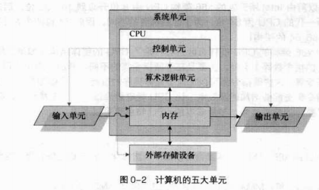

### 0.1.2  CPU的种类

- 精简指令集（RISC--Reduced Insruction Set Computing）

  指令集较为精简，每个指令的执行时间都很短，完成的操作也很单纯，指令的执行性能较佳；但若要做复杂的事情，就要由多个指令来完成。常见的架构有**SPARC架构**（常用于学术领域的大型工作站中）、**PowerPC架构**（如PS3）、**ARM架构**。常使用的各品牌手机、PDA、导航系统、网络设备（交换机、路由器）等，几乎都是使用ARM架构的CPU

- 复杂指令集（CISC--Complex Instruction Set Computer）
  - 与RISC不同，CISC的微指令集中，每个小指令可以执行一些较低阶的硬件操作，指令数目多而复杂，每条指令的长度并不相同。**常见的CISC微指令集CPU主要有AMD、Intel、VIA等x861架构的CPU。**
  - 由于AMD、Intel、VIA所开发出来的x86架构CPU被大量使用于个人计算机，因此个人计算机常被称为x86计算机。
  - 64位的个人计算机CPU又被统称为x86_64的架构
  - 不同的x86架构的CPU区别：CPU整体区别以及微指令集不同

### 0.1.3  接口设备

- CPU
- 输入/输出设备
- 内存
- **主板**
  - 负责将所有的设备连接在一起，让所有的设备能够协调与通信。
  - 主板上最重要的组件就是主板芯片组，这个芯片组将所有的设备汇集在一起
- 存储设备：硬盘、软盘、光盘、磁带等
- 显示设备：显卡
- 网络设备：网卡

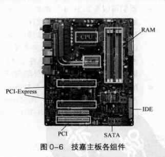

### 0.1.4  运作流程

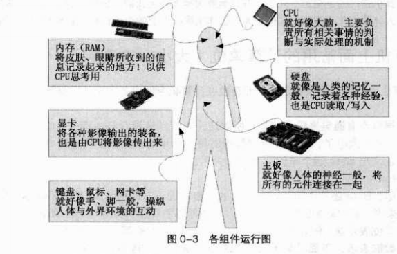

### 0.1.5  计算机分类

- 超级计算机（Superconputer）
  - 运行速度最快的计算机，但是其维护、操作费用也最高。主要用于需要有高速计算的项目中。如国防军事、气象预测、太空科技，用在模拟的领域较多
- 大型计算机（Mainframe Computer）
  - 大型计算机通常也具有数个高速的CPU，功能上虽不及超级计算机，但也可用来处理大量数据与复杂的运算。如大型企业的主机、全国性的证卷交易所或大型企业的数据库服务器等
- 迷你计算机（Minicomputer）
  - 迷你计算机仍保留有大型计算机同时支持多用户的特性，但是主机可以放在一般作业场所，不像前两个大型计算机需要特殊的空调场所。通常用来作为科学研究、工程分析与工厂的流程管理等
- 工作站（Workstation）
  - 工作站的价格又比迷你计算机便宜许多，是针对特殊用途而设计的计算机。在个人计算机的性能还没有提升到目前的状况之前，工作站计算机的性价比是所有计算机当中较佳的，因此在学术研究与工程分析方面相当常见
- 微电脑（Microcomputer）
  - 微电脑又称个人计算机。其体积小、价格低，但功能五脏俱全。大致可分为桌上型电脑、笔记本电脑等。若光以性能来说，目前的个人计算机性能已经够快了，甚至比工作站等级以上的计算机运算速度还要快。但是工作站计算机强调的是稳定不死机，并且运算过程要完全正确，因此工作站以上等级的计算机在设计时考虑与个人计算机并不相同

### 0.1.6  计算机上面常用的计算单位（大小、速度等）

- 大小单位
  - 1Byte=8bit
  - **K，M都是单位。**
  - 一般来说，文件大小使用的是二进制方式，故1GB=1024×1024×1024B。而速度单位则常使用十进制，例如1GHz就是1000×1000×1000Hz的意思。

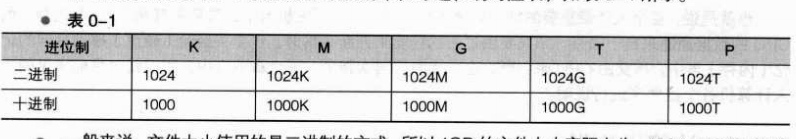

- 速度单位
  - CPU的运算速度常使用MHz或者是GHz之类的单位。
  - 在网络传输方面，由于网络使用的是bit为单位，因此网络常使用的单位为1Mbit/s。如常听到的8M/1M ADSL 传输速度，如果转成文件容量的Byte时，其实理论最大传输值为：1MB/s / 125KB/s的上传/下载速度。

## 0.2  个人计算机架构与接口设备

- Intel主板架构
  - 芯片组分为两个桥接器来控制各组件的通信
  - 北桥负责连接速度较快的CPU、内存与显卡等组件
  - 南桥负责连接速度较慢的周边接口，包括硬盘、USB、网卡等
- AMD主板架构
  - 与Intel不同的地方在于，内存直接与CPU通信而不通过北桥
  - AMD为了加速CPU与内存的通信，将内存控制组件集成到CPU中，理论上这样可以加速CPU与内存的传输速度

### 0.2.1  CPU

- 目前主流的CPU都是双核以上的架构了。原本的单核CPU仅有一个运算单元，所谓的多核则是在一个CPU封装当中潜入了两个以上的运算内核，简单的说，就是一个实际的CPU外壳中含有两个以上的CPU单元
- 不同的CPU型号大多具有不同的脚位，能够搭配的主板芯片组也不同。
- CPU性能的比较
  - 内部不同的微指令集
  - CPU的频率
    - 频率就是CPU每秒钟可以进行的工作次数。
      - 如，Intel的Core 2 Duo型号E8400的CPU频率为3.0GHz，表示这个CPU在1秒内可以进行$3.0 \times 10^{9}$次工作，每次工作都可以进行少数的指令运行
      - **不同的CPU之间不能单纯以频率来判断性能。因为每个CPU的微指令集不同，架构也不同，每次频率能够进行的工作指令数也不同，所以频率目前仅能用来比较同款CPU的速度。**
- CPU的外频与倍频
  - CPU与外部各组件的速度理论上应该要一致才好，但是因为CPU需要较强的运算能力，因为很多判断与数据都是在CPU内处理的，因此CPU开发商就在CPU内再加一个加速功能，所以CPU有所谓的外频与倍频
  - **所谓的外频指的是CPU与外部组件金属数据传输/运算时的速度，倍频则是CPU内部用来加速工作性能的一个倍数，两者相乘才是CPU的频率**
- 所谓“超频”指的是：将CPU的倍频或者外频通过主板的设定功能更改成较高频率的一种方式。
  - 但因为CPU的倍频通常在出厂时已经被锁定而无法修改，因此较常被超频的是外频。
  - 如3.0GHz的CPU如果想要超频，可以将它的外频333MHz调成400MHz，但如此一来整个主板的各个组件的运行频率可能都会被增加成原来的1.333倍，虽然CPU有可能到达3.6GHz，但却因为频率并非正常速度，故可能会造成死机等问题。
- 32位与64位
  - 前面谈到CPU运算的数据都是由内存提供的，内存与CPU的通信速度靠的是外部频率，那么每次工作可以传送的数据量有多大呢？那就是总线的功能了。一般主板芯片组分为北桥与南桥，**北桥的总线称为系统总线，因为是内存传输的主要通道，所以速度较快；南桥就是所谓的I/O总线**，主要用于“联系”硬盘、USB、网卡等接口设备。
  - 目前北桥所支持的频率可高达333/400/533/800/1066/1333/1600MHz等不同频率，支持情况因芯片组功能而有所不同。**北桥所支持的频率我们称为前端总线速度（Front Side Bus,FSB），而每次传送的位数则是总线宽度。**所谓的总线频宽则是“FSB×总线宽度”，亦即每秒钟可传送的最大数据量。目前常见的总线宽度有32/64位。
  - 与总线宽度相似，**CPU每次能够处理的数据量称为字组大小（world size），字组大小依据CPU的设计而有32位与64位。所以现在所称的计算机是32位或64位主要是依据CPU解析的字组大小而来的！**
- CPU等级
  - 由于x86架构的CPU在intel的Pentium系列（1993年）后就有不统一的引脚位与设计，为了将不同种类的CPU规范等级，所以就有i386，i586，i686等名词出现了。目前的64位CPU统称为x86_64等级

### 0.2.2  内存

- CPU所使用的数据都来源于内存，不论是软件程序还是数据，都必须要读入内存后CPU才能利用。**个人计算机的内存主要组件为动态随机访问内存（Dynamic Random Access Memory，DRAM）**，随机访问内存只有在通电时才能记录与使用，断电后数据就消失了。因此也称这种RAM为挥发性内存。
  - DRAM广泛使用的有SDRAM，DDR SDRAM两种。这两种内存的区别除了在于引脚位与工作电压上的不同之外，DDR 是双倍数据传输速度（Double Data Rate），他可以在一次工作周期中进行两次数据的传送，感觉上就是CPU的倍频。所以传输频率方面比SDRAM还要好。新一代的PC大多使用DDR内存了。
  - DDR SDRAM 又依据技术发展，有DDR，DDRⅡ，DDRⅢ等
  - 内存除了频率/频宽与型号是需要考虑之外，容量也是很重要的。通常内存越大表示系统越快，这是因为系统不用常常释放一些内存内部的数据。**对于服务器而言，内存的容量有时比CPU的速度还重要。**

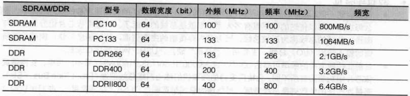

- 双通道设计
  - 由于所有的数据都必须存放到内存中，所以内存的数据宽度越大越好。但传统的总线宽度一般大约仅达64位，为了要加大这个宽度，因此芯片组厂商就将两个内存汇整在一起，如果一条内存可达64位，两条内存就可以达128位了，这就是双通道设计理念。
  - 如上所述，要启用双通道功能你必须要安插两支（或四条）内存，这两条内存最好型号都一模一样比较好，这是因为启动双通道内存功能时，数据是同步写入/读出这一对内存中的，如此才能提升整体的频宽
  - 要启动双信道的功能，必须将两根容量相同的内存插在相同颜色的插槽中
- CPU频率与内存的关系
  - 理论上，CPU与内存的外频应该要相同才好。不过因为技术的提升，这两者的频率速度不会相同，但外频则应该是一致的较佳。
- DRAM 与SRAM
  - 第二层缓存：将某些很常用的程序性或数据放置到CPU内部，CPU数据的读取就不需要通过北桥了，可以大大提升性能
  - 因为第二层缓存（L2Cache）集成到CPU内部，因此这个L2Cache的速度必须要与CPU频率相同。使用DRAM是无法达到这个频率速度的，此时就需要静态随机访问内存（Static Random Access Memory ，SRAM）来帮忙了。SRAM在设计上使用的晶体管数量较多，价格较高，且不易做成大容量，不过由于其速度快，因此集成到CPU内成为高速缓存以加快数据的访问是个不错的方式。新一代的CPU都有内置容量不等的L2Cache在CPU内部，以加快CPU的运行性能。
- 只读存储器（ROM）
  - 主板上的组件是非常多的，而每个组件的参数又具有可调整性。举例来说，CPU与内存的频率是可调整的；而主板上面如果有内置的网卡或者是显卡时，该功能是否启动与该功能的各项参数被记录到主板上面的一个被称为CMOS的芯片上，这个芯片需要借助额外的电源来发挥记录功能，这也是为什么你的主板上面会有一个电池的缘故。
  - 那CMOS内的数据如何读取与更新呢？还记得你的计算机在开机的时候可以按下[Del]键来进入一个名为BIOS的界面吧？**BIOS(Basic Input Output System)是一套程序，这套程序是写死到主板上面的一个内存芯片中，这个内存芯片在没有通电时也能将数据记录下来，那就是只读存储器（Read Only Memory，ROM）**。ROM是一种非挥发性内存。另外BIOS对于个人计算机来说是非常重要的，因为他是系统在开机的时候首先去读取的一个小程序
  - 另外，固件（firmware）很多也是使用ROM来进行软件的写入的。固件像软件一样也是一个被计算机所执行的程序，然而他是对于硬件内部而言更加重要的部分。比如BIOS就是一个韧体，BIOS虽然对于我们日常操作计算机系统没有上面太大的关系，但是他却控制着开机时各项硬件参数的取得！所以很多的硬件上面都会有ROM来写入固件中。
  - BIOS对计算机系统来讲是非常重要的，因为他掌握了系统硬件的详细信息与开机设备的选择等。但是计算机发展的速度太快了，因此BIOS程序代码也可能需要做适度修改才行，所以你会在很多主板官网找到BIOS的更新程序。但是BIOS原本使用的是无法改写的ROM，因此无法修正BIOS程序代码。为此，现在BIOS通常是写入闪存（Flash Memory）或EEPROM中。

### 0.2.3  显卡

显卡又称为VGA（Video Graphics Array），他对于图形影像的显示扮演相当关键的角色。一般对于图形图形影像的显示重点在于分辨率与色彩深度，因为每个图像显示的颜色会占用内存，因此显卡上面会有内存的容量，**这个显卡内存容量将会影响到最终你的屏幕分辨率与色彩深度**。

除了显卡内存之外，现在由于3D game与一些3D 动画的流行，因此显卡的“运算能力”越来越重要。一些3D的运算早期是交给CPU去运行的，但是CPU并非完全针对这些3D来进行设计，而且CPU平时已经非常忙碌了。所以后来**显卡厂商直接在显卡上面嵌入一个3D加速的芯片，这就是GPU称谓的由来**。

显卡主要也是通过北桥芯片与CPU、内存等通信。如前面提到的，对于图形影像来说，显卡也是需要高速运算的一个组件，所以数据的传输也是越快越好。因此显卡的规格由早期的PCI导向AGP，近期APG又被PCI-Express规格取代。下图所示为PCI-Express的插槽。这些插槽最大的区别就是在数据传输的频宽了。

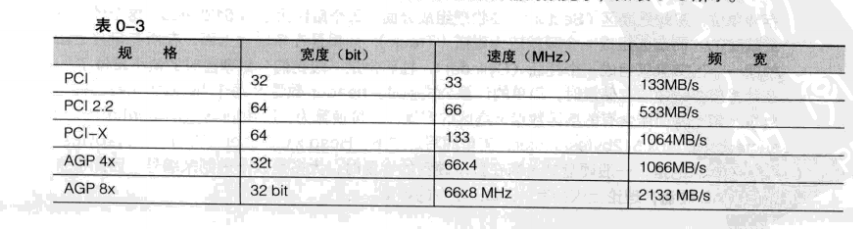

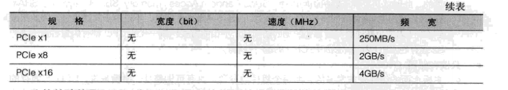

比较特殊的是，PCIe（PCI-Express）使用的类似管线的概念来处理，每条管线可以具有250MB/s的频宽性能，管线越大（最大可达×32）则总频宽越高。

### 0.2.4  硬盘与存储设备

- 硬盘的物理组成

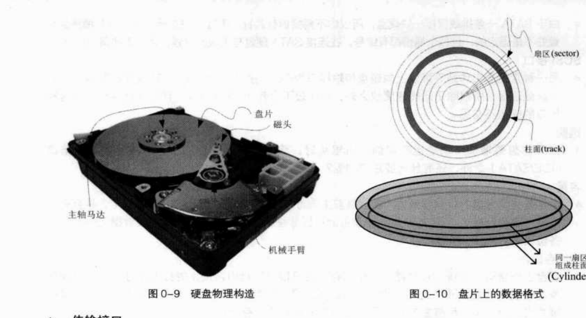

- 盘面上的数据
  - 硬盘根据桌面型与笔记本又分为3.5英寸及2.5英寸大小
  - 数据写在盘片上，最小存储单位为扇区（Sector）。每个扇区521bytes。
  - 扇区组成一个圆成为隧道（Track），如果在多硬盘表面，所有盘片上面的同一磁道可以组成一个柱面，柱面也是我们分割硬盘的最小单位
  - 存储容量的简单计算公式：header数量×每个header负责的柱面数量×每个柱面所含有的扇区数量×扇区容量。
- IDE接口
- SATA接口
- SCSI接口
- 选购：
  - 考虑主板可接受的插槽接口IDE/SATA
  - 容量
  - 缓冲存取器
  - 转速

### 0.2.6  PCI适配卡

有相当多的组件是通过PCI接口传输的，如网卡、声卡、特殊功能卡等。但由于PCI Express规格的发展，很多制造商都往PCIe接口开发硬件了。

目前个人计算机上面常见到的网卡是一种成为以太网（Ethernet）的规格，同样速度的以太网卡所支持的标准可能不太一样，因此造成的价差是非常大的。如果想要在服务器主机上面安转新的网卡，要特别注意标准的区别。

由于各组件的价格一直下降，现在主板上面通常已经集成了相当多的设备组件了。常见集成到主板的组件包括声卡、网卡、USB控制卡、显卡、磁盘阵列卡等。由于主板已经集成了很多常用的功能芯片，所以现在的主板上面所安插的PCI适配卡就少很多。

### 0.2.7  主板

上面谈到的所有组件都是安插在主板上面的。而主板上面负责通信各个组件的就是芯片组。芯片组一般分为北桥与南桥。北桥负责CPU/RAM/VGA等的连接，南桥则负责PCI接口与速度较慢的I/O设备。

芯片组负责所有设备的通信，需扇热。

- 芯片组的功能

  - 所有的芯片组几乎都是参考CPU的能力去规划的，而CPU能够接受的内存规格也不同，因此在**新购买或升级主机时，CPU、主板、内存与相关接口都需要同时考虑才行**。此外，每一种芯片组的功能可能都不太相同，有的芯片组强调的是全功能，因此连显卡、音效、网络等都集成了，在这样的集成型芯片中，你几乎只要购买CPU、主板、内存再加上硬盘就能够组装成一台主机了。不过集成型芯片的性能通常比较弱，对于爱玩3D游戏的玩家以及强调高性能运算的主机来说，就不是这么合适了
  - 至于独立性芯片组虽然可能具有较高的性能，不过你可能必须要额外负担接口设备的花费。例如显卡、网卡、声卡等。但独立型芯片也有一定的好处，就是可以随时更换接口设备。

- 设备I/O地址与IRQ中断信道

  - I/O地址有点类似每个设备的门牌号，每个设备都有他自己的地址，，一般来说，不能有两个设备使用同一个I/O地址
  - IRQ可以想成是各门牌连接到邮件中心（CPU）的专门路径。各设备可以通过IRQ中断信道来告知CPU该设备的工作情况，以便CPU进行工作分配的任务。sharing IRQ技术。

- CMOS和BIOS

  - **CMOS主要功能为记录主板上面的重要参数，包括系统时间、CPU电压与频率、各设备的I/O地址与IRQ等，由于这些数据的记录需要花费电力，因此主板上面才有电池。BIOS为写入到主板上某一块闪存或EEPROM的程序，他可以在开机的时候执行，以加载CMOS当中的参数，并尝试调用存储设备中的开机程序，进一步进入操作系统当中。**BIOS程序也可以修改CMOS中的数据。

- 连接设备与接口

  - 主板与各项输出/输入设备的连接主要都是在主机箱的后方，主要有：
  - PS/2接口：这是常见的键盘与鼠标接口，不过逐渐有被USB接口替代的趋势
  - USB接口。注意USB接口与USB2.0
  - 声音输出、输入与麦克风
  - RJ-45接口

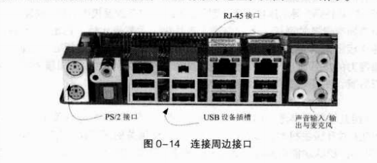

### 0.2.7  电源

稳定度差的电源供应器甚至是造成计算机不稳定的元凶，因此尽量不要使用太差的电源。

- 能源转换率
- 连接接口

### 0.2.8  选购须知

尽量不要自行组装，尽管比较便宜，但设备之间的适合性是否完美则有待自行检测。

系统不稳定的可能原因：

- 系统超频
- 电源不稳
- 内存无法负荷
- 系统过热

## 0.3  数据的表示方式

### 0.3.1  数字系统

### 0.3.2  文字编码系统

最常用的英文编码表为ASCII系统，每个符号1B

最常用的中文编码系统是big5（简体则是gb2312），每个符号2B

Unicode编码系统，即UTF8或统一码

## 0.4  软件程序的运行

### 0.4.1  机器程序与编译程序

我们需要CPU帮忙工作时，就得要参考微指令集的内容，然后编写让CPU读的懂得指令码给CPU执行，这样就能够让CPU运行了。不过这个流程有几个很麻烦的地方，包括：

- 需要了解机器语言
- 需要了解所有硬件的相关功能函数
- 程序不具有可移植性
- 程序具有专一性

### 0.4.2  操作系统

- 操作系统内核（kernel）
  - 操作系统其实也是一组程序，这组程序的**重点在于管理计算机的所有活动以及驱动系统中的所有硬件**。操作系统的作用就是让CPU可以开始判断逻辑与运算数值，让内存可以加载/读出数据与程序代码，让硬盘可以开始被访问，让网卡可以开始传输数据，让所有周边可以开始运转等。总之，硬件的所有操作都必须要通过这个操作系统来完成
  - 上述功能就是操作系统的内核。计算机能不能做到某些事情都与内核有关。只有内核提供了相关功能，计算机系统才能帮你完成。
  - 单有内核计算机也不知道能做啥事。因为内核主要在于管控硬件与提供相关的能力，这些管理的操作是非常重要的，如果用户能够直接使用到内核的话，万一用户不小心将内核程序停止或破坏，将会导致整个系统的崩溃。因此**内核程序所放置到内存当中的区块是受保护的，并且开机后就一直常驻内存当中**
- 系统调用（System Call）
  - 硬件由内核管理，开发软件需要参考内核的相关功能，如此一来从原本的参考硬件函数变成参考内核功能
  - 为解决此问题，操作系统通常会提供一整组的开发接口给工程师来开发软件。
  - 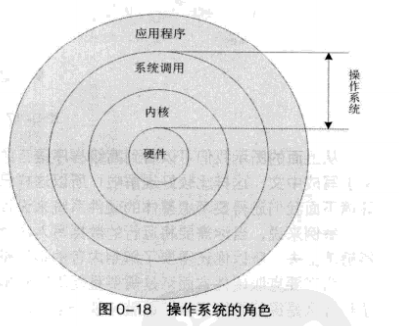
  - 计算机系统主要由硬件构成，然后内核程序主要在于管理硬件，提供合理的计算机资源分配（包括CPU资源、内存使用资源等），因此**只要硬件不同（如x86和RISC架构的CPU），内核就得要进行修改才行**。而由于内核只会进行计算机系统的资源分配，所以在上面还需要有应用程序的提供，用户才能够操作系统
  - 为了保护内核，并且让程序员比较容易开发软件，因此操作系统除了内核程序外，通常还会提供一整组开发接口，那就是系统调用层。软件开发工程师只要遵循公认的系统调用参数来开发软件，该软件就能够在内核上面运行
  - **操作系统的内核层直接参考硬件规格写成，所以同一操作系统程序不能够在不一样的硬件架构下运行**
  - **操作系统只是在管理整个硬件资源，包括CPU、内存、输入输出设备及系统文件**
  - **应用程序的开发都是参考操作系统提供的开发接口，所以该应用程序只能在该操作系统上面运行**
  - 内核功能
    - 系统调用接口（System call inference）
    - 程序管理（Process control）--CPU调度机制
    - 内存管理（Memory management）
    - 文件系统管理（Filesystem management）
    - 设备驱动（Device driver）
    - 操作系统与驱动程序
    - 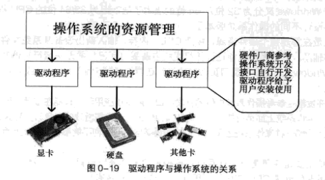
    - 有图知：
    - 操作系统必须要能够驱动硬件，如此应用程序才能够使用该硬件功能
    - 一般来说，操作系统会提供开发接口，让开发商制作他们自己的驱动程序
    - 要使用新硬件功能，必须要安装厂商提供的驱动程序才行
    - 驱动程序由厂商提供，与操作系统开发者无关

### 0.4.3  应用程序

应用程序是参考操作系统提供的开发接口所开发出来的软件，这些软件可以让用户操作，以达到某些计算机的功能利用